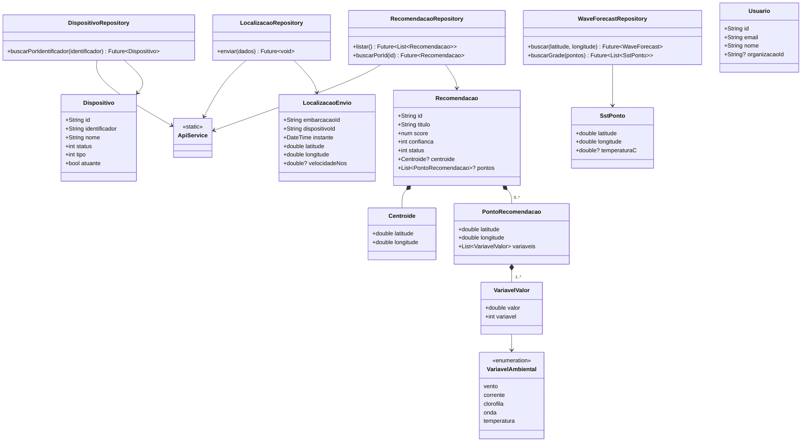
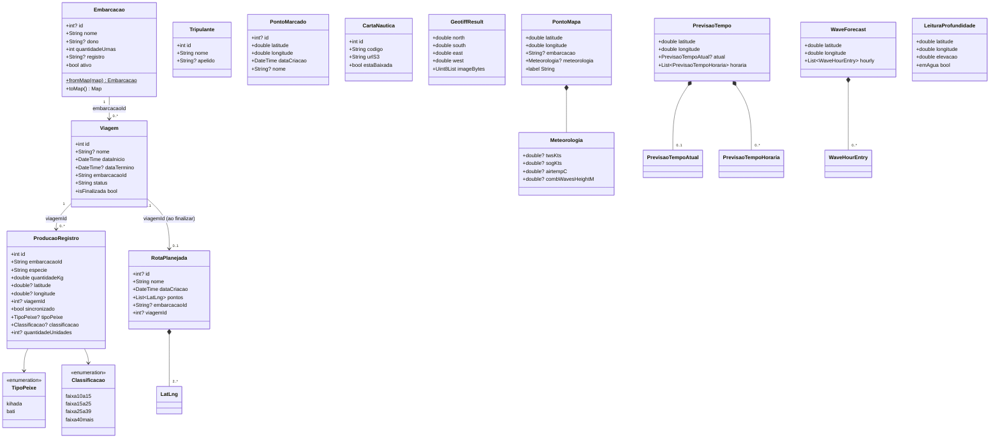

# Atlas Blue Ocean — Documentação Técnica

> Versão: 1.0.0+1 · Flutter ≥ 3.6.0 · Última atualização: Agosto 2026

---

## Índice

1. [Visão Geral](#1-visão-geral)
2. [Configuração do Ambiente](#2-configuração-do-ambiente)
3. [Arquitetura do Projeto](#3-arquitetura-do-projeto)
4. [Estrutura de Pastas](#4-estrutura-de-pastas)
5. [Dependências](#5-dependências)
6. [Banco de Dados SQLite](#6-banco-de-dados-sqlite)
7. [Serviços Principais (`core/`)](#7-serviços-principais-core)
8. [Repositórios de API (`data/`)](#8-repositórios-de-api-data)
9. [Features — Telas e Funcionalidades](#9-features--telas-e-funcionalidades)
10. [Modelos de Dados](#10-modelos-de-dados)
11. [Armazenamento Local (Hive)](#11-armazenamento-local-hive)
12. [Assets](#12-assets)
13. [Fluxos Principais](#13-fluxos-principais)
14. [Permissões Android/iOS](#14-permissões-androidios)
15. [Convenções e Padrões](#15-convenções-e-padrões)
16. [Diagrama de Classes (UML)](#16-diagrama-de-classes-uml)
17. [Testes Automatizados](#17-testes-automatizados)
18. [Próximos Passos](#18-próximos-passos)

---

## 1. Visão Geral

**Atlas Blue Ocean** é um aplicativo móvel multiplataforma desenvolvido em Flutter para **embarcações pesqueiras**. Ele centraliza operações de navegação, rastreamento de posição, registro de produção (capturas), consulta de dados meteorológicos e recomendações de pesca, funcionando **predominantemente offline**, com sincronização oportunista com um backend próprio (Blue Ocean API) quando há conectividade.

### Funcionalidades principais

| Área | O que faz |
|------|-----------|
| **Mapa Offline** | Cartas náuticas em MBTiles, overlay de GeoTIFF e de PNG georreferenciado, mapa de ruas com cache, marcação de pontos, planejamento de rotas, rota entre registros de produção, grade de temperatura da superfície do mar (SST) |
| **Rastreamento GPS** | Registra a posição a cada 5 min (foreground) e 15 min (background), sincroniza com o backend quando logado |
| **Meteorologia** | Vento, correntes, previsão do tempo, ondas e profundidade/batimetria — parte de arquivos JSON locais, parte de APIs públicas (Open-Meteo, OpenTopoData) |
| **Produção** | Registra capturas de pesca (tipo do peixe, classificação por faixa de peso, quantidade, posição GPS, viagem) com peso estimado calculado automaticamente; mostra histórico/totais |
| **Recomendação** | Exibe recomendações de pesca vindas do backend (score, confiança, variáveis ambientais, pontos sugeridos) |
| **Cartas Náuticas** | Gerencia, baixa e visualiza PDFs de cartas náuticas; permite solicitar novas cartas |
| **Rotas Planejadas** | Cria rotas desenhadas manualmente sobre o mapa, ou geradas automaticamente a partir dos registros de produção de uma viagem (ao finalizá-la) |
| **Viagem** | Início/fim de viagem, tripulação, histórico de localizações da viagem |
| **Embarcação** | Cadastro, configuração e foto da embarcação |
| **Autenticação** | Login real contra a Blue Ocean API, com opção de lembrar credenciais para login automático; sessão controlada pela expiração (`exp`) do JWT |
| **Configurações** | Intervalo de rastreamento, modo noturno, contato de emergência, embarcação ativa |
| **Teste de API / Dispositivo** | Ferramentas internas de debug para chamadas HTTP manuais e teste do registro de dispositivo |

### Stack Tecnológica

- **Frontend:** Flutter (Dart)
- **Banco de dados relacional:** SQLite via `sqflite` (dados locais: embarcação, viagens, produção, pontos, rotas)
- **Banco de dados NoSQL:** Hive via `hive_flutter` (preferências/tokens e histórico de chamadas de teste)
- **Mapas:** `flutter_map` com tiles MBTiles, overlay de GeoTIFF, overlay de PNG georreferenciado, grade de temperatura (polígonos) e cache de mapa de ruas
- **GPS:** `geolocator`
- **Background tasks:** `workmanager`
- **Armazenamento seguro:** `flutter_secure_storage` (ID de dispositivo no iOS; credenciais de login lembradas)
- **Backend:** Blue Ocean API (REST, `blue-ocean-app-api.up.railway.app`), consumida via `ApiService`
- **APIs externas:** Open-Meteo (previsão do tempo, ondas e grade de SST), OpenTopoData (profundidade/batimetria)

---

## 2. Configuração do Ambiente

### Pré-requisitos

- Flutter SDK ≥ 3.6.0 (`flutter --version` para verificar)
- Dart SDK compatível com o Flutter instalado
- Android Studio ou VS Code com extensões Flutter/Dart
- Dispositivo Android físico ou emulador (recomendado físico para GPS)

### Como rodar o projeto

```bash
# 1. Clone o repositório
git clone <url-do-repositorio>
cd atlas

# 2. Instale as dependências
flutter pub get

# 3. Execute o app
flutter run
```

### Autenticação em ambiente de desenvolvimento

O login é feito contra a Blue Ocean API real (`ApiService.login` → `POST /api/v1/autenticacao`); não há credenciais fixas no código. É necessário um usuário válido cadastrado no backend. O token retornado é salvo (`Config`/Hive) e a sessão permanece válida até a expiração (`exp`) do JWT.

Marcando **"Lembrar minhas credenciais"** na tela de login, o usuário/senha são salvos no armazenamento seguro do aparelho (`flutter_secure_storage`) e, se o token salvo já tiver expirado num próximo acesso, o app tenta logar de novo sozinho (`AuthService.tentarLoginAutomatico`) antes de cair na tela de login — só exige login manual de novo depois de um `AuthService.logout()` explícito.

---

## 3. Arquitetura do Projeto

O projeto segue uma arquitetura **Feature-First**, com separação em até três camadas dentro de cada feature — mas nem toda feature usa as três:

```
feature/
├── domain/
│   └── models/        ← Entidades de dados (fromJson/fromMap/toMap, sem lógica de negócio)
├── data/               ← Repositórios (só nas features que falam com a API REST)
└── presentation/       ← Telas e widgets (Screens)
```

Features que só persistem localmente (`producao`, `embarcacao`, `mapa`, `viagem`, `cartas`, `rotas`) **não têm `data/`** — as telas acessam `DatabaseHelper` diretamente. Já as features que falam com o backend (`dispositivo`, `localizacao`, `recomendacao`) e as que falam com APIs meteorológicas externas (`metereologia`) têm repositório dedicado em `data/`.

A camada `core/` contém tudo que é compartilhado entre features:

```
core/
├── auth/               ← Autenticação (AuthService, JWT, Usuario)
├── background/         ← Callback do WorkManager (rastreamento em background)
├── config/              ← Config (key-value sobre Hive) e Constantes de chaves
├── database/            ← DatabaseHelper (SQLite)
├── models/              ← Modelos usados por múltiplas features (ondas, SST)
├── network/              ← ApiService, Endpoints, exceções de rede
├── services/             ← Lógica de negócio reutilizável (GPS, mapas, sync, etc.)
├── storage/              ← ApiStorageService (Hive, ferramenta de debug)
└── utils/                ← Funções puras (formatação de coordenadas, proximidade)
```

### Dois mundos de persistência local + um remoto

| Camada | Tecnologia | Uso |
|---|---|---|
| **SQLite** | `sqflite`, via `DatabaseHelper` (CRUD genérico por nome de tabela, sem ORM) | Dados operacionais do app: embarcação, viagem, produção, localizações, pontos marcados, rotas, solicitações de carta |
| **Hive** | `hive_flutter`, chave-valor puro (sem `TypeAdapter`/`build_runner`) | `config` (preferências/tokens) e `api_responses` (histórico do Teste de API) |
| **Blue Ocean API** | REST via `ApiService`/repositórios em `data/` | Autenticação, dispositivo, localização (envio), recomendações |

### Padrões utilizados

| Padrão | Onde é usado |
|--------|-------------|
| **Singleton (instância)** | `DatabaseHelper.instance`, `LocationService()`, `LocationTrackingService()`, `StreetMapCacheService()` |
| **Namespace estático (singleton implícito, sem instância)** | `Config`, `ApiService`, `AuthService`, `NightModeService`, `DeviceIdService`, `SincronizacaoService`, `LocalizacaoReporterService`, `ProducaoReporterService` |
| **Repository** | `DispositivoRepository`, `LocalizacaoRepository`, `RecomendacaoRepository`, `PrevisaoTempoRepository`, `ProfundidadeRepository`, `WaveForecastRepository` |
| **Abstract Base Class** | `BaseMeteorologyCard` para os cards de meteorologia |
| **Isolates (compute)** | `GeotiffService` para não bloquear a UI ao processar imagens |
| **Estado global simples (`ValueNotifier`)** | `NightModeService.ativo`, consumido no `builder` do `MaterialApp` |

Não há gerenciador de estado global (Provider/Bloc/Riverpod) nem geração de código para modelos (`json_serializable`/`freezed`) — toda (de)serialização é manual.

---

## 4. Estrutura de Pastas

```
atlas/
├── assets/
│   ├── cartas/                        # Carta náutica PDF e MBTiles bundled
│   │   ├── Carta_Navegacao_Nordeste.pdf
│   │   └── OUTPUT_FILE.mbtiles        # Mapa base offline (sempre carregado)
│   ├── icons/                         # Ícones customizados / launcher icon
│   ├── overlays/                      # Pasta de referência para PNGs georreferenciados
│   └── json/
│       ├── vento.json                 # Dados de vento (modelo GFS)
│       ├── correntes.json             # Dados de correntes (modelo HYCOM)
│       └── posicoes/
│           └── Routing3.json          # Pontos de rota de exemplo com dados meteorológicos
│
├── lib/
│   ├── main.dart                      # Ponto de entrada (Hive, tema, splash nativo, modo noturno)
│   ├── app_shell.dart                 # BottomNavigationBar: Home / Cartas / Mapa
│   │
│   ├── core/
│   │   ├── auth/
│   │   │   ├── auth_service.dart
│   │   │   ├── jwt_utils.dart
│   │   │   └── models/usuario.dart
│   │   ├── background/
│   │   │   └── location_worker.dart
│   │   ├── config/
│   │   │   ├── config.dart
│   │   │   └── constantes.dart
│   │   ├── database/
│   │   │   └── database_helper.dart
│   │   ├── models/
│   │   │   ├── sst_ponto.dart
│   │   │   └── wave_forecast.dart
│   │   ├── network/
│   │   │   ├── api_service.dart
│   │   │   ├── endpoints.dart
│   │   │   └── excecoes.dart
│   │   ├── services/
│   │   │   ├── device_id_service.dart
│   │   │   ├── foto_embarcacao_service.dart
│   │   │   ├── geo_png_helper.dart
│   │   │   ├── geotiff_service.dart
│   │   │   ├── localizacao_reporter_service.dart
│   │   │   ├── location_service.dart
│   │   │   ├── location_tracking_service.dart
│   │   │   ├── mbtiles_service.dart
│   │   │   ├── night_mode_service.dart
│   │   │   ├── pontos_service.dart
│   │   │   ├── sincronizacao_service.dart
│   │   │   └── street_map_cache_service.dart
│   │   ├── storage/
│   │   │   └── api_storage_service.dart
│   │   └── utils/
│   │       ├── coordenadas_format.dart
│   │       └── proximidade.dart
│   │
│   └── features/
│       ├── api_tester/presentation/
│       │   └── api_tester_screen.dart
│       ├── auth/presentation/
│       │   └── login_screen.dart
│       ├── cartas/
│       │   ├── domain/models/carta_nautica.dart
│       │   └── presentation/
│       │       ├── cartas_screen.dart
│       │       ├── minhas_solicitacoes_screen.dart
│       │       ├── pdf_viewer_screen.dart
│       │       └── solicitar_cartas_screen.dart
│       ├── configuracoes/presentation/
│       │   └── configuracoes_screen.dart
│       ├── dashboard/presentation/
│       │   └── dashboard_screen.dart
│       ├── dispositivo/
│       │   ├── data/dispositivo_repository.dart
│       │   ├── domain/models/dispositivo.dart
│       │   └── presentation/dispositivo_teste_screen.dart
│       ├── embarcacao/
│       │   ├── domain/models/embarcacao.dart
│       │   └── presentation/
│       │       ├── cadastrar_embarcacao_screen.dart
│       │       ├── embarcacao_configuracao_screen.dart
│       │       ├── embarcacao_screen.dart
│       │       └── widgets/foto_embarcacao_picker.dart
│       ├── localizacao/
│       │   ├── data/localizacao_repository.dart
│       │   └── domain/models/localizacao_envio.dart
│       ├── mapa/
│       │   ├── domain/models/ponto_marcado.dart
│       │   ├── presentation/
│       │   │   ├── mapa_screen.dart
│       │   │   └── mapa_widget.dart
│       │   └── widgets/
│       │       ├── download_regiao_dialog.dart
│       │       ├── mbtiles_tile_provider.dart
│       │       ├── meteorologia_sheet.dart
│       │       └── street_map_tile_provider.dart
│       ├── metereologia/
│       │   ├── data/
│       │   │   ├── previsao_tempo_repository.dart
│       │   │   ├── profundidade_repository.dart
│       │   │   └── wave_forecast_repository.dart
│       │   ├── domain/models/
│       │   │   ├── leitura_profundidade.dart
│       │   │   └── previsao_tempo.dart
│       │   └── presentation/
│       │       ├── condicoes_mar_screen.dart
│       │       ├── condicoes_ponto_screen.dart
│       │       └── gribs_screen.dart
│       ├── producao/
│       │   ├── domain/
│       │   │   ├── classificacao_peso.dart
│       │   │   ├── especies_comuns.dart
│       │   │   └── models/producao_registro.dart
│       │   └── presentation/
│       │       ├── producao_historico_screen.dart
│       │       └── producao_screen.dart
│       ├── recomendacao/
│       │   ├── data/recomendacao_repository.dart
│       │   ├── domain/models/recomendacao.dart
│       │   └── widgets/
│       │       ├── recomendacao_card.dart
│       │       ├── recomendacao_confianca_dots.dart
│       │       ├── recomendacao_list_tile.dart
│       │       ├── recomendacao_ponto_card.dart
│       │       ├── recomendacao_pontos_list.dart
│       │       ├── recomendacao_score_badge.dart
│       │       ├── recomendacao_validade_chip.dart
│       │       ├── recomendacao_variavel_chip.dart
│       │       ├── recomendacao_widgets.dart      # barrel
│       │       └── recomendacoes_list.dart
│       ├── rotas/
│       │   ├── domain/models/rota_planejada.dart
│       │   └── presentation/minhas_rotas_screen.dart
│       ├── splash/
│       │   └── splash_screen.dart
│       ├── viagem/
│       │   ├── domain/models/
│       │   │   ├── tripulante.dart
│       │   │   └── viagem.dart
│       │   └── presentation/
│       │       ├── historico_localizacoes_screen.dart
│       │       ├── nova_tripulacao.dart
│       │       └── nova_viagem_screen.dart
│       └── widgets/
│           ├── base_meteorology_card.dart
│           ├── info_column.dart
│           ├── posicao_atual_widget.dart
│           ├── posicao_manual_widget.dart
│           ├── position_card.dart
│           ├── profundidade_card.dart
│           ├── web_view_screen.dart
│           ├── meteorology_widgets/
│           │   ├── current_card.dart
│           │   └── wind_card.dart
│           ├── previsao_tempo/
│           │   ├── condicoes_vento_card.dart
│           │   └── previsao_tempo_widgets.dart      # barrel
│           └── wave_forecast/
│               ├── condicoes_atuais_card.dart
│               ├── sea_surface_temperature_card.dart
│               └── wave_forecast_widgets.dart       # barrel
│
└── pubspec.yaml
```

---

## 5. Dependências

### Principais

| Pacote | Versão | Finalidade |
|--------|--------|-----------|
| `http` | ^1.2.2 | Requisições HTTP (backend + APIs externas) |
| `sqflite` | ^2.3.3 | Banco de dados SQLite local |
| `path_provider` | ^2.1.5 | Diretórios do dispositivo |
| `path` | ^1.9.0 | Manipulação de caminhos |
| `pdfrx` | ^1.0.0 | Visualizador de PDF (cartas náuticas) |
| `geolocator` | ^13.0.0 | GPS e geolocalização |
| `workmanager` | 0.9.0+3 | Tarefas em background (rastreamento) |
| `permission_handler` | ^12.0.0 | Gerenciamento de permissões |
| `flutter_map` | ^7.0.2 | Mapa interativo offline (tiles, overlays, polígonos) |
| `latlong2` | ^0.9.1 | Operações com coordenadas |
| `file_picker` | ^8.1.6 | Seletor de arquivos do dispositivo (MBTiles, GeoTIFF, PNG de overlay) |
| `image` | ^4.5.0 | Processamento de GeoTIFF e leitura de metadados de PNG (`GeoPngHelper`) |
| `hive_flutter` | ^1.1.0 | Armazenamento NoSQL local (config e histórico de API) |
| `intl` | ^0.19.0 | Formatação de datas/números |
| `flutter_secure_storage` | ^9.2.0 | Armazenamento seguro (ID de dispositivo no iOS; credenciais lembradas no login) |
| `device_info_plus` | ^12.4.0 | Dados descritivos do dispositivo |
| `android_id` | ^0.5.2+1 | ID estável de dispositivo Android |
| `battery_plus` | ^6.2.1 | Nível de bateria (enviado junto com a localização) |
| `flutter_native_splash` | ^2.4.3 | Splash screen nativa |
| `url_launcher` | ^6.3.1 | Abrir links/telefone/WhatsApp externos |
| `share_plus` | ^10.1.4 | Compartilhamento (ex: resumo de viagem) |
| `webview_flutter` | ^4.10.0 | WebView embutida (`WebViewScreen`) |

### Dev

| Pacote | Versão | Finalidade |
|--------|--------|-----------|
| `flutter_test` | SDK | Testes |
| `flutter_lints` | ^5.0.0 | Regras de lint |
| `flutter_launcher_icons` | ^0.14.3 | Geração do ícone do app a partir de `assets/icons/blue_ocean.png` |

---

## 6. Banco de Dados SQLite

**Arquivo:** `blue_ocean.db` (em `ApplicationDocumentsDirectory`)
**Gerenciado por:** `lib/core/database/database_helper.dart` — **Singleton** (`DatabaseHelper.instance`), atualmente na **versão 12** do schema (`onCreate`/`onUpgrade` incrementais desde a v2).

O `DatabaseHelper` expõe métodos genéricos CRUD reaproveitados por toda a app — não há DAO por entidade:

```dart
Future<int> insert(String table, Map<String, dynamic> data)
Future<List<Map<String, dynamic>>> query(String table)
Future<List<Map<String, dynamic>>> queryWhere(String table, {required String where, List<Object?>? whereArgs, String? orderBy})
Future<int> update(String table, Map<String, dynamic> data, {required int id})
Future<int> delete(String table, {required int id})
Future<int> deleteWhere(String table, {required String where, List<Object?>? whereArgs})
```

### Tabelas

#### `embarcacao`
| Coluna | Tipo | Descrição |
|--------|------|-----------|
| `id` | INTEGER PK | — |
| `nome` | TEXT | Nome da embarcação |
| `dono` | TEXT | Nome do proprietário |
| `quantidade_urnas` | INTEGER | Nº de compartimentos/urnas (default 1) |
| `registro` | TEXT | Código/placa (ex: PE-1234) |
| `data_cadastro` | TEXT | ISO 8601 |
| `ativo` | INTEGER | 1=ativo, 0=inativo |
| `capacidade_gelo_kg` | REAL | *(desde v4)* |
| `capacidade_diesel_litros` | REAL | *(desde v4)* |
| `numero_tripulantes` | INTEGER | *(desde v4)* |
| `mestre_id` | TEXT | *(desde v4)* |
| `motor_usado` | TEXT | *(desde v5)* |
| `foto` | TEXT | Caminho local da foto *(desde v6)* |

#### `viagem`
| Coluna | Tipo | Descrição |
|--------|------|-----------|
| `id` | INTEGER PK | — |
| `nome` | TEXT | Nome opcional da viagem |
| `data_inicio` | TEXT | ISO 8601 |
| `data_termino` | TEXT | ISO 8601 (nullable) |
| `embarcacao_id` | TEXT | ID da embarcação |
| `status` | TEXT | `'em_andamento'` ou `'finalizada'` |

#### `localizacao_historico`
| Coluna | Tipo | Descrição |
|--------|------|-----------|
| `id` | INTEGER PK | — |
| `data_hora` | TEXT | ISO 8601 |
| `latitude` / `longitude` | REAL | Graus decimais |
| `velocidade` | REAL | m/s (nullable) |
| `precisao` | REAL | Metros (nullable) |
| `altitude` | REAL | *(desde v3)* |
| `direcao` | INTEGER | Rumo em graus *(desde v3)* |
| `bateria_nivel` | INTEGER | % de bateria no momento *(desde v3)* |
| `viagem_id` | INTEGER | FK lógica para `viagem.id` |
| `sincronizado` | INTEGER | 0=pendente, 1=enviado ao servidor |

#### `carta_nautica`
| Coluna | Tipo | Descrição |
|--------|------|-----------|
| `id` | INTEGER PK | — |
| `codigo` | TEXT UNIQUE | Código identificador da carta |
| `nome` | TEXT | Nome descritivo |
| `url_s3` | TEXT | URL para download no S3 |
| `caminho_local` | TEXT | Caminho local após download (nullable) |
| `data_publicacao` / `data_atualizacao` | TEXT | ISO 8601 |
| `esta_baixada` | INTEGER | 0=não baixada, 1=baixada |

#### `producao_registro`
| Coluna | Tipo | Descrição |
|--------|------|-----------|
| `id` | INTEGER PK | — |
| `embarcacao_id` | TEXT | ID da embarcação |
| `data_hora` | TEXT | ISO 8601 |
| `especie` | TEXT | Nome do tipo do peixe (`TipoPeixe.label`, ex: "Kihada") |
| `quantidade_kg` | REAL | Peso total estimado, em quilogramas |
| `latitude` / `longitude` | REAL | Posição da captura (nullable — GPS pode falhar sem bloquear o salvamento) |
| `precisao_metros` | REAL | Acurácia do GPS no momento da captura (nullable) *(desde v11)* |
| `carta_codigo` | TEXT | Referência da carta usada (nullable) |
| `observacao` | TEXT | Obs. livre (nullable) |
| `viagem_id` | INTEGER | FK lógica para `viagem.id` *(desde v7)* |
| `sincronizado` | INTEGER | 0=pendente, 1=enviado ao servidor |
| `tipo_peixe` | TEXT | `TipoPeixe.name` (`kihada`\|`bati`) *(desde v11)* |
| `classificacao` | TEXT | `Classificacao.name` (faixa de peso) *(desde v11)* |
| `quantidade_unidades` | INTEGER | Nº de peixes capturados *(desde v11)* |
| `peso_medio_unitario` | REAL | Ponto médio da faixa de peso usado no cálculo, em kg/unidade *(desde v11)* |

#### `ponto_marcado` *(desde v2, coluna `nome` desde v8)*
| Coluna | Tipo | Descrição |
|--------|------|-----------|
| `id` | INTEGER PK | — |
| `latitude` / `longitude` | REAL | Posição marcada manualmente no mapa |
| `data_criacao` | TEXT | ISO 8601 |
| `nome` | TEXT | Nome opcional do ponto |

#### `solicitacao_carta` *(desde v9)*
| Coluna | Tipo | Descrição |
|--------|------|-----------|
| `id` | INTEGER PK | — |
| `latitude_texto` / `longitude_texto` | TEXT | Coordenadas formatadas do pedido |
| `data_solicitacao` | TEXT | ISO 8601 |

#### `rota_planejada` *(desde v10)*
| Coluna | Tipo | Descrição |
|--------|------|-----------|
| `id` | INTEGER PK | — |
| `nome` | TEXT | Nome da rota — gerado automaticamente (`"Produção · <embarcação> · <data>"`) quando vem de registros de produção, digitado pelo usuário quando desenhada à mão |
| `data_criacao` | TEXT | ISO 8601 |
| `embarcacao_id` | TEXT | Nullable — preenchida só em rotas geradas a partir de registros de produção *(desde v12)* |
| `viagem_id` | INTEGER | FK lógica para `viagem.id`, nullable, mesma origem que `embarcacao_id` *(desde v12)* |

#### `rota_planejada_ponto` *(desde v10)*
| Coluna | Tipo | Descrição |
|--------|------|-----------|
| `id` | INTEGER PK | — |
| `rota_planejada_id` | INTEGER | FK lógica para `rota_planejada.id` |
| `latitude` / `longitude` | REAL | Ponto da rota |
| `ordem` | INTEGER | Posição do ponto na sequência da rota |

> Não existe tabela `recomendacao` nem `tripulante` — recomendações vêm sempre da API (`RecomendacaoRepository`, sem cache local) e tripulantes ainda não são persistidos.

---

## 7. Serviços Principais (`core/`)

### 7.1 Config
**Localização:** `core/config/config.dart` — namespace estático sobre uma `Box<String>` do Hive (`config`), aberta sob demanda.

```dart
Config.obtem(String chave, [String valorPadrao = ''])  // → Future<String>
Config.grava(String chave, String valor)                // → Future<void>
Config.limpa(String chave)                               // → Future<void>
```

As chaves usadas ficam centralizadas em `Constantes` (`api`, `authToken`, `authCredencial`, `deviceId`, `organizacaoId`, `embarcacaoId`, `intervaloRastreamentoMinutos`, `modoNoturno`, `contatoEmergenciaWhatsapp`, `lembrarCredenciais`). É a base de armazenamento de quase todos os outros serviços.

---

### 7.2 ApiService
**Localização:** `core/network/api_service.dart` — namespace estático, cliente HTTP cru da Blue Ocean API.

```dart
ApiService.login(String usuario, String senha)   // POST /api/v1/autenticacao — salva token/credencial/organizacaoId
ApiService.get(String recurso)                   // → Future<dynamic>
ApiService.post(String recurso, dynamic data)
ApiService.put(String recurso, dynamic data)
ApiService.carga(String recurso, DateTime inicio) // pagina até esgotar
```

Lança `UnauthorisedException` em respostas `401`. Todos os repositórios do backend (`DispositivoRepository`, `LocalizacaoRepository`, `RecomendacaoRepository`) passam por aqui — os repositórios de APIs externas (Open-Meteo, OpenTopoData) chamam `http` diretamente, sem `ApiService`.

---

### 7.3 AuthService
**Localização:** `core/auth/auth_service.dart`

```dart
AuthService.login(usuario, senha, {bool lembrar = false})
// delega a ApiService.login; se lembrar=true, salva usuário/senha em flutter_secure_storage

AuthService.isLoggedIn()            // → bool, compara exp do JWT salvo com agora
AuthService.usuarioLogado()         // → Usuario? montado a partir da credencial salva + claims do JWT
AuthService.lembrarCredenciaisAtivo() // → bool, se há credencial salva pra login automático
AuthService.tentarLoginAutomatico() // → bool, tenta logar de novo com a credencial salva
AuthService.logout()                // limpa token/credencial/organizacaoId + credencial lembrada
```

Chamado pelo `LoginScreen` (login manual) e pelo `SplashScreen` (login automático, quando o token salvo já expirou e havia credencial lembrada).

---

### 7.4 DeviceIdService
**Localização:** `core/services/device_id_service.dart`

Obtém um ID estável do dispositivo: `AndroidId` no Android, Keychain (`flutter_secure_storage`, com fallback `identifierForVendor`) no iOS, e um ID persistente genérico (salvo via `Config`) nas demais plataformas. Também expõe `DeviceInfoResumo` (modelo, fabricante, SO, versão).

---

### 7.5 LocationService
**Localização:** `core/services/location_service.dart` — Singleton.

```dart
getCurrentPosition({accuracy, requestPermission})  // → Future<Position?>, trata permissões
decimalToDMS(double decimal, bool isLatitude)       // → String
```

---

### 7.6 LocationTrackingService
**Localização:** `core/services/location_tracking_service.dart` — Singleton.

```dart
initialize()                                       // Workmanager().initialize(callbackDispatcher)
iniciarRastreamento({required int intervaloMinutos}) // mínimo de 15 min, registra task periódica
pararRastreamento()
getHistory({int? viagemId})                        // → histórico em localizacao_historico
```

---

### 7.7 LocalizacaoReporterService
**Localização:** `core/services/localizacao_reporter_service.dart` — orquestrador central do rastreamento (namespace estático).

```dart
registrarESincronizar({Position? posicaoConhecida})
// captura GPS + bateria, salva em localizacao_historico (sincronizado=0), chama sincronizarPendentes()

sincronizarPendentes()
// se não estiver logado, para o rastreamento; resolve embarcacaoId/dispositivoId reais
// (via DispositivoRepository + DeviceIdService) e envia cada pendência via LocalizacaoRepository,
// convertendo velocidade m/s → nós
```

Chamado pelo callback do WorkManager (`location_worker.dart`) e por `PosicaoAtualWidget` na abertura do app.

---

### 7.7a ProducaoReporterService
**Localização:** `core/services/producao_reporter_service.dart` — mesmo padrão do `LocalizacaoReporterService`, adaptado pra `producao_registro` (namespace estático).

```dart
sincronizarPendentes()
// se sincronizacaoHabilitada == false, retorna sem tocar em rede (comportamento atual)
// senão: confere sessão, resolve dispositivoId (DeviceIdService + DispositivoRepository),
// busca producao_registro com sincronizado=0, envia cada um via ProducaoRepository
// e marca sincronizado=1 por linha (um erro não trava a fila inteira)
```

**`sincronizacaoHabilitada = false` — desligada de propósito.** O backend ainda não tem
endpoint de produção (`Endpoints.producaoRegistro` é um placeholder, confirmado com o
usuário em 2026-08). Toda a arquitetura de envio já está pronta e testada — DTO
(`ProducaoEnvio`), repositório (`ProducaoRepository`), fila local, resolução de
dispositivo — mas nenhuma chamada de rede acontece até essa flag virar `true`. Para
ativar de verdade, quando o backend tiver o endpoint real: (1) atualizar
`Endpoints.producaoRegistro` com o path correto, (2) virar `sincronizacaoHabilitada`
para `true`. `ProducaoScreen._salvarProducao()` já chama `sincronizarPendentes()`
(fire-and-forget) depois de cada `insert` bem-sucedido — não precisa mexer no ponto de
chamada.

---

### 7.8 MbtilesService
**Localização:** `core/services/mbtiles_service.dart`

Lê arquivos `.mbtiles` (SQLite) para servir tiles ao `flutter_map`. Auto-detecta convenção TMS vs. XYZ (eixo Y) na primeira requisição e cacheia o resultado (`_isTms`).

```dart
openFromAsset(String assetPath)   // copia do bundle na 1ª vez
open(String filePath)             // abre arquivo externo
getMetadata()                     // name, bounds, center, min/maxzoom
getTileBytes(int z, int x, int y)
```

---

### 7.9 GeotiffService
**Localização:** `core/services/geotiff_service.dart`

Extrai bounds geográficos de tags GeoTIFF (`ModelPixelScale`, `ModelTiepoint`, `ModelTransformation`) e decodifica os pixels em isolate (`compute`), redimensionando para no máximo 4096px.

```dart
load(String filePath) → Future<GeotiffResult>  // {north, south, east, west, imageBytes}
```

---

### 7.10 GeoPngHelper
**Localização:** `core/services/geo_png_helper.dart`

Lê os limites geográficos (bounds) de um PNG georreferenciado a partir de um metadado de texto (chunk `tEXt`) **embutido no próprio arquivo**, eliminando a necessidade de hardcodar coordenadas de overlay no código. É só leitura — a gravação do metadado é feita por uma ferramenta externa ao app, fora do escopo do Flutter.

```dart
GeoPngHelper.readBounds(File pngFile) → Future<LatLngBounds>
```

- Faz um parse leve do PNG (percorre os *chunks* via `img.PngDecoder().startDecode()`, sem decodificar os pixels) — rápido mesmo em imagens grandes.
- Procura a chave **`geo_bounds`**, com valor no formato `sw_lat=X;sw_lng=Y;ne_lat=X;ne_lng=Y`.
- Lança `Exception` com mensagem clara se o arquivo não for um PNG válido, o metadado estiver ausente ou malformado — tratada pela tela de mapa com fallback para bounds fixos (ver [9.6](#96-mapa-offline-mapa)).

---

### 7.11 PontosService
**Localização:** `core/services/pontos_service.dart`

Carrega pontos de exemplo/demonstração a partir de JSON nos assets (`assets/json/posicoes/`), incluindo dados meteorológicos completos por ponto (`PontoMapa` + `Meteorologia`).

---

### 7.12 NightModeService
**Localização:** `core/services/night_mode_service.dart`

Estado global (`ValueNotifier<bool> ativo`) do modo noturno — converte a UI para tons de vermelho (preserva a visão no escuro), aplicado no `builder` do `MaterialApp` em `main.dart`. Persistido via `Config`.

---

### 7.13 SincronizacaoService
**Localização:** `core/services/sincronizacao_service.dart`

Ponto de entrada de sincronização inicial (chamado pelo Dashboard): resolve o `deviceId`, busca o `Dispositivo` correspondente e a lista de `Recomendacao` do backend, retornando os dois num `ResultadoSincronizacao`.

---

### 7.14 StreetMapCacheService
**Localização:** `core/services/street_map_cache_service.dart` — Singleton.

Cache em disco de tiles do OpenStreetMap (`<documents>/street_cache/{z}/{x}/{y}.png`), com download sob demanda e download em lote de uma região (`baixarRegiao`, com progresso via `Stream<ProgressoDownload>` e `CancelToken`).

---

### 7.15 FotoEmbarcacaoService
**Localização:** `core/services/foto_embarcacao_service.dart`

```dart
FotoEmbarcacaoService.salvar(String origemPath) → Future<String>
// copia para <documents>/embarcacao_fotos/embarcacao_<timestamp><ext>
```

---

### 7.16 ApiStorageService
**Localização:** `core/storage/api_storage_service.dart` — Hive, box `api_responses`.

Persiste respostas HTTP da tela de Teste de API (`ApiEntry`): `save`, `getAll` (mais recente primeiro), `delete`, `clear`, `count`.

---

## 8. Repositórios de API (`data/`)

| Repository | Métodos | Backend |
|---|---|---|
| `DispositivoRepository` (`features/dispositivo/data`) | `buscarPorIdentificador(String identificador) → Future<Dispositivo>` | Blue Ocean API, via `ApiService` |
| `LocalizacaoRepository` (`features/localizacao/data`) | `enviar(LocalizacaoEnvio dados) → Future<void>` | Blue Ocean API, via `ApiService` |
| `RecomendacaoRepository` (`features/recomendacao/data`) | `listar() → Future<List<Recomendacao>>`, `buscarPorId(String id) → Future<Recomendacao>` | Blue Ocean API, via `ApiService` |
| `PrevisaoTempoRepository` (`features/metereologia/data`) | `buscar({latitude, longitude}) → Future<PrevisaoTempo>` | Open-Meteo (`http` direto) |
| `ProfundidadeRepository` (`features/metereologia/data`) | `buscarPonto(...)`, `buscarVarios(List<LatLng>)` | OpenTopoData/GEBCO (`http` direto) |
| `WaveForecastRepository` (`features/metereologia/data`) | `buscar({latitude, longitude}) → Future<WaveForecast>`, `buscarGrade(List<LatLng> pontos) → Future<List<SstPonto>>` | Open-Meteo Marine (`http` direto) |

`buscarGrade` pede a SST atual (`current`, não `hourly` — mais leve) de vários pontos numa única chamada, usando listas separadas por vírgula nos parâmetros `latitude`/`longitude` da Open-Meteo; usado pela grade de temperatura do mapa (ver [9.6](#96-mapa-offline-mapa)).

Endpoints do backend próprio ficam centralizados em `core/network/endpoints.dart` (`Endpoints.dispositivoPorIdentificador`, `Endpoints.recomendacoes`, `Endpoints.recomendacaoPorId`, `Endpoints.localizacaoDispositivo`).

---

## 9. Features — Telas e Funcionalidades

### 9.1 Splash (`splash/`)
**Tela:** `SplashScreen` — decide o destino inicial (`AppShell` vs `LoginScreen`) com base em `AuthService.isLoggedIn()`. Se o token salvo expirou mas há credencial lembrada, tenta `AuthService.tentarLoginAutomatico()` antes de decidir. Reconfirma o estado do rastreamento via `LocationTrackingService`.

### 9.2 Login (`auth/`)
**Tela:** `LoginScreen` — formulário de usuário/senha, checkbox **"Lembrar minhas credenciais"**, chama `AuthService.login(usuario, senha, lembrar: ...)` (backend real) → navega para `AppShell` em caso de sucesso. Com "lembrar" marcado, a credencial fica salva em `flutter_secure_storage` para login automático futuro (ver [7.3](#73-authservice)).

### 9.3 Dashboard (`dashboard/`)
**Tela:** `DashboardScreen` — tela inicial (aba "Home"). Dispara `SincronizacaoService.sincronizar()`, exibe posição GPS ao vivo, viagem em andamento, estatísticas, recomendações e atalhos para as demais features. Se houver viagem ativa, inicia o rastreamento automaticamente.

### 9.4 Cartas Náuticas (`cartas/`)
**Telas:** `CartasScreen` (lista/baixa cartas com busca), `PdfViewerScreen` (zoom/pan via `pdfrx`), `SolicitarCartaScreen` (formulário de pedido, salvo em `solicitacao_carta`), `MinhasSolicitacoesScreen` (lista os pedidos feitos).

### 9.5 Embarcação (`embarcacao/`)
**Telas:** `EmbarcacaoScreen`, `CadastrarEmbarcacaoScreen`, `EmbarcacaoConfiguracaoScreen`; widget `FotoEmbarcacaoPicker` (usa `FotoEmbarcacaoService`). A placa/registro é sempre convertida para maiúsculas.

### 9.6 Mapa Offline (`mapa/`)
**Telas:** `MapaScreen` (container) → `MapaWidget` (mapa principal, autocontido).

Suporta os modos:

| Modo | Como ativar |
|------|------------|
| **MBTiles bundled** | Carregado automaticamente ao abrir (`OUTPUT_FILE.mbtiles`) |
| **MBTiles externo** | Botão de pasta na AppBar → file picker |
| **GeoTIFF** | Botão de pasta na AppBar → selecionar `.tif/.tiff` |
| **Mapa de ruas** | Alterna camada, com cache via `StreetMapCacheService` |

**Camadas do mapa (ordem de renderização):**
1. `TileLayer` — MBTiles (`MbtilesTileProvider`) ou mapa de ruas (`StreetMapTileProvider`)
2. `OverlayImageLayer` — GeoTIFF (se modo GeoTIFF ativo)
3. `OverlayImageLayer` — PNG georreferenciado escolhido pelo usuário
4. `MarkerLayer` — calor de produção (círculos proporcionais ao total em kg)
5. `PolygonLayer` + `MarkerLayer` — grade de temperatura da superfície do mar (SST)
6. `PolylineLayer` — rota sendo planejada manualmente
7. `PolylineLayer` + `MarkerLayer` — rota entre registros de produção (ícones de peixe)
8. `MarkerLayer` — pontos marcados manualmente, pontos de recomendação, rota de histórico, posição GPS

**Sobreposição de PNG georreferenciado:** o botão de camadas (ícone de "layers") abre um diálogo (`AlertDialog`) explicando o fluxo e, ao confirmar, abre o seletor de arquivos (`FilePicker`, filtrado para `.png` — no Android inclui a galeria de fotos como origem). Os bounds (sudoeste/nordeste) são lidos automaticamente do metadado `geo_bounds` embutido no arquivo via `GeoPngHelper.readBounds`. Se o PNG não tiver o metadado, o app cai num retângulo fixo de fallback e avisa o usuário por `SnackBar`, em vez de travar. Toque curto no botão liga/desliga a camada já carregada; toque longo reabre o diálogo para trocar de imagem. Um slider ajusta a opacidade em tempo real (padrão 80%).

**Grade de temperatura (SST):** botão termômetro na barra superior. Gera uma grade quadrada de 5×5 pontos (0.25° de espaçamento) centrada no centro do mapa no momento da ativação, busca a SST de todos numa única chamada (`WaveForecastRepository.buscarGrade`) e desenha um quadrado colorido por célula (verde = mais frio → amarelo → laranja = mais quente, normalizado pelo mín./máx. da própria grade) com o valor em cima. Uma legenda compacta (gradiente + mín./máx.) aparece no canto superior direito enquanto a grade está ativa. Os números somem abaixo do zoom 8 para não se sobreporem — a cor de fundo continua visível em qualquer zoom. Resultado cacheado em memória (só busca de novo se reaberta após reiniciar a tela).

**Rota entre registros de produção:** ao vir de "Ver no mapa" em `ProducaoHistoricoScreen`, cada registro de produção com coordenada vira um marcador (ícone de peixe) e, havendo 2 ou mais, uma linha os liga em ordem cronológica — estilo Waze/Google Maps, mesmo padrão visual da rota de histórico de GPS, mas em laranja. Essa rota **não tem botão de salvar** — o salvamento como rota planejada acontece automaticamente ao finalizar a viagem correspondente (ver [9.11](#911-viagem-viagem)).

**Ponto marcado:** tocar num ponto marcado abre um diálogo com coordenadas, data, distância/rumo até a posição atual, e dados oceânicos do próprio ponto (profundidade, temperatura da superfície do mar e **corrente** — velocidade em nós e direção, todos buscados pelas coordenadas do ponto, não pelo GPS). Ações: **Solicitar Carta** (pré-preenche `SolicitarCartaScreen` com a coordenada), **Consultar aqui** (abre `CondicoesPontoScreen`, travada nessa coordenada — ver [9.7](#97-meteorologia-metereologia)) e **Remover**.

**Outras interações do mapa:**
- Marcar ponto manualmente (mira no centro, salvo em `ponto_marcado`)
- Planejar rota manualmente (sequência de toques, salva em `rota_planejada`/`rota_planejada_ponto`)
- Toque no label de um ponto → `MeteorologiaSheet` (bottom sheet com vento, movimento, atmosfera, ondas)
- Download de região do mapa de ruas para uso offline (`DownloadRegiaoDialog`)

**GPS:** estratégia de duas fases — `getLastKnownPosition()` (instantâneo) → `getCurrentPosition()` (fix fresco em segundo plano).

### 9.7 Meteorologia (`metereologia/`)
**Telas:**
- `CondicoesMarScreen` — temperatura da água, corrente, ondas/swell e clima na posição atual da embarcação (GPS) ou numa posição informada manualmente (`PosicaoAtualWidget` + `PosicaoManualWidget`).
- `CondicoesPontoScreen` — mesma informação, mas **travada num único ponto de referência** (latitude/longitude fixos, recebidos por parâmetro) — sem GPS nem campo de posição manual, então não tem como trocar de posição sem querer no meio da consulta. Usada a partir de "Consultar aqui" no diálogo de um ponto marcado no mapa.
- `GribProcessorScreen` — vento e correntes filtrados por proximidade (raio ≈ 80 mn) a partir de `vento.json`/`correntes.json`.

Combina JSON local (vento, correntes) com APIs externas via `PrevisaoTempoRepository`/`ProfundidadeRepository`/`WaveForecastRepository`.

### 9.8 Produção (`producao/`)
**Tela:** `ProducaoScreen` — registro de captura com os campos, nessa ordem:
1. **Tipo do peixe** — seletor de chave (`SegmentedButton`, não um combo) entre Kihada e Bati.
2. **Classificação** — combo com as faixas de peso (`10-15`, `15-25`, `25-39`, `40+` kg), cada item mostrando o intervalo de peso médio por unidade.
3. **Quantidade** — número inteiro de peixes capturados.
4. **Peso estimado** — card somente leitura, recalculado a cada mudança de classificação/quantidade: `quantidade × [peso mínimo, peso máximo]` da faixa (intervalo, não um único valor — ver [`classificacao_peso.dart`](#producaoregistro-featuresproducaodomainmodels)).
5. **Observação** (opcional).

Ao salvar: tenta capturar o GPS (`LocationService`); se falhar, salva mesmo assim sem coordenada, avisando por `SnackBar` (GPS não é obrigatório). O registro grava `quantidadeKg`/`pesoMedioUnitario` usando o **ponto médio** da faixa (o intervalo é só uma estimativa mostrada durante o lançamento).

**Tela:** `ProducaoHistoricoScreen` — histórico e totais por espécie/tipo, exportação CSV, e um botão **"Ver no mapa"** que abre o mapa com a rota entre os registros geolocalizados dessa lista (ver [9.6](#96-mapa-offline-mapa)).

### 9.9 Recomendação (`recomendacao/`)
Sem tela própria — é uma biblioteca de widgets (`RecomendacaoCard`, `RecomendacaoListTile`, `RecomendacaoPontoCard`, `RecomendacaoScoreBadge`, `RecomendacaoConfiancaDots`, `RecomendacaoValidadeChip`, `RecomendacaoVariavelChip`, `RecomendacoesList`) embutida em `dashboard`, `mapa` e `dispositivo`, alimentada por `RecomendacaoRepository`.

### 9.10 Rotas (`rotas/`)
**Tela:** `MinhasRotasScreen` — lista/gerencia rotas planejadas (CRUD local em `rota_planejada`/`rota_planejada_ponto`). Cada item mostra um ícone diferente conforme a origem: peixe/laranja para rotas geradas de registros de produção (`embarcacaoId != null`), rota/roxo para rotas desenhadas à mão no mapa.

### 9.11 Viagem (`viagem/`)
**Telas:** `NovaViagemScreen` (inicia viagem), `NovaTripulacao` (gerencia tripulantes — ainda sem persistência local), `HistoricoLocalizacoesScreen` (timeline de posições em DMS, trajeto no mapa, botão **Finalizar viagem**).

**Ao finalizar uma viagem** (`HistoricoLocalizacoesScreen._finalizarViagem`): além de marcar `status = 'finalizada'`, busca os registros de `producao_registro` dessa viagem com coordenada (ordenados cronologicamente) e, havendo 2 ou mais, salva automaticamente uma `rota_planejada` ligando esses pontos — sem pedir nome ao usuário (o nome é gerado, e a rota já fica identificada por `embarcacao_id`/`viagem_id`). Best-effort: se falhar, não impede a viagem de ser finalizada.

### 9.12 Dispositivo (`dispositivo/`)
**Tela:** `DispositivoTesteScreen` — ferramenta de debug do registro de dispositivo (`DispositivoRepository`) e recomendações associadas.

### 9.13 Localização (`localizacao/`)
Sem tela própria — só `data/` (`LocalizacaoRepository`) e `domain/models` (`LocalizacaoEnvio`), consumida por `LocalizacaoReporterService` e widgets de posição.

### 9.14 Configurações (`configuracoes/`)
**Tela:** `ConfiguracoesScreen` — intervalo de rastreamento, modo noturno, contato de emergência (WhatsApp), embarcação ativa, backup manual do banco.

### 9.15 Teste de API (`api_tester/`)
**Tela:** `ApiTesterScreen` — ferramenta interna para testar endpoints HTTP manualmente.

**Aba "Testar":** GPS ao vivo, método (GET/POST/PUT/PATCH/DELETE), URL e body com placeholders `{latitude}`/`{longitude}`, resposta formatada e salva no Hive.
**Aba "Histórico":** lista expansível das respostas salvas (status, método, URL, tempo, timestamp, coordenadas), com opção de limpar tudo.

### 9.16 Widgets Compartilhados (`features/widgets/`)

| Widget | Descrição |
|--------|-----------|
| `PositionCard`, `PosicaoAtualWidget`, `PosicaoManualWidget` | Coordenadas GPS (ao vivo ou digitadas manualmente) |
| `BaseMeteorologyCard` | Classe abstrata base para todos os cards de meteorologia |
| `InfoColumn` | Coluna com ícone + label + valor |
| `WindCard`, `CurrentCard` | Cards de vento e corrente (dados locais, `vento.json`/`correntes.json`) |
| `CondicoesVentoCard` | Card de previsão do tempo/vento (Open-Meteo) |
| `CondicoesAtuaisCard`, `SeaSurfaceTemperatureCard` | Cards de ondas/temperatura da superfície do mar |
| `ProfundidadeCard` | Card de profundidade/batimetria |
| `MeteorologiaSheet` | Bottom sheet draggável com os dados completos de um `PontoMapa` |
| `WebViewScreen` | WebView genérica (`webview_flutter`) |

---

## 10. Modelos de Dados

### Usuario (`core/auth/models`)
```dart
class Usuario {
  final String id, email, nome;
  final String? organizacaoId, empresaId;
  factory Usuario.fromLoginResponse(Map<String,dynamic> json); // combina resposta de login + claims do JWT
}
```

### Dispositivo (`features/dispositivo/domain/models`)
```dart
class Dispositivo {
  final String id, organizacaoId, identificador, nome;
  final String? empresaId, sigla;
  final int status, tipo, ambiente;
  final bool atuante;
  final DateTime? criadoEm, atualizadoEm;
  factory Dispositivo.fromJson(Map<String,dynamic> json);
}
```

### Embarcacao (`features/embarcacao/domain/models`)
```dart
class Embarcacao {
  final int? id;
  final String nome;
  final String? dono, registro, mestreId, motorUsado, foto;
  final int quantidadeUrnas; // default 1
  final double? capacidadeGeloKg, capacidadeDieselLitros;
  final int? numeroTripulantes;
  final DateTime dataCadastro;
  final bool ativo;
  factory Embarcacao.fromMap(Map map); Map<String,dynamic> toMap(); Embarcacao copyWith(...);
}
```

### Viagem (`features/viagem/domain/models`)
```dart
class Viagem {
  final int id;
  final String? nome;
  final DateTime dataInicio;
  final DateTime? dataTermino;
  final String embarcacaoId;
  final String status;  // 'em_andamento' | 'finalizada'
  bool get isFinalizada => status == 'finalizada';
  factory Viagem.fromMap(Map map); Map<String,dynamic> toMap();
}
```

### Tripulante (`features/viagem/domain/models`)
```dart
class Tripulante {
  final int id;
  final String nome;
  final String? apelido;
  // sem (de)serialização — ainda não persistido no SQLite
}
```

### CartaNautica (`features/cartas/domain/models`)
```dart
class CartaNautica {
  final int id;
  final String codigo, nome, urlS3;
  final String? caminhoLocal;
  final DateTime dataPublicacao, dataAtualizacao;
  final bool estaBaixada;
  factory CartaNautica.fromMap(Map map); Map<String,dynamic> toMap();
}
```

### TipoPeixe, Classificacao, FaixaPeso (`features/producao/domain/classificacao_peso.dart`)
```dart
enum TipoPeixe { kihada('Kihada'), bati('Bati'); final String label; }

enum Classificacao {
  faixa10a15('10-15'), faixa15a25('15-25'),
  faixa25a39('25-39'), faixa40mais('40+');
  final String label;
}

class FaixaPeso {
  final double min, max;       // kg por unidade
  double get media;             // usado pra gravar um único valor no registro
}

// Mesma tabela de peso pra qualquer TipoPeixe. A faixa "40+" usa um
// intervalo estipulado (45–50 kg) em vez de "40 e acima" literal.
const Map<Classificacao, FaixaPeso> faixaPesoPorClassificacao;
FaixaPeso faixaPesoUnitario(TipoPeixe tipo, Classificacao classificacao);
```

### ProducaoRegistro (`features/producao/domain/models`)
```dart
class ProducaoRegistro {
  final int id;
  final String embarcacaoId, especie;   // especie = tipoPeixe.label
  final DateTime dataHora;
  final double quantidadeKg;             // total, usando o ponto médio da faixa
  final double? latitude, longitude, precisaoMetros;
  final String? cartaCodigo, observacao;
  final int? viagemId;
  final bool sincronizado;
  final TipoPeixe? tipoPeixe;             // nulo em registros antigos
  final Classificacao? classificacao;
  final int? quantidadeUnidades;
  final double? pesoMedioUnitario;
  factory ProducaoRegistro.fromMap(Map map); Map<String,dynamic> toMap();
}
// + especiesComuns: List<String> e normalizarEspecie(String) em especies_comuns.dart
```

### PontoMarcado (`features/mapa/domain/models`)
```dart
class PontoMarcado {
  final int? id;
  final double latitude, longitude;
  final DateTime dataCriacao;
  final String? nome;
  factory PontoMarcado.fromMap(Map map); Map<String,dynamic> toMap();
}
```

### RotaPlanejada (`features/rotas/domain/models`)
```dart
class RotaPlanejada {
  final int? id;
  final String nome;
  final DateTime dataCriacao;
  final List<LatLng> pontos;  // gravados à parte, em rota_planejada_ponto
  final String? embarcacaoId; // preenchido só em rotas geradas de registros de produção
  final int? viagemId;
  factory RotaPlanejada.fromMap(Map map, {required List<LatLng> pontos}); Map<String,dynamic> toMap();
}
```

### LocalizacaoEnvio (`features/localizacao/domain/models`)
```dart
class LocalizacaoEnvio {
  final String embarcacaoId, dispositivoId;
  final DateTime instante;
  final double latitude, longitude, precisaoMetros;
  final double? altitude, velocidadeNos;
  final int? direcao, bateriaNivel;
  final int gpsStatus, origem; // defaults 1, 1
  // DTO write-only — sem fromJson, serializado manualmente em LocalizacaoRepository
}
```

### Recomendacao e agregados (`features/recomendacao/domain/models`)
```dart
enum VariavelAmbiental { vento(1), corrente(2), clorofila(3), onda(4), temperatura(5) }

class VariavelValor { final double valor; final int variavel; VariavelAmbiental get tipo; factory fromJson; }
class Centroide { final double latitude, longitude; factory fromJson; }
class PontoRecomendacao { final double latitude, longitude; final List<VariavelValor> variaveis; factory fromJson; }

class Recomendacao {
  final String id, organizacaoId, titulo;
  final int tipo, confianca, status;
  final num score;
  final String? descricao, motivoRejeicao, cartaNauticaUrl;
  final Centroide? centroide;
  final num? estimativaCapturaKg;
  final DateTime? criadoEm, validoAte;
  final List<PontoRecomendacao>? pontos;
  bool get temCoordenadas;
  factory Recomendacao.fromJson(Map<String,dynamic> json);
}
```

> `VariavelAmbiental.clorofila` continua existindo aqui (é um tipo de dado que a API de recomendações pode retornar), mesmo sem nenhuma tela local exibindo dado de clorofila — ver [18](#18-próximos-passos).

### PrevisaoTempo e agregados (`features/metereologia/domain/models`)
```dart
class PrevisaoTempoHoraria {
  final DateTime horario;
  final double velocidadeVento, precipitacao, temperatura, pressao, umidadeRelativa;
  final int direcaoVento;
  String get direcaoLabel; double get direcaoRadianos;
}
class PrevisaoTempoAtual { final DateTime horario; final double temperatura, velocidadeVento; final int direcaoVento; factory fromJson; }
class PrevisaoTempo {
  final double latitude, longitude;
  final String timezone;
  final PrevisaoTempoAtual? atual;
  final List<PrevisaoTempoHoraria> horaria;
  List<PrevisaoTempoHoraria> get proximasHoras;
  factory PrevisaoTempo.fromJson(Map<String,dynamic> json); // Open-Meteo
}
```

### LeituraProfundidade (`features/metereologia/domain/models`)
```dart
class LeituraProfundidade {
  final double latitude, longitude, elevacao; // negativo = profundidade
  bool get emAgua; double get profundidadeMetros;
  factory LeituraProfundidade.fromJson(Map<String,dynamic> json); // OpenTopoData
}
```

### PontoMapa + Meteorologia (`core/services/pontos_service.dart`)
```dart
class PontoMapa {
  final double latitude, longitude;
  final String? embarcacao, instante;
  final Meteorologia? meteorologia;
  String get label; // ex: "3.76°S, 32.35°W"
  factory PontoMapa.fromJson(Map<String,dynamic> json);
}
class Meteorologia {
  // vento: twsKts, twdDeg, twaDeg, awsKts, awaDeg, gustsKts
  // movimento: sogKts, cogDeg, stwKts, ctwDeg
  // atmosfera: airtempC, pressureHpa, cloudsPct, rainMmH
  // ondas: combWavesHeightM, windWavesHeightM, windWavesDirDeg, windWavesPeriodS, swellHeightM, swellDirDeg, swellPeriodS
  // todos double?
  factory Meteorologia.fromJson(Map<String,dynamic> json);
}
```

### WaveForecast (`core/models`)
```dart
class WaveHourEntry {
  final DateTime time;
  final double waveHeight, waveDirection... /* ver tabela completa em wave_forecast.dart */
  final double? swellWaveHeight, oceanCurrentVelocity, oceanCurrentDirection, seaSurfaceTemperature;
  String get directionLabel; double get directionRadians;
}
class WaveForecast {
  final double latitude, longitude;
  final String timezone;
  final List<WaveHourEntry> hourly;
  WaveHourEntry? get current; List<WaveHourEntry> get upcoming;
  factory WaveForecast.fromJson(Map<String,dynamic> json); // Open-Meteo Marine
}
```

### SstPonto (`core/models/sst_ponto.dart`)
```dart
class SstPonto {
  final double latitude, longitude;
  final double? temperaturaC; // nulo se a API não retornar leitura (ex: em terra)
  factory SstPonto.fromJson(Map<String,dynamic> json);
}
// Usado só pela grade de temperatura do mapa — diferente de WaveForecast,
// não carrega a série horária inteira, só a leitura atual de cada ponto.
```

### ApiEntry (`core/storage/api_storage_service.dart`)
```dart
class ApiEntry {
  final String url, method, responseBody;
  final int statusCode, elapsedMs;
  final double? latitude, longitude;
  final DateTime savedAt;
  Map<String,dynamic>? get parsedBody;
  Map<String,dynamic> toMap(); factory ApiEntry.fromMap(Map map);
}
```

### GeotiffResult (`core/services/geotiff_service.dart`)
```dart
class GeotiffResult {
  final double north, south, east, west;  // bounds geográficos
  final Uint8List imageBytes;             // PNG decodificado em memória
}
```

---

## 11. Armazenamento Local (Hive)

O Hive é inicializado em `main.dart` antes do `runApp`:

```dart
await Hive.initFlutter();
await Hive.openBox('api_responses');
```

A box `config` é aberta sob demanda pelo próprio `Config` (lazy init), na primeira chamada de `obtem`/`grava`/`limpa`.

**Boxes abertas:**

| Box | Tipo | Conteúdo | Gerenciada por |
|-----|------|----------|---------------|
| `config` | `Box<String>` | Preferências e tokens: `authToken`, `authCredencial`, `deviceId`, `organizacaoId`, `embarcacaoId`, `intervaloRastreamentoMinutos`, `modoNoturno`, `contatoEmergenciaWhatsapp`, `lembrarCredenciais`, `api` | `Config` |
| `api_responses` | `Box` (dynamic) | Respostas HTTP do Teste de API (`ApiEntry`) | `ApiStorageService` |

Os dados são armazenados sem `TypeAdapter`/geração de código, garantindo simplicidade — o body de resposta HTTP é salvo como String JSON formatada.

Credenciais lembradas (usuário/senha, quando "Lembrar minhas credenciais" está marcado) **não** ficam no Hive — vão para `flutter_secure_storage` (Keystore/Keychain), separado do restante da configuração por serem dado sensível.

---

## 12. Assets

### `assets/cartas/`
- `OUTPUT_FILE.mbtiles` — mapa base offline bundled no app. Copiado do bundle para o diretório de documentos na primeira execução.
- `Carta_Navegacao_Nordeste.pdf` — carta de exemplo para a feature de Cartas.

### `assets/overlays/`
Pasta de referência para PNGs georreferenciados. O fluxo atual **não depende de um arquivo fixo aqui** — o usuário escolhe o PNG pelo seletor de arquivos na tela de Mapa (ver [9.6](#96-mapa-offline-mapa)), e os bounds são lidos do metadado `geo_bounds` embutido no arquivo (ver [`GeoPngHelper`](#710-geopnghelper)). O metadado é gravado por uma ferramenta externa ao app.

### `assets/json/`

**`vento.json`** — vento (modelo GFS, 0.25°): `latitude`, `longitude`, `u10`/`v10` (m/s), `velocidade` (nós), `direcao` (graus), `tmp2m` (K), `rh2m` (%).

**`correntes.json`** — correntes marinhas (modelo HYCOM): `latitude`, `longitude`, `velocidade` (nós), `direcao` (graus), `temperatura_agua` (°C), `salinidade` (PSU).

**`posicoes/Routing3.json`** — pontos de rota de exemplo, no formato `PontoMapa` (`empresa`, `embarcacao`, `dispositivo`, `instante`, `latitude`, `longitude`, `meteorologia`).

> `clorofila.json` foi removido dos assets — a feature de clorofila (card, chip, legenda, lista de proximidade) foi retirada do app (ver [18](#18-próximos-passos)).

---

## 13. Fluxos Principais

### Inicialização do App

```
main()
 ├─ WidgetsFlutterBinding.ensureInitialized() + FlutterNativeSplash.preserve()
 ├─ DatabaseHelper.instance          → abre blue_ocean.db
 ├─ Hive.initFlutter() + Hive.openBox('api_responses')
 ├─ NightModeService.carregar()
 ├─ FlutterNativeSplash.remove()
 └─ runApp(AtlasBlueOceanApp)
     └─ MaterialApp (tema único — ver _buildTheme() — + filtro de modo noturno global)
         └─ SplashScreen
             ├─ AuthService.isLoggedIn() == true  → AppShell
             │    └─ BottomNavigationBar: Home (Dashboard) | Cartas | Mapa
             └─ AuthService.isLoggedIn() == false
                  ├─ AuthService.tentarLoginAutomatico() == true → AppShell
                  └─ AuthService.tentarLoginAutomatico() == false → LoginScreen
```

### Fluxo de Autenticação

```
LoginScreen
 └─ AuthService.login(usuario, senha, lembrar: bool)
     └─ ApiService.login → POST /api/v1/autenticacao
         ├─ OK   → salva authToken/authCredencial/organizacaoId (Config)
         │         → se lembrar=true, salva usuário/senha em flutter_secure_storage
         │         → Navigator.pushReplacement(AppShell)
         └─ FAIL → SnackBar com mensagem de erro (ex: UnauthorisedException)

[Cold start com token expirado, ver SplashScreen]
 └─ AuthService.tentarLoginAutomatico()
     ├─ lembrarCredenciaisAtivo() == false → retorna false, cai na LoginScreen
     └─ lembrarCredenciaisAtivo() == true
         └─ lê usuário/senha do flutter_secure_storage → AuthService.login(..., lembrar: true) de novo

[Em qualquer tela]
 └─ AuthService.logout() → limpa Config + credencial lembrada → Navigator.pushReplacement(LoginScreen)
```

### Fluxo de Rastreamento

```
DashboardScreen.initState()
 └─ se viagem em andamento:
     ├─ LocationTrackingService.iniciarRastreamento(intervaloMinutos)
     │   └─ WorkManager.registerPeriodicTask (mín. 15 min)
     │       └─ location_worker.callbackDispatcher()
     │           └─ LocalizacaoReporterService.registrarESincronizar()
     │               ├─ Geolocator.getCurrentPosition() + Battery.batteryLevel
     │               ├─ INSERT localizacao_historico (sincronizado=0)
     │               └─ sincronizarPendentes()
     │                   ├─ AuthService.isLoggedIn()? senão para o rastreamento
     │                   ├─ DispositivoRepository.buscarPorIdentificador(DeviceIdService.obtemId())
     │                   └─ LocalizacaoRepository.enviar(...) por pendência → marca sincronizado=1
     └─ (paralelo, foreground) mesma lógica disparada com frequência maior via Timer
```

### Fluxo do Mapa — sobreposição de PNG georreferenciado

```
MapaWidget — botão de camadas (ícone "layers")
 ├─ já tem PNG carregado?
 │   ├─ toque curto  → liga/desliga a camada (_overlayAtiva)
 │   └─ toque longo  → reabre o diálogo de seleção (trocar imagem)
 └─ ainda não tem PNG carregado → toque curto abre o diálogo direto
     └─ AlertDialog "Sobreposição PNG" → [Cancelar | Selecionar imagem]
         └─ FilePicker.pickFiles(type: custom, allowedExtensions: ['png'])
             └─ GeoPngHelper.readBounds(arquivo)
                 ├─ OK      → OverlayImageLayer com FileImage(arquivo) + bounds lidos
                 └─ Falha   → SnackBar explicando o erro + fallback para bounds fixos
```

### Fluxo do Mapa — grade de temperatura (SST)

```
MapaWidget — botão termômetro
 ├─ já tem grade carregada? → só alterna visibilidade (_mostrarGradeTemperatura)
 └─ ainda não tem → gera 25 pontos ao redor do centro do mapa (5×5, 0.25°)
     └─ WaveForecastRepository.buscarGrade(pontos) — 1 chamada só
         ├─ OK    → PolygonLayer (cor por temperatura) + MarkerLayer (valores, só se zoom ≥ 8)
         │          + legenda flutuante (gradiente + mín./máx.)
         └─ Falha → SnackBar de erro, grade não ativa
```

### Fluxo do Mapa — rota entre registros de produção

```
ProducaoHistoricoScreen — botão "Ver no mapa"
 └─ MapaScreen(producaoPontos: registros com coordenada, em ordem cronológica)
     └─ MapaWidget desenha:
         ├─ PolylineLayer ligando os pontos (laranja)
         └─ MarkerLayer com ícone de peixe por ponto — toque abre detalhes
             (data, classificação, peso — mesmo padrão do diálogo de ponto marcado)

[Ao finalizar a viagem, ver HistoricoLocalizacoesScreen._finalizarViagem]
 └─ busca producao_registro dessa viagem com coordenada (ordem cronológica)
     └─ se ≥ 2 pontos → INSERT rota_planejada (nome automático, embarcacao_id, viagem_id)
                       + INSERT rota_planejada_ponto por ponto
                       (best-effort — não bloqueia a finalização da viagem se falhar)
```

### Fluxo do Mapa — inicialização

```
MapaWidget.initState()
 ├─ _loadGpsPosition()      → getLastKnownPosition() (instantâneo) → getCurrentPosition() (até 30s)
 ├─ _loadBundledChart()     → MbtilesService.openFromAsset(...) → aplica center/zoom/min-max zoom
 ├─ _loadPontos()           → PontosService.loadFromAsset(...) → MarkerLayer (círculos + labels)
 └─ _carregarPontosMarcados() → DatabaseHelper.query('ponto_marcado')

[Toque no label de um ponto] → MeteorologiaSheet.show(context, ponto)
                                └─ DraggableScrollableSheet: Vento | Movimento | Atmosfera | Ondas
```

---

## 14. Permissões Android/iOS

### Android (`android/app/src/main/AndroidManifest.xml`)

```xml
<uses-permission android:name="android.permission.ACCESS_FINE_LOCATION" />
<uses-permission android:name="android.permission.ACCESS_COARSE_LOCATION" />
<uses-permission android:name="android.permission.ACCESS_BACKGROUND_LOCATION" />
<uses-permission android:name="android.permission.INTERNET" />
<uses-permission android:name="android.permission.READ_EXTERNAL_STORAGE" />
<uses-permission android:name="android.permission.WAKE_LOCK" />
<uses-permission android:name="android.permission.RECEIVE_BOOT_COMPLETED" />
```

Para o WorkManager funcionar corretamente em background, o serviço deve estar declarado no manifest. `READ_EXTERNAL_STORAGE`/o seletor de documentos do sistema também cobrem a seleção de PNG de overlay via `file_picker`.

### iOS (`ios/Runner/Info.plist`)

```xml
<key>NSLocationWhenInUseUsageDescription</key>
<string>Necessário para rastrear a posição da embarcação.</string>
<key>NSLocationAlwaysUsageDescription</key>
<string>Necessário para rastrear em segundo plano.</string>
```

---

## 15. Convenções e Padrões

### Nomenclatura de Arquivos

- Telas: `nome_screen.dart`
- Widgets reutilizáveis: `nome_card.dart`, `nome_widget.dart`, `nome_sheet.dart`, `nome_dialog.dart`
- Serviços: `nome_service.dart` (ou `nome_helper.dart` para utilitários sem estado, ex: `GeoPngHelper`)
- Repositórios: `nome_repository.dart`
- Modelos: `nome_modelo.dart` (snake_case)
- Barrels de widgets (re-export): `nome_widgets.dart`

### Coordenadas

O app usa **graus decimais** internamente em todos os modelos e no banco de dados. A conversão para DMS (graus/minutos/segundos) é feita apenas na camada de apresentação, via `core/utils/coordenadas_format.dart` e `LocationService.decimalToDMS()`.

### Sincronização

Dados gerados offline (`localizacao_historico`, `producao_registro`) são salvos com `sincronizado = 0`. A localização já é sincronizada de fato (`LocalizacaoReporterService.sincronizarPendentes`); produção tem o mesmo pipeline pronto (`ProducaoReporterService.sincronizarPendentes`), mas desligado até o backend confirmar o endpoint real (ver §7.7a).

### Tema único (`main.dart` → `_buildTheme()`)

Todo campo, dropdown, card e botão do app puxa do mesmo `ThemeData` — antes cada tela definia sua própria `InputDecoration`/borda (algumas com cantos quadrados sem preenchimento, outras com cantos arredondados e fundo cinza), agora só a cor de destaque/ícone muda por tela quando faz sentido. Elementos:
- `colorScheme`: `ColorScheme.fromSeed` a partir de um azul profundo (`0xFF0D3B66`), o mesmo tom já usado no fundo do mapa.
- `inputDecorationTheme`: preenchido, sem borda visível em repouso, contorno de 2px na cor primária em foco, cantos com raio 12.
- `elevatedButtonTheme`/`outlinedButtonTheme`/`cardTheme`: mesmo raio de 12–14 nos cantos.
- Uma tela só sobrescreve a decoração quando precisa de algo genuinamente diferente do padrão (ex: destaque condicional de um campo obrigatório).

### Boas práticas adotadas

- GPS usa estratégia de duas fases: **last known** (instantâneo) → **current position** (atualizado)
- Imagens GeoTIFF são processadas em **isolate** (`compute`) para não travar a UI
- Leitura de metadado de PNG (`GeoPngHelper`) usa parse leve de chunks em vez de decodificar todos os pixels
- Grade de temperatura busca todos os pontos numa única chamada de rede (listas lat/lon separadas por vírgula), em vez de uma requisição por ponto
- Tiles MBTiles ausentes retornam pixel transparente em vez de erro
- Hive armazena sem `TypeAdapter`s (sem `build_runner`)
- Sessão de autenticação segue a expiração real do JWT (`exp`), sem cálculo local paralelo; credencial lembrada fica em armazenamento seguro, não no Hive
- Imports de assets em subpastas (`assets/json/posicoes/`) devem estar **explícitos** no `pubspec.yaml`

---

## 16. Diagrama de Classes (UML)

Visão resumida das relações entre as principais classes do projeto. Para o diagrama completo e navegável, veja a versão interativa publicada — link compartilhado à parte.

### 16.1 Camada de serviços e configuração

```mermaid
classDiagram
    class Config {
        <<static>>
        +obtem(chave, valorPadrao) Future~String~
        +grava(chave, valor) Future~void~
        +limpa(chave) Future~void~
    }
    class ApiService {
        <<static>>
        +login(usuario, senha) Future~void~
        +get(recurso) Future~dynamic~
        +post(recurso, data) Future~dynamic~
        +put(recurso, data) Future~dynamic~
        +carga(recurso, inicio) Future~List~
    }
    class AuthService {
        <<static>>
        +login(usuario, senha, lembrar) Future~void~
        +isLoggedIn() Future~bool~
        +usuarioLogado() Future~Usuario~
        +tentarLoginAutomatico() Future~bool~
        +logout() Future~void~
    }
    class DeviceIdService {
        <<static>>
        +obtemId() Future~String~
        +obtemInfo() Future~DeviceInfoResumo~
    }
    class DatabaseHelper {
        <<singleton>>
        +instance DatabaseHelper$
        +insert(table, data) Future~int~
        +query(table) Future~List~
        +queryWhere(table, where, whereArgs) Future~List~
        +update(table, data, id) Future~int~
        +delete(table, id) Future~int~
    }
    class LocationService {
        <<singleton>>
        +getCurrentPosition() Future~Position~
        +decimalToDMS(decimal, isLatitude) String
    }
    class LocationTrackingService {
        <<singleton>>
        +iniciarRastreamento(intervaloMinutos) Future~void~
        +pararRastreamento() Future~void~
        +getHistory(viagemId) Future~List~
    }
    class LocalizacaoReporterService {
        <<static>>
        +registrarESincronizar(posicaoConhecida) Future~void~
        +sincronizarPendentes() Future~void~
    }
    class SincronizacaoService {
        <<static>>
        +sincronizar() Future~ResultadoSincronizacao~
    }
    class MbtilesService {
        +openFromAsset(assetPath) Future~void~
        +open(filePath) Future~void~
        +getTileBytes(z, x, y) Future~Uint8List~
    }
    class GeotiffService {
        +load(filePath) Future~GeotiffResult~
    }
    class GeoPngHelper {
        <<static>>
        +readBounds(pngFile) Future~LatLngBounds~
    }
    class StreetMapCacheService {
        <<singleton>>
        +obterTile(z, x, y) Future~Uint8List~
        +baixarRegiao(...) Stream~ProgressoDownload~
    }
    class NightModeService {
        <<static>>
        +ativo ValueNotifier~bool~$
        +alternar(valor) Future~void~
    }
    class ApiStorageService {
        +save(entry) void
        +getAll() List~ApiEntry~
    }

    AuthService --> ApiService
    AuthService --> Config
    ApiService --> Config
    DeviceIdService --> Config
    NightModeService --> Config
    LocalizacaoReporterService --> DatabaseHelper
    LocalizacaoReporterService --> DeviceIdService
    LocalizacaoReporterService --> LocationTrackingService
    LocalizacaoReporterService --> AuthService
    LocationTrackingService --> DatabaseHelper
    SincronizacaoService --> DeviceIdService
    ApiStorageService --> ApiEntry
```



### 16.2 Repositórios e modelos de API



### 16.3 Modelos locais (SQLite) e domínio das features



---

## 17. Testes Automatizados

**Framework:** `flutter_test` (unitário/widget) + `sqflite_common_ffi` para testar o
schema e o CRUD do `DatabaseHelper` sem um dispositivo real. Rodar com:

```bash
flutter test
```

### Padrão para testar código que depende de SQLite

`DatabaseHelper` é um singleton que abre o banco em
`getApplicationDocumentsDirectory()` — canal de plataforma que não existe em
`flutter test`. O padrão usado (`test/core/database/database_helper_test.dart`,
reaproveitado em `test/core/services/producao_reporter_service_test.dart`):

```dart
sqfliteFfiInit();
databaseFactory = databaseFactoryFfi;          // SQLite em memória/FFI, não o plugin real
PathProviderPlatform.instance =
    _FakePathProviderPlatform(tempDir.path);    // fake que aponta pra um diretório temp real
await DatabaseHelper.resetForTesting();         // fecha e zera o singleton entre testes
```

`DatabaseHelper.resetForTesting()` (`@visibleForTesting`) existe só pra isso — fecha a
conexão aberta e limpa a referência estática, permitindo que cada teste comece com um
banco novo em `onCreate`.

### O que está coberto hoje

| Área | Arquivo | Cobre |
|---|---|---|
| Schema/CRUD do banco | `test/core/database/database_helper_test.dart` | Todas as tabelas existem no `onCreate`; colunas das migrações v8/v11/v12; insert/query/update/delete/queryWhere/deleteWhere genéricos |
| Classificação por peso | `test/features/producao/domain/classificacao_peso_test.dart` | Faixa de peso por classificação (incl. override 40+ = 45-50), cálculo de peso estimado |
| Espécies comuns | `test/features/producao/domain/especies_comuns_test.dart` | Normalização (capitalização/trim/case-insensitive) |
| `ProducaoRegistro` | `test/features/producao/domain/models/producao_registro_test.dart` | Round-trip `toMap`/`fromMap`, compatibilidade com registros antigos (sem tipo/classificação), serialização de enum por `.name` |
| `ProducaoEnvio` | `test/features/producao/domain/models/producao_envio_test.dart` | Construção do DTO com campos obrigatórios/opcionais |
| `ProducaoReporterService` | `test/core/services/producao_reporter_service_test.dart` | Confirma que a flag `sincronizacaoHabilitada` está `false` e que `sincronizarPendentes()` não marca nada como sincronizado enquanto ela estiver desligada (sem precisar mockar rede) |
| `RotaPlanejada` | `test/features/rotas/domain/models/rota_planejada_test.dart` | `fromMap`/`toMap`, `embarcacaoId`/`viagemId` nulo vs. populado |
| `SstPonto` | `test/core/models/sst_ponto_test.dart` | `fromJson` com/sem leitura, coerção int→double |
| JWT | `test/core/auth/jwt_utils_test.dart` | Decodificação de payload, tokens malformados |
| Formatação de coordenadas | `test/core/utils/coordenadas_format_test.dart` | DMS (N/S/E/W), formatos compacto/multilinha |
| Proximidade | `test/core/utils/proximidade_test.dart` | Distância em milhas náuticas, ordenação por proximidade |
| Login | `test/widget_test.dart` | Tela de login exibida quando não há sessão |

### O que ainda não está coberto (ver §18)

- Serviços que dependem de plugins nativos sem um fake equivalente ao do
  `path_provider` (`MbtilesService`, `GeotiffService`, `GeoPngHelper`, `LocationService`)
- Testes de integração ponta-a-ponta (fluxo completo de viagem, rastreamento)
- Chamadas de rede reais do `ProducaoRepository`/`LocalizacaoRepository` (hoje só o
  formato do DTO é testado, não a chamada HTTP em si — não há mock de `ApiService`
  no projeto ainda)

---

## 18. Próximos Passos

### Integração com Backend

- [x] ~~Substituir credenciais hardcoded por API de autenticação real~~ — feito (`AuthService`/`ApiService` já usam a Blue Ocean API)
- [x] ~~Implementar sincronização de `localizacao_historico`~~ — feito (`LocalizacaoReporterService.sincronizarPendentes`)
- [x] ~~Implementar sincronização de `producao_registro`~~ — arquitetura pronta e testada (`ProducaoReporterService`, `ProducaoRepository`, `ProducaoEnvio`), mas **desligada** (`sincronizacaoHabilitada = false`) até o backend confirmar o endpoint real — ver §7.7a
- [ ] Substituir `Endpoints.producaoRegistro` (hoje placeholder) pelo path real e ligar `ProducaoReporterService.sincronizacaoHabilitada` assim que o backend tiver o endpoint
- [ ] Download de cartas náuticas a partir de S3 (hoje `CartasScreen` já lista `url_s3`, mas o download efetivo precisa ser confirmado/testado ponta a ponta)

### Melhorias de Produto

- [x] ~~Splash screen~~ — feito (`SplashScreen` + `flutter_native_splash`)
- [x] ~~Login automático (lembrar credenciais)~~ — feito (`AuthService.tentarLoginAutomatico`, checkbox no `LoginScreen`)
- [x] ~~Modo de visualização de rota no mapa a partir de dados não-GPS~~ — feito pra produção (rota entre registros de produção + salvamento automático ao finalizar viagem)
- [ ] Gerenciamento de múltiplas viagens (listar, encerrar, ver histórico completo)
- [ ] Exportar dados de produção em CSV/PDF
- [ ] Persistência local de tripulantes (`Tripulante` ainda não tem tabela/serialização)
- [ ] Edição de uma `RotaPlanejada` já salva (hoje só visualizar ou apagar)

### Sobreposição de PNG georreferenciado

- [x] ~~Ler bounds de um PNG a partir de metadado embutido~~ — feito (`GeoPngHelper.readBounds`, chunk `tEXt` `geo_bounds`)
- [x] ~~Selecionar o PNG por diálogo + seletor de arquivos~~ — feito em `MapaWidget`
- [ ] Confirmar/documentar a ferramenta externa que grava o metadado `geo_bounds` nos PNGs (script fora do app, formato deve continuar `sw_lat=X;sw_lng=Y;ne_lat=X;ne_lng=Y`)
- [ ] Considerar suporte a overlay com rotação (hoje só retângulo alinhado aos eixos, sem rotação)

### Grade de temperatura (SST)

- [x] ~~Buscar SST de vários pontos numa única chamada~~ — feito (`WaveForecastRepository.buscarGrade`)
- [x] ~~Desenhar como grid colorido + legenda no mapa~~ — feito em `MapaWidget`
- [ ] Grade reagir ao mover o mapa (hoje é gerada uma vez, no centro do mapa no momento em que é ativada — não acompanha o pan automaticamente)
- [ ] Permitir configurar o tamanho/espaçamento da grade (hoje fixo em 5×5, 0.25°)

### Produção — classificação por peso

- [x] ~~Tipo do peixe + classificação por faixa de peso~~ — feito em `ProducaoScreen`
- [x] ~~Peso estimado como intervalo (mín.–máx.), não um único valor~~ — feito
- [ ] Confirmar com o usuário se a tabela de peso por classificação (`classificacao_peso.dart`) precisa variar por tipo de peixe — hoje é a mesma para Kihada e Bati

### Qualidade de Código

- [x] ~~Remover a feature de clorofila (card, chip, legenda, lista de proximidade, `clorofila.json`)~~ — feito, sem uso em nenhuma tela
- [x] ~~Tema único no app (`InputDecorationTheme`/cores consistentes)~~ — feito em `main.dart` (`_buildTheme()`)
- [x] ~~Testes unitários para modelos/domínio/banco (produção, rotas, DMS, proximidade, JWT)~~ — feito, ver §17
- [ ] Testes unitários para serviços que dependem de plugin nativo (`MbtilesService`, `GeotiffService`, `GeoPngHelper`, `PontosService`, `WaveForecastRepository.buscarGrade`)
- [ ] Testes de integração para fluxos de viagem e rastreamento
- [ ] Migrar `desiredAccuracy`/`timeLimit` depreciados em `dashboard_screen.dart` para a nova API do `geolocator`
- [ ] Repositórios locais (`producao`, `embarcacao`, `mapa`, `viagem`, `cartas`, `rotas`) hoje acessam `DatabaseHelper` direto das telas — poderia se padronizar com um repository dedicado por entidade, como já é feito para `dispositivo`/`localizacao`/`recomendacao`
- [ ] Investigar o crash de `Autocomplete` (`focusNode`/`textEditingController` incompatíveis) reportado durante testes em dispositivo, numa versão anterior da tela de Produção — a tela foi reescrita desde então (sem mais `Autocomplete`), mas vale confirmar se algum outro ponto do app ainda usa esse padrão

---

*Documentação atualizada em Agosto de 2026 — Atlas Blue Ocean v1.0.0*
