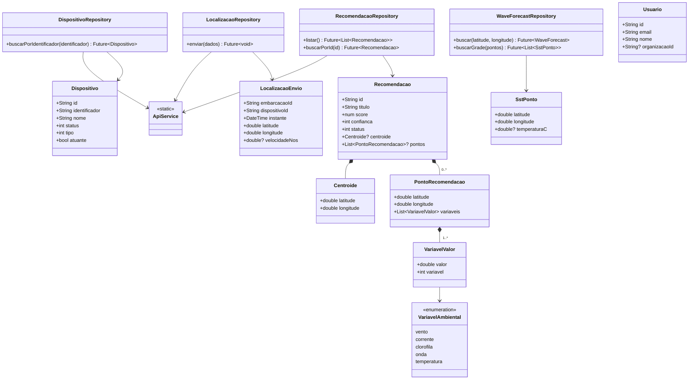
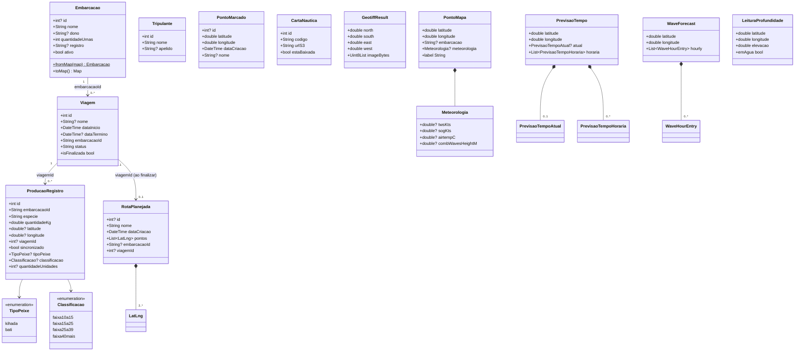

# Atlas Blue Ocean — Documentação Técnica

> Versão: 1.0.0+1 · Flutter ≥ 3.6.0 · Última atualização: 24 de Setembro de 2026

> **Mudanças estruturais desde a última atualização (Agosto→Setembro 2026)**, resumidas aqui pra quem já conhecia a versão anterior:
> - **Viagem e embarcação passaram a vir da retaguarda/plataforma**, não mais cadastradas no app — `CadastrarEmbarcacaoScreen`/`NovaViagemScreen` não existem mais; o app agora só *espelha* localmente a viagem ativa e a embarcação dela (`ContextoViagemService`, `ViagemRepository.buscarAtual()`, `EmbarcacaoRepository`).
> - **Rastreamento em segundo plano trocou de `workmanager` pra `flutter_foreground_task`** — serviço em primeiro plano de verdade (notificação persistente), não mais tarefa periódica de melhor esforço (ver §7.6).
> - **Modo Navegação no mapa** (estilo Waze): mapa gira acompanhando o rumo, inclinação pseudo-3D, barco 3D (`.glb`, via `flutter_3d_controller`) como marcador de posição, bússola do aparelho com opção de usar o giroscópio no lugar do magnetômetro.
> - Telas novas não documentadas na versão anterior: Configurar Alertas, Fase da Lua, Tábua de Maré (+ detalhe por porto, com modelo harmônico offline), Maré e Pesca de Atum, Análise de Rota.
> - Banco de dados na **versão 16** (era 12); 5 idiomas suportados (pt/en/es/fr/it, era pt/es/fr).

---

## Índice

1. [Visão Geral](#1-visão-geral)
2. [Configuração do Ambiente](#2-configuração-do-ambiente)
3. [Arquitetura do Projeto](#3-arquitetura-do-projeto)
4. [Estrutura de Pastas](#4-estrutura-de-pastas)
5. [Dependências](#5-dependências)
6. [Banco de Dados SQLite](#6-banco-de-dados-sqlite)
7. [Serviços Principais (`core/`)](#7-serviços-principais-core)
8. [Repositórios de API (`data/`)](#8-repositórios-de-api-data)
9. [Features — Telas e Funcionalidades](#9-features--telas-e-funcionalidades)
10. [Modelos de Dados](#10-modelos-de-dados)
11. [Armazenamento Local (Hive)](#11-armazenamento-local-hive)
12. [Assets](#12-assets)
13. [Fluxos Principais](#13-fluxos-principais)
14. [Permissões Android/iOS](#14-permissões-androidios)
15. [Convenções e Padrões](#15-convenções-e-padrões)
16. [Diagrama de Classes (UML)](#16-diagrama-de-classes-uml)
17. [Testes Automatizados](#17-testes-automatizados)
18. [Próximos Passos](#18-próximos-passos)

---

## 1. Visão Geral

**Atlas Blue Ocean** é um aplicativo móvel multiplataforma desenvolvido em Flutter para **embarcações pesqueiras**. Ele centraliza operações de navegação, rastreamento de posição, registro de produção (capturas), consulta de dados meteorológicos e recomendações de pesca, funcionando **predominantemente offline**, com sincronização oportunista com um backend próprio (Blue Ocean API) quando há conectividade.

### Funcionalidades principais

| Área | O que faz |
|------|-----------|
| **Mapa Offline** | Cartas náuticas em MBTiles, overlay de GeoTIFF e de PNG georreferenciado, mapa de ruas com cache, marcação de pontos (com retículo de precisão), planejamento de rotas (mesmo retículo, botão "Adicionar ponto"), rota entre registros de produção, grade de temperatura da superfície do mar (SST, múltiplos pontos), clorofila-a, índice de produtividade Blue Ocean (SST+clorofila), trilha ao vivo da viagem em andamento |
| **Modo Navegação (mapa)** | Vista estilo Waze: mapa gira acompanhando o rumo (course-up), inclinação pseudo-3D, barco 3D (`.glb`) como marcador de posição orientado pela bússola/giroscópio do aparelho, bússola circular sempre visível (pode ser desligada em favor do giroscópio) |
| **Meus Pontos** | Lista unificada (estilo da aba Recomendações) de pontos marcados manualmente + recomendações, com card de detalhe flutuante mostrando dados oceânicos ao vivo e produção associada a cada ponto |
| **Alerta de Rota** | Projeta um ponto a X milhas náuticas no rumo atual (GPS) ou simulado (a partir de um ponto marcado) e mostra vento, corrente, altura de onda e swell nesse ponto à frente; inclui bússola (magnetômetro) num card próprio |
| **Configurar Alertas** | Limiares individuais (liga/desliga + slider) por condição — vento, altura de onda/swell, corrente, temperatura — pra disparo da notificação de condição severa |
| **Rastreamento GPS** | Serviço em primeiro plano (`flutter_foreground_task`, notificação persistente) durante viagem em andamento — registra e sincroniza a posição no intervalo configurado, sobrevive ao app fechado |
| **Meteorologia** | Vento, correntes, previsão do tempo, ondas/swell, tábua de marés e profundidade/batimetria — via APIs públicas (Open-Meteo, Open-Meteo Marine, OpenTopoData) |
| **Fase da Lua** | Fase atual, próximas fases principais e horário de nascer/pôr da lua |
| **Tábua de Maré** | Portos salvos pelo usuário com modelo de maré por harmônicos — preamar/baixa-mar dos próximos dias, funciona **offline** depois de sincronizado uma vez |
| **Maré e Pesca de Atum** | Cruza sizígia/quadratura com a dinâmica que pode afetar a disponibilidade de atum — sempre como indicador de apoio à decisão, nunca como correlação direta com captura |
| **Análise de Rota** | Busca condições do mar (vento/onda/corrente/SST) pra cada ponto de uma rota planejada |
| **Notificação de Recomendação** | Avisa (notificação local) quando uma recomendação nova é gerada, checada pelo mesmo serviço em primeiro plano do rastreamento (só roda com viagem em andamento) |
| **Produção** | Registra capturas de pesca (tipo do peixe, classificação por faixa de peso, quantidade, posição GPS, viagem) com peso estimado calculado automaticamente; mostra histórico/totais e ranking de produção por ponto marcado |
| **Recomendação** | Exibe recomendações de pesca vindas do backend (score, confiança, variáveis ambientais, pontos sugeridos) |
| **Cartas Náuticas** | Gerencia, baixa e visualiza PDFs de cartas náuticas; permite solicitar novas cartas |
| **Rotas Planejadas** | Cria rotas desenhadas manualmente sobre o mapa (com retículo de precisão), ou geradas automaticamente a partir dos registros de produção de uma viagem (ao finalizá-la) |
| **Viagem** | Viagem ativa vem da retaguarda (`ContextoViagemService`) — app espelha localmente; tripulação, histórico de localizações da viagem, finalizar viagem |
| **Embarcação** | Vem da retaguarda (catálogo remoto), espelhada localmente — sem cadastro manual no app; configuração e foto da embarcação |
| **Autenticação** | Login real contra a Blue Ocean API, com opção de lembrar credenciais para login automático; sessão controlada pela expiração (`exp`) do JWT |
| **Configurações** | Intervalo de rastreamento, modo noturno, tema escuro, contato de emergência, embarcação ativa, idioma |
| **Teste de API / Dispositivo** | Ferramentas internas de debug para chamadas HTTP manuais, teste do registro de dispositivo e teste manual da notificação de recomendação |

### Stack Tecnológica

- **Frontend:** Flutter (Dart)
- **Banco de dados relacional:** SQLite via `sqflite` (dados locais: embarcação, viagens, produção, pontos, rotas)
- **Banco de dados NoSQL:** Hive via `hive_flutter` (preferências/tokens e histórico de chamadas de teste)
- **Mapas:** `flutter_map` com tiles MBTiles, overlay de GeoTIFF, overlay de PNG georreferenciado, grades de temperatura/clorofila/índice de produtividade (polígonos), cache de mapa de ruas
- **Modelo 3D:** `flutter_3d_controller` (renderiza `.glb` via WebView local/`model-viewer`, sem precisar de internet — ver §9.6) para o barco do Modo Navegação
- **GPS:** `geolocator`
- **Bússola:** `flutter_compass` (magnetômetro, usada em `AlertaRotaScreen` e no Modo Navegação do mapa)
- **Giroscópio:** `sensors_plus` — fonte alternativa de rumo no Modo Navegação, quando a bússola do aparelho é desligada
- **Notificações locais:** `flutter_local_notifications` (recomendação nova, condição severa)
- **Serviço em primeiro plano:** `flutter_foreground_task` (rastreamento contínuo durante viagem — substituiu `workmanager`, ver §7.6)
- **Armazenamento seguro:** `flutter_secure_storage` (ID de dispositivo no iOS; credenciais de login lembradas)
- **Backend:** Blue Ocean API (REST, `blue-ocean-app-api.up.railway.app`), consumida via `ApiService`
- **APIs externas:** Open-Meteo (previsão do tempo, grade de SST), Open-Meteo Marine (ondas, swell, corrente, maré), OpenTopoData (profundidade/batimetria)

---

## 2. Configuração do Ambiente

### Pré-requisitos

- Flutter SDK ≥ 3.6.0 (`flutter --version` para verificar)
- Dart SDK compatível com o Flutter instalado
- Android Studio ou VS Code com extensões Flutter/Dart
- Dispositivo Android físico ou emulador (recomendado físico para GPS)

### Como rodar o projeto

```bash
# 1. Clone o repositório
git clone <url-do-repositorio>
cd atlas

# 2. Instale as dependências
flutter pub get

# 3. Execute o app
flutter run
```

### Autenticação em ambiente de desenvolvimento

O login é feito contra a Blue Ocean API real (`ApiService.login` → `POST /api/v1/autenticacao`); não há credenciais fixas no código. É necessário um usuário válido cadastrado no backend. O token retornado é salvo (`Config`/Hive) e a sessão permanece válida até a expiração (`exp`) do JWT.

Marcando **"Lembrar minhas credenciais"** na tela de login, o usuário/senha são salvos no armazenamento seguro do aparelho (`flutter_secure_storage`) e, se o token salvo já tiver expirado num próximo acesso, o app tenta logar de novo sozinho (`AuthService.tentarLoginAutomatico`) antes de cair na tela de login — só exige login manual de novo depois de um `AuthService.logout()` explícito.

---

## 3. Arquitetura do Projeto

O projeto segue uma arquitetura **Feature-First**, com separação em até três camadas dentro de cada feature — mas nem toda feature usa as três:

```
feature/
├── domain/
│   └── models/        ← Entidades de dados (fromJson/fromMap/toMap, sem lógica de negócio)
├── data/               ← Repositórios (só nas features que falam com a API REST)
└── presentation/       ← Telas e widgets (Screens)
```

Hoje a maioria das features já tem `data/` — só `cartas` e `configuracoes` continuam acessando `DatabaseHelper` direto das telas. As demais têm repositório dedicado: `dispositivo`, `localizacao`, `recomendacao` (Blue Ocean API), `metereologia`, `mapa` (clorofila — Blue Ocean API), `producao` (`ProducaoRepository`/`EspecieRepository`), `viagem` (`ViagemRepository`/`PortoRepository`) e `embarcacao` (`EmbarcacaoRepository`) — as duas últimas fazem parte da mudança de 2026-09 que moveu criação/edição de viagem e embarcação pra retaguarda (ver nota no topo do documento e §9.5/§9.11).

A camada `core/` contém tudo que é compartilhado entre features:

```
core/
├── auth/               ← Autenticação (AuthService, JWT, Usuario, Organizacao)
├── background/         ← Handler do serviço em primeiro plano (rastreamento — flutter_foreground_task)
├── config/              ← Config (key-value sobre Hive) e Constantes de chaves
├── database/            ← DatabaseHelper (SQLite)
├── models/              ← Modelos usados por múltiplas features (ondas, SST)
├── network/              ← ApiService, Endpoints, exceções de rede
├── services/             ← Lógica de negócio reutilizável (GPS, mapas, sync, etc.)
├── storage/              ← ApiStorageService (Hive, ferramenta de debug)
└── utils/                ← Funções puras (formatação de coordenadas, proximidade)
```

### Dois mundos de persistência local + um remoto

| Camada | Tecnologia | Uso |
|---|---|---|
| **SQLite** | `sqflite`, via `DatabaseHelper` (CRUD genérico por nome de tabela, sem ORM) | Dados operacionais do app: embarcação, viagem, produção, localizações, pontos marcados, rotas, solicitações de carta |
| **Hive** | `hive_flutter`, chave-valor puro (sem `TypeAdapter`/`build_runner`) | `config` (preferências/tokens) e `api_responses` (histórico do Teste de API) |
| **Blue Ocean API** | REST via `ApiService`/repositórios em `data/` | Autenticação, dispositivo, localização (envio), recomendações |

### Padrões utilizados

| Padrão | Onde é usado |
|--------|-------------|
| **Singleton (instância)** | `DatabaseHelper.instance`, `LocationService()`, `LocationTrackingService()`, `StreetMapCacheService()` |
| **Namespace estático (singleton implícito, sem instância)** | `Config`, `ApiService`, `AuthService`, `NightModeService`, `DeviceIdService`, `SincronizacaoService`, `LocalizacaoReporterService`, `ProducaoReporterService` |
| **Repository** | `DispositivoRepository`, `LocalizacaoRepository`, `RecomendacaoRepository`, `PrevisaoTempoRepository`, `ProfundidadeRepository`, `WaveForecastRepository` |
| **Abstract Base Class** | `BaseMeteorologyCard` para os cards de meteorologia |
| **Isolates (compute)** | `GeotiffService` para não bloquear a UI ao processar imagens |
| **Estado global simples (`ValueNotifier`)** | `NightModeService.ativo`, consumido no `builder` do `MaterialApp` |

Não há gerenciador de estado global (Provider/Bloc/Riverpod) nem geração de código para modelos (`json_serializable`/`freezed`) — toda (de)serialização é manual.

---

## 4. Estrutura de Pastas

```
atlas/
├── assets/
│   ├── cartas/                        # Carta náutica PDF e MBTiles bundled
│   │   ├── Carta_Navegacao_Nordeste.pdf
│   │   └── OUTPUT_FILE.mbtiles        # Mapa base offline (sempre carregado)
│   ├── icons/                         # Ícones customizados / launcher icon
│   ├── overlays/                      # Pasta de referência para PNGs georreferenciados
│   └── json/
│       └── posicoes/
│           └── Routing3.json          # Pontos de rota de exemplo com dados meteorológicos
│
├── lib/
│   ├── main.dart                      # Ponto de entrada (Hive, tema, splash nativo, modo noturno)
│   ├── app_shell.dart                 # BottomNavigationBar: Home / Cartas / Mapa
│   │
│   ├── core/
│   │   ├── auth/
│   │   │   ├── auth_service.dart
│   │   │   ├── jwt_utils.dart
│   │   │   └── models/{usuario.dart, organizacao.dart}
│   │   ├── background/
│   │   │   └── location_foreground_task_handler.dart  # handler do serviço em 1º plano (flutter_foreground_task)
│   │   ├── config/
│   │   │   ├── config.dart
│   │   │   ├── constantes.dart
│   │   │   └── limiares_alerta.dart   # limiares configuráveis do alerta de condição severa
│   │   ├── database/
│   │   │   └── database_helper.dart
│   │   ├── models/
│   │   │   ├── sst_ponto.dart
│   │   │   └── wave_forecast.dart
│   │   ├── network/
│   │   │   ├── api_service.dart
│   │   │   ├── endpoints.dart
│   │   │   └── excecoes.dart
│   │   ├── services/
│   │   │   ├── alerta_condicao_notification_service.dart  # notificação de vento/onda/corrente severos
│   │   │   ├── battery_optimization_service.dart
│   │   │   ├── contexto_viagem_service.dart   # resolve viagem ativa + embarcação a partir do backend
│   │   │   ├── dados_ponto_cache_service.dart
│   │   │   ├── device_id_service.dart
│   │   │   ├── foto_embarcacao_service.dart
│   │   │   ├── geo_png_helper.dart
│   │   │   ├── geotiff_service.dart
│   │   │   ├── locale_service.dart            # idioma ativo (pt/en/es/fr/it)
│   │   │   ├── localizacao_reporter_service.dart
│   │   │   ├── location_service.dart
│   │   │   ├── location_tracking_service.dart # serviço em 1º plano, ver §7.6
│   │   │   ├── mbtiles_service.dart
│   │   │   ├── night_mode_service.dart
│   │   │   ├── theme_mode_service.dart        # tema claro/escuro/sistema
│   │   │   ├── pontos_service.dart
│   │   │   ├── producao_reporter_service.dart
│   │   │   ├── recomendacao_notification_service.dart  # notificação local de recomendação nova
│   │   │   ├── sincronizacao_service.dart
│   │   │   └── street_map_cache_service.dart
│   │   ├── storage/
│   │   │   └── api_storage_service.dart
│   │   └── utils/
│   │       ├── coordenadas_format.dart
│   │       ├── proximidade.dart               # + projetarPontoNoRumo (geodésia direta)
│   │       ├── cor_tema.dart
│   │       ├── erro_amigavel.dart
│   │       ├── fase_lua.dart
│   │       ├── indice_influencia_mare.dart
│   │       ├── nivel_operacional_mare.dart
│   │       └── severidade_condicoes.dart
│   │
│   └── features/
│       ├── api_tester/presentation/
│       │   └── api_tester_screen.dart
│       ├── auth/presentation/
│       │   └── login_screen.dart
│       ├── cartas/
│       │   ├── domain/models/carta_nautica.dart
│       │   └── presentation/
│       │       ├── cartas_screen.dart
│       │       ├── minhas_solicitacoes_screen.dart
│       │       ├── pdf_viewer_screen.dart
│       │       └── solicitar_cartas_screen.dart
│       ├── configuracoes/presentation/
│       │   └── configuracoes_screen.dart
│       ├── dashboard/presentation/
│       │   └── dashboard_screen.dart
│       ├── dispositivo/
│       │   ├── data/dispositivo_repository.dart
│       │   ├── domain/models/dispositivo.dart
│       │   └── presentation/dispositivo_teste_screen.dart
│       ├── embarcacao/                        # ver nota no topo: sem cadastro manual, vem da retaguarda
│       │   ├── data/
│       │   │   ├── embarcacao_repository.dart      # catálogo remoto (Blue Ocean API)
│       │   │   └── embarcacao_local_lookup.dart
│       │   ├── domain/models/{embarcacao.dart, embarcacao_remota.dart}
│       │   └── presentation/
│       │       ├── embarcacao_configuracao_screen.dart
│       │       ├── embarcacao_screen.dart
│       │       └── widgets/foto_embarcacao_picker.dart
│       ├── localizacao/
│       │   ├── data/localizacao_repository.dart
│       │   └── domain/models/localizacao_envio.dart
│       ├── mapa/
│       │   ├── data/clorofila_repository.dart # Blue Ocean API — leitura de clorofila-a num ponto
│       │   ├── domain/models/
│       │   │   ├── ponto_marcado.dart
│       │   │   ├── leitura_clorofila.dart
│       │   │   ├── indice_produtividade_blue_ocean.dart  # SST+clorofila → Ruim/Bom/Ótimo/Excelente
│       │   │   └── nivel_produtividade.dart
│       │   ├── presentation/
│       │   │   ├── mapa_screen.dart
│       │   │   ├── mapa_widget.dart           # ~3000 linhas — ver §9.6
│       │   │   └── meus_pontos_screen.dart    # pontos marcados + recomendações, lista unificada
│       │   └── widgets/
│       │       ├── barco_navegacao_3d.dart    # modelo 3D (.glb) do Modo Navegação
│       │       ├── compasso_circular.dart     # badge de rumo em graus (canto do mapa)
│       │       ├── dados_oceanicos_ponto.dart # profundidade/SST/corrente/maré de um ponto qualquer
│       │       ├── download_regiao_dialog.dart
│       │       ├── legenda_clorofila.dart
│       │       ├── legenda_grade_temperatura.dart
│       │       ├── mbtiles_tile_provider.dart
│       │       ├── meteorologia_sheet.dart
│       │       ├── ponto_marcado_list_tile.dart
│       │       └── street_map_tile_provider.dart
│       ├── metereologia/
│       │   ├── data/
│       │   │   ├── fase_lua_repository.dart
│       │   │   ├── previsao_tempo_repository.dart
│       │   │   ├── profundidade_repository.dart
│       │   │   └── wave_forecast_repository.dart
│       │   ├── domain/models/
│       │   │   ├── dia_lunar.dart
│       │   │   ├── leitura_profundidade.dart
│       │   │   ├── porto_mare.dart            # porto salvo + modelo harmônico de maré
│       │   │   └── previsao_tempo.dart
│       │   └── presentation/
│       │       ├── alerta_config_screen.dart  # limiares por condição do alerta de rota
│       │       ├── alerta_rota_screen.dart    # vento/corrente/onda/swell à frente + bússola
│       │       ├── condicoes_mar_screen.dart
│       │       ├── condicoes_ponto_screen.dart
│       │       ├── fase_lua_screen.dart
│       │       ├── mare_pesca_atum_screen.dart
│       │       ├── tabua_mare_screen.dart          # lista de portos salvos
│       │       └── tabua_mare_detalhe_screen.dart  # maré offline do porto (modelo harmônico)
│       ├── producao/
│       │   ├── data/{producao_repository.dart, especie_repository.dart}
│       │   ├── domain/
│       │   │   ├── classificacao_peso.dart
│       │   │   ├── especies_comuns.dart
│       │   │   ├── models/{producao_registro.dart, producao_envio.dart, especie_remota.dart}
│       │   │   └── services/
│       │   │       └── producao_pontos_analyzer.dart  # agrupa produção por ponto marcado
│       │   └── presentation/
│       │       ├── producao_historico_screen.dart
│       │       ├── producao_por_ponto_screen.dart      # ranking de produção por ponto
│       │       └── producao_screen.dart
│       ├── recomendacao/
│       │   ├── data/recomendacao_repository.dart
│       │   ├── domain/models/recomendacao.dart
│       │   └── widgets/
│       │       ├── recomendacao_card.dart
│       │       ├── recomendacao_confianca_dots.dart
│       │       ├── recomendacao_list_tile.dart
│       │       ├── recomendacao_ponto_card.dart
│       │       ├── recomendacao_pontos_list.dart
│       │       ├── recomendacao_score_badge.dart
│       │       ├── recomendacao_validade_chip.dart
│       │       ├── recomendacao_variavel_chip.dart
│       │       ├── recomendacao_widgets.dart      # barrel
│       │       └── recomendacoes_list.dart
│       ├── rotas/
│       │   ├── domain/models/rota_planejada.dart
│       │   └── presentation/
│       │       ├── minhas_rotas_screen.dart
│       │       └── analise_rota_screen.dart   # condições do mar por ponto de uma rota
│       ├── splash/
│       │   └── splash_screen.dart
│       ├── viagem/                            # ver nota no topo: viagem vem da retaguarda
│       │   ├── data/{viagem_repository.dart, porto_repository.dart}
│       │   ├── domain/models/
│       │   │   ├── tripulante.dart
│       │   │   ├── viagem.dart
│       │   │   ├── viagem_atual_remota.dart   # GET base/operacao/viagens/eu/atual
│       │   │   └── porto.dart
│       │   └── presentation/
│       │       ├── historico_localizacoes_screen.dart  # finalizar viagem fica aqui
│       │       └── nova_tripulacao.dart
│       └── widgets/
│           ├── base_meteorology_card.dart
│           ├── info_column.dart
│           ├── offline_dados_banner.dart
│           ├── posicao_atual_widget.dart
│           ├── posicao_manual_widget.dart
│           ├── position_card.dart
│           ├── profundidade_card.dart
│           ├── seletor_coordenada_widget.dart
│           ├── web_view_screen.dart
│           ├── previsao_tempo/
│           │   ├── condicoes_vento_card.dart
│           │   └── previsao_tempo_widgets.dart      # barrel
│           ├── mare_pesca_atum/                     # 7 widgets — gráficos e cards da tela dedicada
│           │   ├── comparacao_sizigia_quadratura_widget.dart
│           │   ├── estado_mare_card.dart
│           │   ├── explicacao_mare_dialogs.dart
│           │   ├── fluxo_influencia_widget.dart
│           │   ├── grafico_mare_24h.dart
│           │   ├── indice_influencia_card.dart
│           │   ├── janela_operacional_widget.dart
│           │   └── nivel_operacional_card.dart
│           └── wave_forecast/
│               ├── condicoes_atuais_card.dart
│               ├── fase_lua_card.dart
│               ├── mare_card.dart                   # tábua de marés (preamar/baixa-mar)
│               ├── sea_surface_temperature_card.dart
│               ├── tabela_solunar_card.dart
│               └── wave_forecast_widgets.dart       # barrel
│
└── pubspec.yaml
```

---

## 5. Dependências

### Principais

| Pacote | Versão | Finalidade |
|--------|--------|-----------|
| `http` | ^1.2.2 | Requisições HTTP (backend + APIs externas) |
| `sqflite` | ^2.3.3 | Banco de dados SQLite local |
| `path_provider` | ^2.1.5 | Diretórios do dispositivo |
| `path` | ^1.9.0 | Manipulação de caminhos |
| `pdfrx` | ^1.0.0 | Visualizador de PDF (cartas náuticas) |
| `geolocator` | ^13.0.0 | GPS e geolocalização |
| `flutter_foreground_task` | ^9.2.2 | Serviço em primeiro plano — rastreamento contínuo durante viagem (substituiu `workmanager`, ver §7.6) |
| `sensors_plus` | ^7.1.0 | Giroscópio — fonte alternativa de rumo no Modo Navegação do mapa |
| `flutter_3d_controller` | ^2.3.0 | Renderiza o modelo 3D (`.glb`) do barco no Modo Navegação — via WebView local, sem depender de internet |
| `permission_handler` | ^12.0.0 | Gerenciamento de permissões |
| `flutter_map` | ^7.0.2 | Mapa interativo offline (tiles, overlays, polígonos) |
| `latlong2` | ^0.9.1 | Operações com coordenadas |
| `file_picker` | ^8.1.6 | Seletor de arquivos do dispositivo (MBTiles, GeoTIFF, PNG de overlay) |
| `image` | ^4.5.0 | Processamento de GeoTIFF e leitura de metadados de PNG (`GeoPngHelper`) |
| `hive_flutter` | ^1.1.0 | Armazenamento NoSQL local (config e histórico de API) |
| `intl` | ^0.20.2 | Formatação de datas/números, i18n (pt/en/es/fr/it, ver `l10n.yaml`) |
| `flutter_secure_storage` | ^9.2.0 | Armazenamento seguro (ID de dispositivo no iOS; credenciais lembradas no login) |
| `device_info_plus` | ^12.4.0 | Dados descritivos do dispositivo |
| `android_id` | ^0.5.2+1 | ID estável de dispositivo Android |
| `battery_plus` | ^6.2.1 | Nível de bateria (enviado junto com a localização) |
| `flutter_native_splash` | ^2.4.3 | Splash screen nativa |
| `url_launcher` | ^6.3.1 | Abrir links/telefone/WhatsApp externos |
| `share_plus` | ^10.1.4 | Compartilhamento (ex: resumo de viagem) |
| `webview_flutter` | ^4.10.0 | WebView embutida (`WebViewScreen`) |
| `flutter_local_notifications` | ^18.0.1 | Notificação local de recomendação nova |
| `flutter_compass` | ^0.8.1 | Bússola (magnetômetro) na tela Alerta de Rota |

### Dev

| Pacote | Versão | Finalidade |
|--------|--------|-----------|
| `flutter_test` | SDK | Testes |
| `flutter_lints` | ^5.0.0 | Regras de lint |
| `flutter_launcher_icons` | ^0.14.3 | Geração do ícone do app a partir de `assets/icons/blue_ocean.png` |

---

## 6. Banco de Dados SQLite

**Arquivo:** `blue_ocean.db` (em `ApplicationDocumentsDirectory`)
**Gerenciado por:** `lib/core/database/database_helper.dart` — **Singleton** (`DatabaseHelper.instance`), atualmente na **versão 16** do schema (`onCreate`/`onUpgrade` incrementais desde a v2).

O `DatabaseHelper` expõe métodos genéricos CRUD reaproveitados por toda a app — não há DAO por entidade:

```dart
Future<int> insert(String table, Map<String, dynamic> data)
Future<List<Map<String, dynamic>>> query(String table)
Future<List<Map<String, dynamic>>> queryWhere(String table, {required String where, List<Object?>? whereArgs, String? orderBy})
Future<int> update(String table, Map<String, dynamic> data, {required int id})
Future<int> delete(String table, {required int id})
Future<int> deleteWhere(String table, {required String where, List<Object?>? whereArgs})
```

### Tabelas

#### `embarcacao`
| Coluna | Tipo | Descrição |
|--------|------|-----------|
| `id` | INTEGER PK | — |
| `nome` | TEXT | Nome da embarcação |
| `dono` | TEXT | Nome do proprietário |
| `quantidade_urnas` | INTEGER | Nº de compartimentos/urnas (default 1) |
| `registro` | TEXT | Código/placa (ex: PE-1234) |
| `data_cadastro` | TEXT | ISO 8601 |
| `ativo` | INTEGER | 1=ativo, 0=inativo |
| `capacidade_gelo_kg` | REAL | *(desde v4)* |
| `capacidade_diesel_litros` | REAL | *(desde v4)* |
| `numero_tripulantes` | INTEGER | *(desde v4)* |
| `mestre_id` | TEXT | *(desde v4)* |
| `motor_usado` | TEXT | *(desde v5)* |
| `foto` | TEXT | Caminho local da foto *(desde v6)* |
| `remoto_id` | TEXT | Id da embarcação no catálogo remoto — vincula a linha local espelhada ao `EmbarcacaoRemota` correspondente *(desde v16)*. Ver nota no topo do documento: cadastro/edição manual acabou, quem cria é a retaguarda. |

#### `viagem`
| Coluna | Tipo | Descrição |
|--------|------|-----------|
| `id` | INTEGER PK | — |
| `nome` | TEXT | Nome opcional da viagem |
| `data_inicio` | TEXT | ISO 8601 |
| `data_termino` | TEXT | ISO 8601 (nullable) |
| `embarcacao_id` | TEXT | ID da embarcação |
| `status` | TEXT | `'em_andamento'` ou `'finalizada'` |
| `remoto_id` | TEXT | UUID da viagem no backend *(desde v14)* — obrigatório pra `producao_registro` conseguir sincronizar (ver §7.7a). Um índice único parcial (`idx_viagem_unica_ativa`, migração v15) garante no máximo uma linha `status = 'em_andamento'` por vez. |

#### `localizacao_historico`
| Coluna | Tipo | Descrição |
|--------|------|-----------|
| `id` | INTEGER PK | — |
| `data_hora` | TEXT | ISO 8601 |
| `latitude` / `longitude` | REAL | Graus decimais |
| `velocidade` | REAL | m/s (nullable) |
| `precisao` | REAL | Metros (nullable) |
| `altitude` | REAL | *(desde v3)* |
| `direcao` | INTEGER | Rumo em graus *(desde v3)* |
| `bateria_nivel` | INTEGER | % de bateria no momento *(desde v3)* |
| `viagem_id` | INTEGER | FK lógica para `viagem.id` |
| `sincronizado` | INTEGER | 0=pendente, 1=enviado ao servidor |

#### `carta_nautica`
| Coluna | Tipo | Descrição |
|--------|------|-----------|
| `id` | INTEGER PK | — |
| `codigo` | TEXT UNIQUE | Código identificador da carta |
| `nome` | TEXT | Nome descritivo |
| `url_s3` | TEXT | URL para download no S3 |
| `caminho_local` | TEXT | Caminho local após download (nullable) |
| `data_publicacao` / `data_atualizacao` | TEXT | ISO 8601 |
| `esta_baixada` | INTEGER | 0=não baixada, 1=baixada |

#### `producao_registro`
| Coluna | Tipo | Descrição |
|--------|------|-----------|
| `id` | INTEGER PK | — |
| `embarcacao_id` | TEXT | ID da embarcação |
| `data_hora` | TEXT | ISO 8601 |
| `especie` | TEXT | Nome do tipo do peixe (`TipoPeixe.label`, ex: "Kihada") |
| `quantidade_kg` | REAL | Peso total estimado, em quilogramas |
| `latitude` / `longitude` | REAL | Posição da captura (nullable — GPS pode falhar sem bloquear o salvamento) |
| `precisao_metros` | REAL | Acurácia do GPS no momento da captura (nullable) *(desde v11)* |
| `carta_codigo` | TEXT | Referência da carta usada (nullable) |
| `observacao` | TEXT | Obs. livre (nullable) |
| `viagem_id` | INTEGER | FK lógica para `viagem.id` *(desde v7)* |
| `sincronizado` | INTEGER | 0=pendente, 1=enviado ao servidor |
| `tipo_peixe` | TEXT | `TipoPeixe.name` (`kihada`\|`bati`) *(desde v11)* |
| `classificacao` | TEXT | `Classificacao.name` (faixa de peso) *(desde v11)* |
| `quantidade_unidades` | INTEGER | Nº de peixes capturados *(desde v11)* |
| `peso_medio_unitario` | REAL | Ponto médio da faixa de peso usado no cálculo, em kg/unidade *(desde v11)* |

#### `ponto_marcado` *(desde v2, coluna `nome` desde v8)*
| Coluna | Tipo | Descrição |
|--------|------|-----------|
| `id` | INTEGER PK | — |
| `latitude` / `longitude` | REAL | Posição marcada manualmente no mapa |
| `data_criacao` | TEXT | ISO 8601 |
| `nome` | TEXT | Nome opcional do ponto |

#### `porto_mare` *(desde v13)*
| Coluna | Tipo | Descrição |
|--------|------|-----------|
| `id` | INTEGER PK | — |
| `nome` | TEXT | Nome do porto salvo pelo usuário (ex: "Porto de Itarema") |
| `latitude` / `longitude` | REAL | Posição do porto |
| `data_criacao` | TEXT | ISO 8601 |
| `constantes_json` | TEXT | Modelo de maré por harmônicos, ajustado a partir da série da Open-Meteo — permite calcular preamar/baixa-mar **offline**, sem nova chamada de rede (ver `TabuaMareDetalheScreen`, §9.7) |
| `sincronizado_em` | TEXT | ISO 8601, última vez que o modelo foi reajustado com dado fresco |

#### `solicitacao_carta` *(desde v9)*
| Coluna | Tipo | Descrição |
|--------|------|-----------|
| `id` | INTEGER PK | — |
| `latitude_texto` / `longitude_texto` | TEXT | Coordenadas formatadas do pedido |
| `data_solicitacao` | TEXT | ISO 8601 |

#### `rota_planejada` *(desde v10)*
| Coluna | Tipo | Descrição |
|--------|------|-----------|
| `id` | INTEGER PK | — |
| `nome` | TEXT | Nome da rota — gerado automaticamente (`"Produção · <embarcação> · <data>"`) quando vem de registros de produção, digitado pelo usuário quando desenhada à mão |
| `data_criacao` | TEXT | ISO 8601 |
| `embarcacao_id` | TEXT | Nullable — preenchida só em rotas geradas a partir de registros de produção *(desde v12)* |
| `viagem_id` | INTEGER | FK lógica para `viagem.id`, nullable, mesma origem que `embarcacao_id` *(desde v12)* |

#### `rota_planejada_ponto` *(desde v10)*
| Coluna | Tipo | Descrição |
|--------|------|-----------|
| `id` | INTEGER PK | — |
| `rota_planejada_id` | INTEGER | FK lógica para `rota_planejada.id` |
| `latitude` / `longitude` | REAL | Ponto da rota |
| `ordem` | INTEGER | Posição do ponto na sequência da rota |

> Não existe tabela `recomendacao` nem `tripulante` — recomendações vêm sempre da API (`RecomendacaoRepository`, sem cache local) e tripulantes ainda não são persistidos.

---

## 7. Serviços Principais (`core/`)

### 7.1 Config
**Localização:** `core/config/config.dart` — namespace estático sobre uma `Box<String>` do Hive (`config`), aberta sob demanda.

```dart
Config.obtem(String chave, [String valorPadrao = ''])  // → Future<String>
Config.grava(String chave, String valor)                // → Future<void>
Config.limpa(String chave)                               // → Future<void>
```

As chaves usadas ficam centralizadas em `Constantes` (`api`, `authToken`, `authCredencial`, `deviceId`, `organizacaoId`, `embarcacaoId`, `intervaloRastreamentoMinutos`, `modoNoturno`, `lembrarCredenciais`, `contatoEmergenciaWhatsapp`, `ocultarRecomendacoesExpiradas`, `temaModo`, `ultimaVerificacaoRecomendacoes`, `alcanceAlertaRotaMn`). É a base de armazenamento de quase todos os outros serviços.

---

### 7.2 ApiService
**Localização:** `core/network/api_service.dart` — namespace estático, cliente HTTP cru da Blue Ocean API.

```dart
ApiService.login(String usuario, String senha)   // POST /api/v1/autenticacao — salva token/credencial/organizacaoId
ApiService.get(String recurso)                   // → Future<dynamic>
ApiService.post(String recurso, dynamic data)
ApiService.put(String recurso, dynamic data)
ApiService.carga(String recurso, DateTime inicio) // pagina até esgotar
```

Lança `UnauthorisedException` em respostas `401`. Todos os repositórios do backend (`DispositivoRepository`, `LocalizacaoRepository`, `RecomendacaoRepository`) passam por aqui — os repositórios de APIs externas (Open-Meteo, OpenTopoData) chamam `http` diretamente, sem `ApiService`.

---

### 7.3 AuthService
**Localização:** `core/auth/auth_service.dart`

```dart
AuthService.login(usuario, senha, {bool lembrar = false})
// delega a ApiService.login; se lembrar=true, salva usuário/senha em flutter_secure_storage

AuthService.isLoggedIn()            // → bool, compara exp do JWT salvo com agora
AuthService.usuarioLogado()         // → Usuario? montado a partir da credencial salva + claims do JWT
AuthService.lembrarCredenciaisAtivo() // → bool, se há credencial salva pra login automático
AuthService.tentarLoginAutomatico() // → bool, tenta logar de novo com a credencial salva
AuthService.logout()                // limpa token/credencial/organizacaoId + credencial lembrada
```

Chamado pelo `LoginScreen` (login manual) e pelo `SplashScreen` (login automático, quando o token salvo já expirou e havia credencial lembrada).

---

### 7.4 DeviceIdService
**Localização:** `core/services/device_id_service.dart`

Obtém um ID estável do dispositivo: `AndroidId` no Android, Keychain (`flutter_secure_storage`, com fallback `identifierForVendor`) no iOS, e um ID persistente genérico (salvo via `Config`) nas demais plataformas. Também expõe `DeviceInfoResumo` (modelo, fabricante, SO, versão).

---

### 7.5 LocationService
**Localização:** `core/services/location_service.dart` — Singleton.

```dart
getCurrentPosition({accuracy, requestPermission})  // → Future<Position?>, trata permissões
decimalToDMS(double decimal, bool isLatitude)       // → String
```

---

### 7.6 LocationTrackingService
**Localização:** `core/services/location_tracking_service.dart` — Singleton.

Rastreamento de posição durante uma viagem — roda como **serviço em primeiro plano de verdade** (`flutter_foreground_task`, com notificação persistente), não mais como tarefa periódica do `workmanager` (mudança de 2026-09). Diferença que importa na prática: o WorkManager era melhor-esforço — o Android podia atrasar, agrupar ou simplesmente não rodar a tarefa com o app fechado, dependendo do fabricante e do modo Doze. Um serviço em primeiro plano com notificação continua rodando mesmo com o app fechado/removido dos recentes, e só para quando o mestre finaliza a viagem ou o sistema mata o app via "Forçar parada".

```dart
Future<bool> get isTracking  // consulta o sistema (FlutterForegroundTask.isRunningService), não um bool em memória
iniciarRastreamento({required int intervaloMinutos})
// configura canal de notificação (channelImportance: DEFAULT — importância baixa deixava a OneUI/Samsung
// dispensar a notificação com swipe mesmo sendo de serviço em 1º plano), pede permissão de notificação +
// isenção de otimização de bateria, e sobe o serviço (FlutterForegroundTask.startService)
pararRastreamento()          // FlutterForegroundTask.stopService()
getHistory({int? viagemId})  // → histórico em localizacao_historico
```

No iOS não existe "serviço em primeiro plano" — o rastreamento em background depende do modo de localização do sistema (`UIBackgroundModes` + permissão "Sempre" no `Info.plist`), não dessa notificação.

---

### 7.6a LocationForegroundTaskHandler
**Localização:** `core/background/location_foreground_task_handler.dart`

Handler que roda dentro da isolate própria do serviço em primeiro plano (`vm:entry-point`, reinicializa o Hive nela — não reaproveita a isolate principal do app). A cada disparo (`onStart`/`onRepeatEvent`, no intervalo configurado): captura a posição e grava/sincroniza (`LocalizacaoReporterService.registrarESincronizar`), checa recomendação nova (`RecomendacaoNotificationService.verificarNovas`) e condição severa à frente (`AlertaCondicaoNotificationService.verificarCondicoesAFrente`) — atualiza o texto da notificação a cada execução (hora do último envio + contador), pra o mestre distinguir "rodando" de "travado" só olhando a notificação.

---

### 7.7 LocalizacaoReporterService
**Localização:** `core/services/localizacao_reporter_service.dart` — orquestrador central do rastreamento (namespace estático).

```dart
registrarESincronizar({Position? posicaoConhecida})
// captura GPS + bateria, salva em localizacao_historico (sincronizado=0), chama sincronizarPendentes()

sincronizarPendentes()
// se não estiver logado, para o rastreamento; resolve embarcacaoId/dispositivoId reais
// (via DispositivoRepository + DeviceIdService) e envia cada pendência via LocalizacaoRepository,
// convertendo velocidade m/s → nós
```

Chamado pelo handler do serviço em primeiro plano (`LocationForegroundTaskHandler`, §7.6a) e por `PosicaoAtualWidget` na abertura do app.

---

### 7.7a ProducaoReporterService
**Localização:** `core/services/producao_reporter_service.dart` — mesmo padrão do `LocalizacaoReporterService`, adaptado pra `producao_registro` (namespace estático).

```dart
sincronizarPendentes()
// confere sessão; busca producao_registro com sincronizado=0
// por registro: pula se faltar tipo_peixe/classificacao/quantidade_unidades (pré-v11)
//               pula se não tiver viagem_id vinculado (obrigatório no backend)
//               adia se a viagem local ainda não tem remoto_id (POST de criação em andamento/falhou)
//               resolve especieId no catálogo (cache por tipo dentro da chamada) e envia via ProducaoRepository
// e marca sincronizado=1 por linha (um erro não trava a fila inteira)
```

**Integração real (2026-08).** O backend tem `POST base/resultado/capturas`
(`Endpoints.capturas`), mas o corpo é bem mais simples que o modelo local: só
`viagemId` (remoto), `especieId` (do catálogo genérico `base/resultado/especies`,
cadastrado na plataforma — o app só lista, nunca cria), `pesoKg`, `quantidade` e
`instante`. Não existe conceito de tipo/classificação de peixe nem dispositivo/
coordenada no backend. `ProducaoReporterService` resolve os dois IDs que faltam:
`especieId` via `EspecieRepository` (mapeando `TipoPeixe.kihada`/`bati` → "Atum", único
item de atum do catálogo) e o `viagemId` remoto via `viagem.remoto_id` (coluna nova,
preenchida a partir do `ViagemAtualRemota.id` que `ContextoViagemService` espelha, ver §7.17
— ou, quando o app ainda cria a viagem, pelo UUID que `ViagemRepository.criar()` retorna).
Um registro de produção só sincroniza depois que a viagem dele já sincronizou.
`ProducaoScreen._salvarProducao()` já chama `sincronizarPendentes()` (fire-and-forget)
depois de cada `insert` bem-sucedido — não precisa mexer no ponto de chamada.

---

### 7.8 MbtilesService
**Localização:** `core/services/mbtiles_service.dart`

Lê arquivos `.mbtiles` (SQLite) para servir tiles ao `flutter_map`. Auto-detecta convenção TMS vs. XYZ (eixo Y) na primeira requisição e cacheia o resultado (`_isTms`).

```dart
openFromAsset(String assetPath)   // copia do bundle na 1ª vez
open(String filePath)             // abre arquivo externo
getMetadata()                     // name, bounds, center, min/maxzoom
getTileBytes(int z, int x, int y)
```

---

### 7.9 GeotiffService
**Localização:** `core/services/geotiff_service.dart`

Extrai bounds geográficos de tags GeoTIFF (`ModelPixelScale`, `ModelTiepoint`, `ModelTransformation`) e decodifica os pixels em isolate (`compute`), redimensionando para no máximo 4096px.

```dart
load(String filePath) → Future<GeotiffResult>  // {north, south, east, west, imageBytes}
```

---

### 7.10 GeoPngHelper
**Localização:** `core/services/geo_png_helper.dart`

Lê os limites geográficos (bounds) de um PNG georreferenciado a partir de um metadado de texto (chunk `tEXt`) **embutido no próprio arquivo**, eliminando a necessidade de hardcodar coordenadas de overlay no código. É só leitura — a gravação do metadado é feita por uma ferramenta externa ao app, fora do escopo do Flutter.

```dart
GeoPngHelper.readBounds(File pngFile) → Future<LatLngBounds>
```

- Faz um parse leve do PNG (percorre os *chunks* via `img.PngDecoder().startDecode()`, sem decodificar os pixels) — rápido mesmo em imagens grandes.
- Procura a chave **`geo_bounds`**, com valor no formato `sw_lat=X;sw_lng=Y;ne_lat=X;ne_lng=Y`.
- Lança `Exception` com mensagem clara se o arquivo não for um PNG válido, o metadado estiver ausente ou malformado — tratada pela tela de mapa com fallback para bounds fixos (ver [9.6](#96-mapa-offline-mapa)).

---

### 7.11 PontosService
**Localização:** `core/services/pontos_service.dart`

Carrega pontos de exemplo/demonstração a partir de JSON nos assets (`assets/json/posicoes/`), incluindo dados meteorológicos completos por ponto (`PontoMapa` + `Meteorologia`).

---

### 7.12 NightModeService
**Localização:** `core/services/night_mode_service.dart`

Estado global (`ValueNotifier<bool> ativo`) do modo noturno — converte a UI para tons de vermelho (preserva a visão no escuro), aplicado no `builder` do `MaterialApp` em `main.dart`. Persistido via `Config`.

---

### 7.12a ThemeModeService
**Localização:** `core/services/theme_mode_service.dart`

Estado global (`ValueNotifier<ThemeMode> modo`) do tema claro/escuro/sistema — diferente do `NightModeService` (que é um filtro vermelho por cima da UI, não o tema de verdade). Mesmo padrão: `carregar()` lê de `Config` (chave `temaModo`), `alternar(ThemeMode)` atualiza o `ValueNotifier` e persiste. Consumido em `main.dart` (`_buildTheme(Brightness)` gera a variante clara/escura da mesma paleta) e exposto na tela de Configurações via `SegmentedButton<ThemeMode>`.

---

### 7.12b RecomendacaoNotificationService
**Localização:** `core/services/recomendacao_notification_service.dart` — namespace estático sobre `flutter_local_notifications`.

```dart
inicializar({void Function(String? payload)? aoTocarNotificacao})
// idempotente — cria o canal Android e pede a permissão de notificação (Android 13+)

verificarNovas()
// busca RecomendacaoRepository().listar(); na 1ª execução só grava a marca d'água
// (maior criadoEm visto) sem notificar; nas seguintes, notifica as recomendações
// com criadoEm posterior à marca salva e avança a marca — evita re-notificar
```

Chamado pelo mesmo serviço em primeiro plano do rastreamento de GPS (`LocationForegroundTaskHandler`, §7.6a), então só roda enquanto há uma viagem em andamento, no intervalo configurado pelo usuário (não é push de verdade, não depende de servidor/Firebase). No toque da notificação, `main.dart` usa um `GlobalKey<NavigatorState>` (`navigatorKey`) pra abrir `MeusPontosScreen`. Tem um botão de teste manual em `DispositivoTesteScreen` (zera a marca d'água e chama `verificarNovas()` na hora, sem esperar o próximo disparo do serviço).

---

### 7.13 SincronizacaoService
**Localização:** `core/services/sincronizacao_service.dart`

Ponto de entrada de sincronização inicial (chamado pelo Dashboard): resolve o `deviceId`, busca o `Dispositivo` correspondente e a lista de `Recomendacao` do backend, retornando os dois num `ResultadoSincronizacao`.

---

### 7.14 StreetMapCacheService
**Localização:** `core/services/street_map_cache_service.dart` — Singleton.

Cache em disco de tiles do OpenStreetMap (`<documents>/street_cache/{z}/{x}/{y}.png`), com download sob demanda e download em lote de uma região (`baixarRegiao`, com progresso via `Stream<ProgressoDownload>` e `CancelToken`).

---

### 7.15 FotoEmbarcacaoService
**Localização:** `core/services/foto_embarcacao_service.dart`

```dart
FotoEmbarcacaoService.salvar(String origemPath) → Future<String>
// copia para <documents>/embarcacao_fotos/embarcacao_<timestamp><ext>
```

---

### 7.16 ApiStorageService
**Localização:** `core/storage/api_storage_service.dart` — Hive, box `api_responses`.

Persiste respostas HTTP da tela de Teste de API (`ApiEntry`): `save`, `getAll` (mais recente primeiro), `delete`, `clear`, `count`.

---

### 7.17 ContextoViagemService
**Localização:** `core/services/contexto_viagem_service.dart` — namespace estático.

Resolve o contexto operacional a partir da viagem ativa do usuário **no backend**: busca a viagem (`ViagemRepository.buscarAtual()`), e a partir do `embarcacaoId` dela, resolve/espelha a embarcação. Reflete o novo desenho de 2026-09 (ver nota no topo do documento): antes tanto viagem quanto embarcação eram cadastradas manualmente no app; agora as duas só existem na retaguarda, e o app espelha localmente o que a viagem ativa aponta — nunca cria nem edita nenhuma das duas.

```dart
resolverAoLogar(DatabaseHelper dbHelper)   // chamado pelo LoginScreen após login — nunca lança
sincronizar(DatabaseHelper dbHelper) → Future<bool>
// chamável a qualquer momento (botões "Sincronizar" no Dashboard e em EmbarcacaoConfiguracaoScreen)
// true = achou e sincronizou viagem ativa; false = sem viagem ativa OU erro de rede (não distingue os dois)
```

Best-effort de propósito (mesmo padrão de `SincronizacaoService`): nunca trava nem falha visivelmente — sem viagem ativa ou erro de rede/backend, o app segue com o que já tinha localmente. A sincronização local (`_sincronizarViagemLocal`) nunca sobrescreve nem finaliza uma viagem `em_andamento` local diferente da que veio do backend (só registra no log) — proteção contra perder rastreamento/produção em andamento por um conflito de sincronização.

---

### 7.18 AlertaCondicaoNotificationService
**Localização:** `core/services/alerta_condicao_notification_service.dart`

Notificação (com vibração) quando vento, corrente, onda ou swell no ponto à frente da embarcação ficam severos — checado tanto em primeiro plano (`AlertaRotaScreen`, a cada busca) quanto em segundo plano (`LocationForegroundTaskHandler`, durante uma viagem em andamento), pelo mesmo método, pra não duplicar a lógica de limiar em dois lugares. Canal e inicialização independentes de `RecomendacaoNotificationService` (plugins/canais separados, mesmo pacote). Limiares configuráveis por condição na `AlertaConfigScreen` (ver `core/config/limiares_alerta.dart`, §9.7). Intervalo mínimo de 1h entre duas notificações da mesma condição severa persistente, pra não notificar de novo a cada checagem em segundo plano.

---

### 7.19 BatteryOptimizationService
**Localização:** `core/services/battery_optimization_service.dart`

Helper pequeno em torno de `FlutterForegroundTask.isIgnoringBatteryOptimizations`/`requestIgnoreBatteryOptimization` — usado por `LocationTrackingService` (§7.6) na hora de iniciar o rastreamento, e exposto também nas Configurações pra o mestre checar/pedir a isenção manualmente se o rastreamento estiver sendo interrompido pelo sistema.

---

### 7.20 DadosPontoCacheService
**Localização:** `core/services/dados_ponto_cache_service.dart`

Cache em memória (TTL curto) de consultas repetidas de dados oceânicos por coordenada — evita rechamar `WaveForecastRepository`/`ProfundidadeRepository`/`ClorofilaRepository` várias vezes seguidas pro mesmo ponto (ex: abrir o mesmo ponto marcado de novo logo em seguida, ou telas diferentes consultando a mesma posição). Não persiste em disco — zera a cada reabertura do app.

---

### 7.21 LocaleService
**Localização:** `core/services/locale_service.dart`

Estado global do idioma ativo (`ValueNotifier<Locale>`), mesmo padrão de `NightModeService`/`ThemeModeService` — persistido via `Config`, consumido no `builder` do `MaterialApp` (`main.dart`) e exposto na tela de Configurações. Idiomas suportados: pt (padrão/template do `l10n.yaml`), en, es, fr, it.

---

## 8. Repositórios de API (`data/`)

| Repository | Métodos | Backend |
|---|---|---|
| `DispositivoRepository` (`features/dispositivo/data`) | `buscarPorIdentificador(String identificador) → Future<Dispositivo>` | Blue Ocean API, via `ApiService` |
| `LocalizacaoRepository` (`features/localizacao/data`) | `enviar(LocalizacaoEnvio dados) → Future<void>` | Blue Ocean API, via `ApiService` |
| `RecomendacaoRepository` (`features/recomendacao/data`) | `listar() → Future<List<Recomendacao>>`, `buscarPorId(String id) → Future<Recomendacao>` | Blue Ocean API, via `ApiService` |
| `PrevisaoTempoRepository` (`features/metereologia/data`) | `buscar({latitude, longitude}) → Future<PrevisaoTempo>` | Open-Meteo (`http` direto) |
| `ProfundidadeRepository` (`features/metereologia/data`) | `buscarPonto(...)`, `buscarVarios(List<LatLng>)` | OpenTopoData/GEBCO (`http` direto) |
| `WaveForecastRepository` (`features/metereologia/data`) | `buscar({latitude, longitude}) → Future<WaveForecast>` (onda, swell, corrente, SST, **maré**), `buscarGrade(List<LatLng> pontos) → Future<List<SstPonto>>` | Open-Meteo Marine (`http` direto) |
| `FaseLuaRepository` (`features/metereologia/data`) | `buscar({latitude, longitude, ...}) → Future<List<DiaLunar>>` | Open-Meteo (`http` direto) |
| `ClorofilaRepository` (`features/mapa/data`) | `buscarPonto({latitude, longitude}) → Future<LeituraClorofilaPonto>` | Blue Ocean API, via `ApiService` |
| `ProducaoRepository` (`features/producao/data`) | `enviar(ProducaoEnvio dados) → Future<void>` | Blue Ocean API — `POST base/resultado/capturas`, via `ApiService` |
| `EspecieRepository` (`features/producao/data`) | `listar({String? nome}) → Future<List<EspecieRemota>>` | Blue Ocean API — `base/resultado/especies/indice`, catálogo só-leitura |
| `ViagemRepository` (`features/viagem/data`) | `criar(...) → Future<String>` (retorna o UUID gerado pelo backend), `buscarAtual() → Future<ViagemAtualRemota?>` | Blue Ocean API — `base/operacao/viagens` |
| `PortoRepository` (`features/viagem/data`) | `listar({nome, codigo}) → Future<List<Porto>>`, `criarOuReaproveitar(...) → Future<Porto>` | Blue Ocean API — `base/operacao/portos` |
| `EmbarcacaoRepository` (`features/embarcacao/data`) | `listar({String? nome}) → Future<List<EmbarcacaoRemota>>`, `buscarPorId(String id) → Future<EmbarcacaoRemota?>` | Blue Ocean API — `base/operacao/embarcacoes`, catálogo só-leitura (não cria/edita) |

`buscarGrade` pede a SST atual (`current`, não `hourly` — mais leve) de vários pontos numa única chamada, usando listas separadas por vírgula nos parâmetros `latitude`/`longitude` da Open-Meteo; usado pela grade de temperatura do mapa (ver [9.6](#96-mapa-offline-mapa)).

Endpoints do backend próprio ficam centralizados em `core/network/endpoints.dart` (`Endpoints.euOrganizacoes`, `Endpoints.dispositivoPorIdentificador`, `Endpoints.recomendacoes`/`recomendacaoPorId`, `Endpoints.localizacaoDispositivo`, `Endpoints.viagens`/`viagemAtual`, `Endpoints.portos`/`portosIndice`, `Endpoints.embarcacoesIndice`/`embarcacaoPorId`, `Endpoints.especiesIndice`, `Endpoints.capturas`).

---

## 9. Features — Telas e Funcionalidades

### 9.1 Splash (`splash/`)
**Tela:** `SplashScreen` — decide o destino inicial (`AppShell` vs `LoginScreen`) com base em `AuthService.isLoggedIn()`. Se o token salvo expirou mas há credencial lembrada, tenta `AuthService.tentarLoginAutomatico()` antes de decidir. Reconfirma o estado do rastreamento via `LocationTrackingService`.

### 9.2 Login (`auth/`)
**Tela:** `LoginScreen` — formulário de usuário/senha, checkbox **"Lembrar minhas credenciais"**, chama `AuthService.login(usuario, senha, lembrar: ...)` (backend real) → navega para `AppShell` em caso de sucesso. Com "lembrar" marcado, a credencial fica salva em `flutter_secure_storage` para login automático futuro (ver [7.3](#73-authservice)).

### 9.3 Dashboard (`dashboard/`)
**Tela:** `DashboardScreen` — tela inicial (aba "Home"). Dispara `SincronizacaoService.sincronizar()`, exibe posição GPS ao vivo, viagem em andamento, estatísticas, recomendações e atalhos para as demais features. Se houver viagem ativa, inicia o rastreamento automaticamente.

### 9.4 Cartas Náuticas (`cartas/`)
**Telas:** `CartasScreen` (lista/baixa cartas com busca), `PdfViewerScreen` (zoom/pan via `pdfrx`), `SolicitarCartaScreen` (formulário de pedido, salvo em `solicitacao_carta`), `MinhasSolicitacoesScreen` (lista os pedidos feitos).

### 9.5 Embarcação (`embarcacao/`)
**Telas:** `EmbarcacaoScreen`, `EmbarcacaoConfiguracaoScreen`; widget `FotoEmbarcacaoPicker` (usa `FotoEmbarcacaoService`).

> ⚠️ **Sem cadastro manual desde 2026-09.** `CadastrarEmbarcacaoScreen` não existe mais — a embarcação vem do catálogo remoto (`EmbarcacaoRepository`, `base/operacao/embarcacoes`) e é espelhada localmente a partir do `embarcacaoId` da viagem ativa (`ContextoViagemService`, ver §7.17). `EmbarcacaoConfiguracaoScreen` continua existindo, mas hoje é mais um ponto de "Sincronizar" (chama `ContextoViagemService.sincronizar`) do que um formulário de edição — os campos que o catálogo remoto ainda não traz (capacidade de gelo/diesel, tripulação, mestre, motor) ficam nulos e não são mais editáveis à mão.

### 9.6 Mapa Offline (`mapa/`)
**Telas:** `MapaScreen` (container) → `MapaWidget` (mapa principal, autocontido, ~3000 linhas — concentra navegação, camadas, overlays, diálogos e o Modo Navegação).

Suporta os modos:

| Modo | Como ativar |
|------|------------|
| **MBTiles bundled** | Carregado automaticamente ao abrir (`OUTPUT_FILE.mbtiles`) |
| **MBTiles externo** | Botão de pasta na AppBar → file picker |
| **GeoTIFF** | Botão de pasta na AppBar → selecionar `.tif/.tiff` |
| **Mapa de ruas** | Alterna camada, com cache via `StreetMapCacheService` |

**Camadas do mapa (ordem de renderização):**
1. `TileLayer` — MBTiles (`MbtilesTileProvider`) ou mapa de ruas (`StreetMapTileProvider`)
2. `OverlayImageLayer` — GeoTIFF (se modo GeoTIFF ativo)
3. `OverlayImageLayer` — PNG georreferenciado escolhido pelo usuário
4. `MarkerLayer` — calor de produção (círculos proporcionais ao total em kg)
5. `PolygonLayer` + `MarkerLayer` — grade de temperatura da superfície do mar (SST, múltiplos pontos)
6. `PolygonLayer`/`MarkerLayer` — clorofila-a e índice de produtividade Blue Ocean
7. `PolylineLayer` — trilha ao vivo da viagem em andamento
8. `PolylineLayer` — rota sendo planejada manualmente
9. `PolylineLayer` + `MarkerLayer` — rota entre registros de produção (ícones de peixe)
10. `MarkerLayer` — pontos marcados manualmente, pontos de recomendação, rota de histórico
11. `MarkerLayer` — posição GPS: ícone estático (mapa embutido no Dashboard) ou o barco 3D (mapa em tela cheia, ver Modo Navegação abaixo)

**Sobreposição de PNG georreferenciado:** o botão de camadas (ícone de "layers") abre um diálogo (`AlertDialog`) explicando o fluxo e, ao confirmar, abre o seletor de arquivos (`FilePicker`, filtrado para `.png` — no Android inclui a galeria de fotos como origem). Os bounds (sudoeste/nordeste) são lidos automaticamente do metadado `geo_bounds` embutido no arquivo via `GeoPngHelper.readBounds`. Se o PNG não tiver o metadado, o app cai num retângulo fixo de fallback e avisa o usuário por `SnackBar`, em vez de travar. Toque curto no botão liga/desliga a camada já carregada; toque longo reabre o diálogo para trocar de imagem. Um slider ajusta a opacidade em tempo real (padrão 80%).

**Grade de temperatura (SST):** menu lateral → "Temperatura da superfície do mar". Cada consulta abre o mesmo seletor de posição (retículo no centro do mapa + coordenada exibida) usado em "Marcar um ponto", e ao confirmar busca a SST daquele ponto (`WaveForecastRepository.buscarGrade`) e desenha um quadrado colorido (verde = mais frio → amarelo → laranja = mais quente, normalizado pelo mín./máx. dos pontos já consultados) com o valor em cima. **Suporta múltiplos pontos simultâneos** — um botão "+" flutuante adiciona mais um sem substituir os já consultados (antes, cada nova consulta substituía a anterior); tocar num ponto abre um diálogo com o valor exato e a opção de remover só aquele. Não há mais legenda de escala fixa no canto da tela — o valor de cada ponto já aparece escrito em cima do quadrado colorido. Os números somem abaixo do zoom 8 para não se sobreporem — a cor de fundo continua visível em qualquer zoom.

**Clorofila-a e Índice de Produtividade Blue Ocean:** mesmo padrão de múltiplos pontos + botão "+" da grade de temperatura. Clorofila-a vem da Blue Ocean API (`ClorofilaRepository`); o Índice de Produtividade (`IndiceProdutividadeBlueOcean.calcular`) combina clorofila-a + SST num nível único (Ruim/Bom/Ótimo/Excelente) — sempre com uma frase curta explicando os fatores (ex: "Clorofila-a: Ótimo (0,19 mg/m³) · Temperatura: Bom (24,8 °C)"), tratado explicitamente como estimativa heurística, nunca como garantia de cardume.

**Trilha ao vivo da viagem:** menu lateral → "Trilha da viagem". Desenha o trajeto da viagem em andamento (`localizacao_historico`) e se atualiza sozinha a cada 60s enquanto ligada — best-effort, o intervalo real de gravação é o do rastreamento (`LocationTrackingService`), a atualização de 60s só garante que a linha reflete o ponto mais recente já gravado sem exigir sair e voltar ao mapa.

**Rota entre registros de produção:** ao vir de "Ver no mapa" em `ProducaoHistoricoScreen`, cada registro de produção com coordenada vira um marcador (ícone de peixe) e, havendo 2 ou mais, uma linha os liga em ordem cronológica — estilo Waze/Google Maps, mesmo padrão visual da rota de histórico de GPS, mas em laranja. Essa rota **não tem botão de salvar** — o salvamento como rota planejada acontece automaticamente ao finalizar a viagem correspondente (ver [9.11](#911-viagem-viagem)).

**Ponto marcado:** tocar num ponto marcado abre um diálogo com coordenadas, data, distância/rumo até a posição atual, e dados oceânicos do próprio ponto — widget compartilhado `DadosOceanicosPonto` (profundidade, temperatura da superfície do mar, **corrente** e **maré**, todos buscados pelas coordenadas do ponto, não pelo GPS), mais a produção total já registrada perto dali (`ProducaoPorPonto`, ver [9.8](#98-produção-producao)). Ações: **Solicitar Carta** (pré-preenche `SolicitarCartaScreen` com a coordenada), **Consultar aqui** (abre `CondicoesPontoScreen`, travada nessa coordenada — ver [9.7](#97-meteorologia-metereologia)) e **Remover**.

**Meus Pontos** (`MeusPontosScreen`, acessível por um ícone ao lado do botão de GPS no mapa): lista, no mesmo estilo visual da aba Recomendações (linhas com acento lateral colorido, divisor fino, card de detalhe flutuante), os pontos marcados e as recomendações juntos — reaproveita `RecomendacaoListTile`/`RecomendacaoCard` para as recomendações e um novo `PontoMarcadoListTile`/`_DetalhePontoMarcado` para os pontos marcados, ambos abrindo o detalhe no mesmo chrome de diálogo.

**Precisão ao marcar pontos e planejar rotas:** tanto "Marcar um ponto" quanto "Planejar rota" usam o mesmo retículo fixo no centro da tela + coordenada exibida em tempo real, em vez de um toque direto no mapa (o dedo cobre o ponto exato e não dá controle fino). Ao planejar rota, o botão "Adicionar ponto" usa a posição apontada pelo retículo; tocar diretamente num ponto já marcado no mapa continua funcionando como atalho (usa a coordenada exata já salva, sem depender de acertar o toque).

**Modo Navegação (vista estilo Waze):** botão dedicado no mapa liga/desliga uma vista de navegação — o mapa recentraliza e gira sozinho acompanhando o rumo (course-up, `moveAndRotate`), com uma inclinação pseudo-3D (`Transform` com matriz de perspectiva) simulando uma câmera de navegação. O marcador de posição vira um modelo 3D do barco (`assets/icons/fishing-boat.glb`, renderizado via `flutter_3d_controller`/WebView local — **não depende de internet**, o modelo e o motor de renderização (`model-viewer`) vêm empacotados no próprio app); a câmera orbita suavemente ao redor do modelo conforme o rumo muda (filtro de suavização + transição animada, não o ícone em si girando). O rumo vem da bússola do aparelho (`CompassoCircular`, badge de graus no canto do mapa, sempre visível) por padrão, ou do **giroscópio** (`sensors_plus`, integração da velocidade angular) se a bússola for desligada no menu lateral — útil perto de motor/metal, onde o magnetômetro sofre interferência; nesse caso o badge de graus some (deixa de representar um rumo bussolar de verdade). A reorbitação do barco 3D pausa automaticamente enquanto o usuário arrasta/dá pinça no mapa, pra não competir com o gesto.

**Otimizações de performance do mapa:** o rumo do sensor é propagado via `ValueNotifier` (não `setState`) pra evitar reconstruir a árvore inteira do mapa a cada leitura; há throttle na frequência de processamento da bússola, um limiar angular antes de de fato girar o mapa no Modo Navegação (girar é um repaint caro do canvas inteiro), `RepaintBoundary` isolando a WebView do barco 3D do resto do canvas, e precisão de GPS adaptativa (alta só durante o Modo Navegação). O preview do mapa embutido no Dashboard (`MapaWidget(navegacaoTempoReal: false)`) não roda nenhum desses streams contínuos nem a WebView 3D — só um ícone estático de posição, pra não pagar esse custo toda vez que o app abre no Home.

**Outras interações do mapa:**
- Toque no label de um ponto → `MeteorologiaSheet` (bottom sheet com vento, movimento, atmosfera, ondas)
- Download de região do mapa de ruas para uso offline (`DownloadRegiaoDialog`)

**GPS:** estratégia de duas fases — `getLastKnownPosition()` (instantâneo) → `getCurrentPosition()` (fix fresco em segundo plano). Fora do fix único inicial, o mapa mantém um stream contínuo de GPS/bússola enquanto a tela está aberta (ver "Modo Navegação" acima).

### 9.7 Meteorologia (`metereologia/`)
**Telas:**
- `CondicoesMarScreen` — temperatura da água, corrente, ondas/swell, **maré** (`MareCard`) e clima na posição atual da embarcação (GPS) ou numa posição informada manualmente (`PosicaoAtualWidget` + `PosicaoManualWidget`).
- `CondicoesPontoScreen` — mesma informação, mas **travada num único ponto de referência** (latitude/longitude fixos, recebidos por parâmetro) — sem GPS nem campo de posição manual, então não tem como trocar de posição sem querer no meio da consulta. Usada a partir de "Consultar aqui" no diálogo de um ponto marcado no mapa.
- `AlertaRotaScreen` — ver [9.17](#917-alerta-de-rota-metereologia).
- `AlertaConfigScreen` — configura os limiares do alerta de condição severa (`AlertaCondicaoNotificationService`, §7.18): um card por condição (vento, altura de onda/swell, corrente, temperatura), cada um com liga/desliga e slider de limiar (`core/config/limiares_alerta.dart`). Salva a cada mudança, sem botão "Salvar" separado.
- `FaseLuaScreen` — fase atual da lua, próximas fases principais (Nova/Quarto Crescente/Cheia/Quarto Minguante) e nascer/pôr da lua (`FaseLuaRepository`, `DiaLunar`).
- `TabuaMareScreen` — lista de portos salvos pelo usuário pra consulta de maré (tabela `porto_mare`); cada porto guarda um modelo de maré por harmônicos ajustado a partir da série da Open-Meteo.
- `TabuaMareDetalheScreen` — maré de um porto salvo: altura prevista agora + preamares/baixa-mares dos próximos dias, calculadas pelo modelo harmônico local. Funciona **sem internet** depois de sincronizado ao menos uma vez; um botão de sincronizar busca série nova e reajusta o modelo (precisa de conexão).
- `MarePescaAtumScreen` — inteligência oceanográfica de apoio à decisão: explica sizígia/quadratura e relaciona a maré com a dinâmica que pode afetar a disponibilidade de atum (correntes, mistura, distribuição de presas) — **nunca afirma correlação direta entre fase da maré e captura** (`calcularIndiceInfluenciaMare`/`calcularNivelOperacionalMare`, `core/utils/`). Widgets dedicados em `features/widgets/mare_pesca_atum/` (gráfico de maré 24h, comparação sizígia×quadratura, índice de influência, janela/nível operacional).

Os dados de vento/onda/maré/profundidade vêm de APIs externas via `PrevisaoTempoRepository`/`ProfundidadeRepository`/`WaveForecastRepository`/`FaseLuaRepository` (Open-Meteo). A antiga tela de Gribs (`vento.json`/`correntes.json` locais) foi removida — não há mais consulta de dados fora dessas telas.

**Tábua de marés (cálculo ao vivo, sem porto salvo):** `WaveForecastRepository.buscar()` já pede `sea_level_height_msl` junto com onda/swell/corrente/SST (mesma chamada, sem custo extra de rede). `WaveForecast.eventosMare` (getter em `core/models/wave_forecast.dart`) calcula os picos/vales dessa série horária — cada ponto onde a curva muda de direção é uma preamar (`TipoMare.alta`) ou baixa-mar (`TipoMare.baixa`), já que a Open-Meteo não expõe esses horários prontos. `MareCard` mostra o nível atual + os próximos eventos; `DadosOceanicosPonto` mostra uma linha compacta ("X m (preamar às HH:mm)").

**Tábua de marés offline (porto salvo):** diferente do cálculo ao vivo acima, `TabuaMareDetalheScreen` usa um **modelo de maré por harmônicos** (ajustado uma vez a partir da série da Open-Meteo e salvo em `porto_mare.constantes_json`) — permite calcular preamar/baixa-mar dos próximos dias sem nenhuma chamada de rede, útil em viagem longa sem sinal.

### 9.8 Produção (`producao/`)
**Tela:** `ProducaoScreen` — registro de captura com os campos, nessa ordem:
1. **Tipo do peixe** — seletor de chave (`SegmentedButton`, não um combo) entre Kihada e Bati.
2. **Classificação** — combo com as faixas de peso (`10-15`, `15-25`, `25-39`, `40+` kg), cada item mostrando o intervalo de peso médio por unidade.
3. **Quantidade** — número inteiro de peixes capturados.
4. **Peso estimado** — card somente leitura, recalculado a cada mudança de classificação/quantidade: `quantidade × [peso mínimo, peso máximo]` da faixa (intervalo, não um único valor — ver [`classificacao_peso.dart`](#producaoregistro-featuresproducaodomainmodels)).
5. **Observação** (opcional).

Ao salvar: tenta capturar o GPS (`LocationService`); se falhar, salva mesmo assim sem coordenada, avisando por `SnackBar` (GPS não é obrigatório). O registro grava `quantidadeKg`/`pesoMedioUnitario` usando o **ponto médio** da faixa (o intervalo é só uma estimativa mostrada durante o lançamento).

**Tela:** `ProducaoHistoricoScreen` — histórico e totais por espécie/tipo, exportação CSV, botão **"Ver no mapa"** que abre o mapa com a rota entre os registros geolocalizados dessa lista (ver [9.6](#96-mapa-offline-mapa)), e botão **"Produção por ponto"**.

**Tela:** `ProducaoPorPontoScreen` — ranking dos pontos marcados mais produtivos: `agruparProducaoPorPonto` (`producao_pontos_analyzer.dart`) associa cada registro de produção com coordenada ao ponto marcado mais próximo dentro de um raio fixo (5 mn, haversine via `calcularDistanciaNauticas`), soma o total em kg e a espécie em destaque por ponto, e ordena do mais produtivo pro menos. O mesmo cálculo alimenta a linha "Produção aqui" no diálogo de detalhe de um ponto marcado (ver [9.6](#96-mapa-offline-mapa)).

### 9.9 Recomendação (`recomendacao/`)
Sem tela própria — é uma biblioteca de widgets (`RecomendacaoCard`, `RecomendacaoListTile`, `RecomendacaoPontoCard`, `RecomendacaoScoreBadge`, `RecomendacaoConfiancaDots`, `RecomendacaoValidadeChip`, `RecomendacaoVariavelChip`, `RecomendacoesList`) embutida em `dashboard`, `mapa` e `dispositivo`, alimentada por `RecomendacaoRepository`.

### 9.10 Rotas (`rotas/`)
**Tela:** `MinhasRotasScreen` — lista/gerencia rotas planejadas (CRUD local em `rota_planejada`/`rota_planejada_ponto`). Cada item mostra um ícone diferente conforme a origem: peixe/laranja para rotas geradas de registros de produção (`embarcacaoId != null`), rota/roxo para rotas desenhadas à mão no mapa (ver [9.6](#96-mapa-offline-mapa) — usa o mesmo retículo de precisão de "Marcar um ponto").

**Tela:** `AnaliseRotaScreen` — busca condições do mar (vento/onda/corrente/SST) pra cada ponto de uma rota planejada; cada campo nulo significa "a API não trouxe esse dado nesse ponto" (comum em pontos sobre terra ou fora de cobertura marinha), sem inventar valor.

### 9.11 Viagem (`viagem/`)

> ⚠️ **Sem criação manual desde 2026-09.** `NovaViagemScreen` não existe mais. Viagem e embarcação agora vêm da retaguarda: `ContextoViagemService.sincronizar()` (§7.17) busca a viagem ativa do usuário logado (`ViagemRepository.buscarAtual()`, `GET base/operacao/viagens/eu/atual`) e espelha localmente na tabela `viagem` (por `remoto_id`), além de resolver a embarcação vinculada. Chamado após o login (`LoginScreen`) e por botões "Sincronizar" manuais (Dashboard, `EmbarcacaoConfiguracaoScreen`).

**Telas:** `NovaTripulacao` (gerencia tripulantes — ainda sem persistência local nem remota, ver §10), `HistoricoLocalizacoesScreen` (timeline de posições em DMS, trajeto no mapa, botão **Finalizar viagem**).

**Ao finalizar uma viagem** (`HistoricoLocalizacoesScreen._finalizarViagem`): além de marcar `status = 'finalizada'`, busca os registros de `producao_registro` dessa viagem com coordenada (ordenados cronologicamente) e, havendo 2 ou mais, salva automaticamente uma `rota_planejada` ligando esses pontos — sem pedir nome ao usuário (o nome é gerado, e a rota já fica identificada por `embarcacao_id`/`viagem_id`). Best-effort: se falhar, não impede a viagem de ser finalizada. Finalizar a viagem também é o que encerra o serviço em primeiro plano do rastreamento (§7.6).

### 9.12 Dispositivo (`dispositivo/`)
**Tela:** `DispositivoTesteScreen` — ferramenta de debug do registro de dispositivo (`DispositivoRepository`) e recomendações associadas.

### 9.13 Localização (`localizacao/`)
Sem tela própria — só `data/` (`LocalizacaoRepository`) e `domain/models` (`LocalizacaoEnvio`), consumida por `LocalizacaoReporterService` e widgets de posição.

### 9.14 Configurações (`configuracoes/`)
**Tela:** `ConfiguracoesScreen` — intervalo de rastreamento, modo noturno, tema claro/escuro/sistema, idioma (pt/en/es/fr/it — `LocaleService`, §7.21), contato de emergência (WhatsApp), embarcação ativa, backup manual do banco.

### 9.15 Teste de API (`api_tester/`)
**Tela:** `ApiTesterScreen` — ferramenta interna para testar endpoints HTTP manualmente.

**Aba "Testar":** GPS ao vivo, método (GET/POST/PUT/PATCH/DELETE), URL e body com placeholders `{latitude}`/`{longitude}`, resposta formatada e salva no Hive.
**Aba "Histórico":** lista expansível das respostas salvas (status, método, URL, tempo, timestamp, coordenadas), com opção de limpar tudo.

### 9.16 Widgets Compartilhados (`features/widgets/`)

| Widget | Descrição |
|--------|-----------|
| `PositionCard`, `PosicaoAtualWidget`, `PosicaoManualWidget` | Coordenadas GPS (ao vivo ou digitadas manualmente) |
| `BaseMeteorologyCard` | Classe abstrata base para todos os cards de meteorologia |
| `InfoColumn` | Coluna com ícone + label + valor |
| `CondicoesVentoCard` | Card de previsão do tempo/vento (Open-Meteo) |
| `CondicoesAtuaisCard`, `SeaSurfaceTemperatureCard`, `MareCard` | Cards de ondas/swell, temperatura da superfície do mar e tábua de marés |
| `DadosOceanicosPonto` | Profundidade + SST + corrente + maré de um ponto qualquer (ao vivo, não depende do GPS) — usado nos diálogos de ponto marcado/recomendação, no mapa e em "Meus Pontos" |
| `ProfundidadeCard` | Card de profundidade/batimetria |
| `MeteorologiaSheet` | Bottom sheet draggável com os dados completos de um `PontoMapa` |
| `WebViewScreen` | WebView genérica (`webview_flutter`) |

### 9.17 Alerta de Rota (`metereologia/`)
**Tela:** `AlertaRotaScreen` — em vez de uma grade de valores no mapa, responde diretamente "o que tem no meu caminho": projeta um ponto a X milhas náuticas (configurável, 5–100 mn, persistido via `Config`) no rumo atual e busca vento, corrente, altura de onda e swell **nesse ponto**, via `projetarPontoNoRumo` (geodésia direta/esférica, "inverso" da haversine — `core/utils/proximidade.dart`) + `PrevisaoTempoRepository`/`WaveForecastRepository`.

- **Rumo**: usa `Position.heading` do GPS (curso sobre o solo) — só é válido com a embarcação em movimento (`speed > 0.5`); parada, mostra um aviso em vez de um rumo enganoso.
- **Bússola** (card ao lado do de alcance): usa o **magnetômetro** (`flutter_compass`), não o GPS — funciona parada ou em movimento, mostrador fixo (N/L/S/O) com uma agulha girando pro rumo atual, só número em graus + rótulo cardinal (sem desenho de ponteiro).
- **Simulação**: botão "Simular com ponto marcado" (ícone de frasco) — escolhe um ponto já salvo em `ponto_marcado` + um rumo arbitrário (slider 0–359°) e monta uma `Position` sintética (`isMocked: true`) nessa coordenada, rodando o mesmo pipeline de busca. Um banner amarelo deixa claro que não é o GPS real, com botão "Sair" (chama `_atualizar()`, que volta pro GPS real). Útil pra testar/planejar sem depender de a embarcação estar de fato em movimento.
- **Cards de alerta**: vento (limiares de `CondicoesVentoCard`), corrente (limiares próprios em nós), onda e swell (limiares de `CondicoesAtuaisCard`, altura em metros) — cada um com ícone, cor por severidade (verde→vermelho) e direção.
- **Limiares configuráveis**: os mesmos limiares que definem "severo" aqui e na notificação em segundo plano (`AlertaCondicaoNotificationService`, §7.18) ficam em `core/config/limiares_alerta.dart` e podem ser ajustados na tela `AlertaConfigScreen` (§9.7) — liga/desliga + slider por condição.

---

## 10. Modelos de Dados

### Usuario (`core/auth/models`)
```dart
class Usuario {
  final String id, email, nome;
  final String? organizacaoId, empresaId;
  factory Usuario.fromLoginResponse(Map<String,dynamic> json); // combina resposta de login + claims do JWT
}
```

### Organizacao (`core/auth/models`)
```dart
class Organizacao {
  final String id, nome;
  final String? documento;
  factory Organizacao.fromJson(Map<String,dynamic> json); // GET autenticacao/eu/organizacoes
}
```

### Dispositivo (`features/dispositivo/domain/models`)
```dart
class Dispositivo {
  final String id, organizacaoId, identificador, nome;
  final String? empresaId, sigla;
  final int status, tipo, ambiente;
  final bool atuante;
  final DateTime? criadoEm, atualizadoEm;
  factory Dispositivo.fromJson(Map<String,dynamic> json);
}
```

### Embarcacao (`features/embarcacao/domain/models`)
```dart
class Embarcacao {
  final int? id;
  final String nome;
  final String? dono, registro, mestreId, motorUsado, foto, remotoId; // remotoId desde v16
  final int quantidadeUrnas; // default 1
  final double? capacidadeGeloKg, capacidadeDieselLitros;
  final int? numeroTripulantes;
  final DateTime dataCadastro;
  final bool ativo;
  factory Embarcacao.fromMap(Map map); Map<String,dynamic> toMap(); Embarcacao copyWith(...);
}
```
Linha local espelhada a partir do catálogo remoto (ver `EmbarcacaoRemota` abaixo) — não confundir os dois. `remotoId` vincula essa linha ao id no backend.

### EmbarcacaoRemota (`features/embarcacao/domain/models`)
```dart
class EmbarcacaoRemota {
  final String id, nome;
  final String? codigo, sigla, dono, registro;
  final int? status, quantidadeUrnas;
  factory EmbarcacaoRemota.fromJson(Map<String,dynamic> json); // base/operacao/embarcacoes
}
```

### Viagem (`features/viagem/domain/models`)
```dart
class Viagem {
  final int id;
  final String? nome, remotoId; // remotoId desde v14 — UUID gerado pelo backend
  final DateTime dataInicio;
  final DateTime? dataTermino;
  final String embarcacaoId;
  final String status;  // 'em_andamento' | 'finalizada'
  bool get isFinalizada => status == 'finalizada';
  factory Viagem.fromMap(Map map); Map<String,dynamic> toMap();
}
```

### ViagemAtualRemota (`features/viagem/domain/models`)
```dart
class ViagemAtualRemota {
  final String id, embarcacaoId; // únicos obrigatórios
  final String? nome, portoOrigemId, portoDestinoId;
  final DateTime? dataInicio, dataTermino;
  factory ViagemAtualRemota.fromJson(Map<String,dynamic> json);
  // GET base/operacao/viagens/eu/atual — resposta vem como {"viagem": {...}},
  // desembrulhado automaticamente; tolera nomes de campo alternativos
  // (dataInicio/inicioPrevisto, viagemId/id) sem depender deles.
}
```

### Porto (`features/viagem/domain/models`)
```dart
class Porto {
  final String id, nome;
  final String? codigo, sigla, pais;
  final int status;
  final double latitude, longitude;
  factory Porto.fromJson(Map<String,dynamic> json); // base/operacao/portos
}
```
Porto cadastrado no backend, usado como origem/destino de uma viagem — **não confundir com `PortoMare`** (só um ponto salvo localmente pra tábua de maré offline, sem relação com este).

### Tripulante (`features/viagem/domain/models`)
```dart
class Tripulante {
  final int id;
  final String nome;
  final String? apelido;
  // sem (de)serialização — ainda não persistido no SQLite
}
```

### CartaNautica (`features/cartas/domain/models`)
```dart
class CartaNautica {
  final int id;
  final String codigo, nome, urlS3;
  final String? caminhoLocal;
  final DateTime dataPublicacao, dataAtualizacao;
  final bool estaBaixada;
  factory CartaNautica.fromMap(Map map); Map<String,dynamic> toMap();
}
```

### TipoPeixe, Classificacao, FaixaPeso (`features/producao/domain/classificacao_peso.dart`)
```dart
enum TipoPeixe { kihada('Kihada'), bati('Bati'); final String label; }

enum Classificacao {
  faixa10a15('10-15'), faixa15a25('15-25'),
  faixa25a39('25-39'), faixa40mais('40+');
  final String label;
}

class FaixaPeso {
  final double min, max;       // kg por unidade
  double get media;             // usado pra gravar um único valor no registro
}

// Mesma tabela de peso pra qualquer TipoPeixe. A faixa "40+" usa um
// intervalo estipulado (45–50 kg) em vez de "40 e acima" literal.
const Map<Classificacao, FaixaPeso> faixaPesoPorClassificacao;
FaixaPeso faixaPesoUnitario(TipoPeixe tipo, Classificacao classificacao);
```

### ProducaoRegistro (`features/producao/domain/models`)
```dart
class ProducaoRegistro {
  final int id;
  final String embarcacaoId, especie;   // especie = tipoPeixe.label
  final DateTime dataHora;
  final double quantidadeKg;             // total, usando o ponto médio da faixa
  final double? latitude, longitude, precisaoMetros;
  final String? cartaCodigo, observacao;
  final int? viagemId;
  final bool sincronizado;
  final TipoPeixe? tipoPeixe;             // nulo em registros antigos
  final Classificacao? classificacao;
  final int? quantidadeUnidades;
  final double? pesoMedioUnitario;
  factory ProducaoRegistro.fromMap(Map map); Map<String,dynamic> toMap();
}
// + especiesComuns: List<String> e normalizarEspecie(String) em especies_comuns.dart
```

### ProducaoEnvio + EspecieRemota (`features/producao/domain/models`)
```dart
class ProducaoEnvio {
  final String viagemId, especieId;  // ambos remotos — resolvidos por ProducaoReporterService
  final double pesoKg;
  final int quantidade;
  final DateTime instante;
}
class EspecieRemota {
  final String id, nome;
  final String? nomeCientifico;
  factory EspecieRemota.fromJson(Map<String,dynamic> json); // base/resultado/especies
}
```
`ProducaoEnvio` é o DTO write-only mandado a `POST base/resultado/capturas` — bem mais simples que `ProducaoRegistro` (sem tipo/classificação de peixe, dispositivo ou coordenada). `EspecieRemota` é o catálogo só-leitura que resolve `especieId`.

### PontoMarcado (`features/mapa/domain/models`)
```dart
class PontoMarcado {
  final int? id;
  final double latitude, longitude;
  final DateTime dataCriacao;
  final String? nome;
  factory PontoMarcado.fromMap(Map map); Map<String,dynamic> toMap();
}
```

### LeituraClorofilaPonto (`features/mapa/domain/models`)
```dart
class LeituraClorofilaPonto {
  final double latitude, longitude;
  final double? valorMgM3; // nulo = sem dado válido (nuvem, terra, falha do sensor) — nunca inventado
  final DateTime data;     // data do dado mais recente disponível no ERDDAP, pode não ser hoje
  final String source;
  factory LeituraClorofilaPonto.fromJson(Map<String,dynamic> json);
}
```
Vem de `ClorofilaRepository` (NOAA CoastWatch/ERDDAP, satélite, sem autenticação). Indicador de produtividade biológica — nunca tratado como biomassa de peixe diretamente.

### NivelProdutividade + IndiceProdutividadeBlueOcean (`features/mapa/domain/models`)
```dart
enum NivelProdutividade { ruim, bom, otimo, excelente } // rotulo: Ruim/Bom/Ótimo/Excelente

class IndiceProdutividadeBlueOcean {
  final double latitude, longitude;
  final double? clorofilaMgM3, temperaturaC;
  final DateTime? clorofilaData;
  final NivelProdutividade nivel;
  final String explicacao; // ex: "Clorofila-a: Ótimo (0,19 mg/m³) · Temperatura: Bom (24,8 °C)"
  factory IndiceProdutividadeBlueOcean.calcular({
    required double latitude, required double longitude,
    double? clorofilaMgM3, DateTime? clorofilaData, double? temperaturaC,
  });
}
```
Combina clorofila-a + SST num único indicador (camada "Índice de Produtividade Blue Ocean" no mapa, §9.6) — quando os dois fatores existem, o nível final é o **pior dos dois** (um fator ruim já basta pra não chamar o ponto de "excelente"); com um fator só, usa o que tiver. Sempre heurística/estimativa, nunca garantia de cardume.

### RotaPlanejada (`features/rotas/domain/models`)
```dart
class RotaPlanejada {
  final int? id;
  final String nome;
  final DateTime dataCriacao;
  final List<LatLng> pontos;  // gravados à parte, em rota_planejada_ponto
  final String? embarcacaoId; // preenchido só em rotas geradas de registros de produção
  final int? viagemId;
  factory RotaPlanejada.fromMap(Map map, {required List<LatLng> pontos}); Map<String,dynamic> toMap();
}
```

### LocalizacaoEnvio (`features/localizacao/domain/models`)
```dart
class LocalizacaoEnvio {
  final String embarcacaoId, dispositivoId;
  final DateTime instante;
  final double latitude, longitude, precisaoMetros;
  final double? altitude, velocidadeNos;
  final int? direcao, bateriaNivel;
  final int gpsStatus, origem; // defaults 1, 1
  // DTO write-only — sem fromJson, serializado manualmente em LocalizacaoRepository
}
```

### Recomendacao e agregados (`features/recomendacao/domain/models`)
```dart
enum VariavelAmbiental { vento(1), corrente(2), clorofila(3), onda(4), temperatura(5) }

class VariavelValor { final double valor; final int variavel; VariavelAmbiental get tipo; factory fromJson; }
class Centroide { final double latitude, longitude; factory fromJson; }
class PontoRecomendacao { final double latitude, longitude; final List<VariavelValor> variaveis; factory fromJson; }

class Recomendacao {
  final String id, organizacaoId, titulo;
  final int tipo, confianca, status;
  final num score;
  final String? descricao, motivoRejeicao, cartaNauticaUrl;
  final Centroide? centroide;
  final num? estimativaCapturaKg;
  final DateTime? criadoEm, validoAte;
  final List<PontoRecomendacao>? pontos;
  bool get temCoordenadas;
  factory Recomendacao.fromJson(Map<String,dynamic> json);
}
```

> `VariavelAmbiental.clorofila` continua existindo aqui (é um tipo de dado que a API de recomendações pode retornar), mesmo sem nenhuma tela local exibindo dado de clorofila — ver [18](#18-próximos-passos).

### PrevisaoTempo e agregados (`features/metereologia/domain/models`)
```dart
class PrevisaoTempoHoraria {
  final DateTime horario;
  final double velocidadeVento, precipitacao, temperatura, pressao, umidadeRelativa;
  final int direcaoVento;
  String get direcaoLabel; double get direcaoRadianos;
}
class PrevisaoTempoAtual { final DateTime horario; final double temperatura, velocidadeVento; final int direcaoVento; factory fromJson; }
class PrevisaoTempo {
  final double latitude, longitude;
  final String timezone;
  final PrevisaoTempoAtual? atual;
  final List<PrevisaoTempoHoraria> horaria;
  List<PrevisaoTempoHoraria> get proximasHoras;
  factory PrevisaoTempo.fromJson(Map<String,dynamic> json); // Open-Meteo
}
```

### LeituraProfundidade (`features/metereologia/domain/models`)
```dart
class LeituraProfundidade {
  final double latitude, longitude, elevacao; // negativo = profundidade
  bool get emAgua; double get profundidadeMetros;
  factory LeituraProfundidade.fromJson(Map<String,dynamic> json); // OpenTopoData
}
```

### DiaLunar (`features/metereologia/domain/models`)
```dart
class DiaLunar {
  final DateTime data;
  final DateTime? nascerSol, porSol, nascer, poesta; // nascer/poesta da lua — nulo é dia válido sem evento
  factory DiaLunar.fromJson(Map<String,dynamic> json); // Open-Meteo (daily=sunrise,sunset,moonrise,moonset)
}
```

### PortoMare (`features/metereologia/domain/models`)
```dart
class PortoMare {
  final int? id;
  final String nome;
  final double latitude, longitude;
  final DateTime dataCriacao;
  final ModeloMareHarmonico? modelo;   // nulo até a 1ª sincronização bem-sucedida
  final DateTime? sincronizadoEm;
  bool get temModeloOffline => modelo != null;
  factory PortoMare.fromMap(Map map); Map<String,dynamic> toMap(); PortoMare copyWith(...);
}
```
Porto salvo pelo usuário pra consulta de maré **offline** (tabela `porto_mare`, §6) — `modelo` (`core/utils/mare_harmonica.dart`) é ajustado a partir da série horária da Open-Meteo e permite calcular preamar/baixa-mar sem rede depois da 1ª sincronização. Não confundir com `Porto` (cadastro remoto de origem/destino de viagem).

### PontoMapa + Meteorologia (`core/services/pontos_service.dart`)
```dart
class PontoMapa {
  final double latitude, longitude;
  final String? embarcacao, instante;
  final Meteorologia? meteorologia;
  String get label; // ex: "3.76°S, 32.35°W"
  factory PontoMapa.fromJson(Map<String,dynamic> json);
}
class Meteorologia {
  // vento: twsKts, twdDeg, twaDeg, awsKts, awaDeg, gustsKts
  // movimento: sogKts, cogDeg, stwKts, ctwDeg
  // atmosfera: airtempC, pressureHpa, cloudsPct, rainMmH
  // ondas: combWavesHeightM, windWavesHeightM, windWavesDirDeg, windWavesPeriodS, swellHeightM, swellDirDeg, swellPeriodS
  // todos double?
  factory Meteorologia.fromJson(Map<String,dynamic> json);
}
```

### WaveForecast (`core/models`)
```dart
class WaveHourEntry {
  final DateTime time;
  final double waveHeight, waveDirection... /* ver tabela completa em wave_forecast.dart */
  final double? swellWaveHeight, oceanCurrentVelocity, oceanCurrentDirection, seaSurfaceTemperature;
  final double? seaLevelHeightMsl;  // nível do mar (m) — série usada como maré
  String get directionLabel; double get directionRadians;
}
enum TipoMare { alta, baixa }
class MareEvento {
  final DateTime time; final double alturaM; final TipoMare tipo;
}
class WaveForecast {
  final double latitude, longitude;
  final String timezone;
  final List<WaveHourEntry> hourly;
  WaveHourEntry? get current; List<WaveHourEntry> get upcoming;
  List<MareEvento> get eventosMare;  // picos/vales de seaLevelHeightMsl em upcoming
  factory WaveForecast.fromJson(Map<String,dynamic> json); // Open-Meteo Marine
}
```

### SstPonto (`core/models/sst_ponto.dart`)
```dart
class SstPonto {
  final double latitude, longitude;
  final double? temperaturaC; // nulo se a API não retornar leitura (ex: em terra)
  factory SstPonto.fromJson(Map<String,dynamic> json);
}
// Usado só pela grade de temperatura do mapa — diferente de WaveForecast,
// não carrega a série horária inteira, só a leitura atual de cada ponto.
```

### ApiEntry (`core/storage/api_storage_service.dart`)
```dart
class ApiEntry {
  final String url, method, responseBody;
  final int statusCode, elapsedMs;
  final double? latitude, longitude;
  final DateTime savedAt;
  Map<String,dynamic>? get parsedBody;
  Map<String,dynamic> toMap(); factory ApiEntry.fromMap(Map map);
}
```

### GeotiffResult (`core/services/geotiff_service.dart`)
```dart
class GeotiffResult {
  final double north, south, east, west;  // bounds geográficos
  final Uint8List imageBytes;             // PNG decodificado em memória
}
```

---

## 11. Armazenamento Local (Hive)

O Hive é inicializado em `main.dart` antes do `runApp`:

```dart
await Hive.initFlutter();
await Hive.openBox('api_responses');
```

A box `config` é aberta sob demanda pelo próprio `Config` (lazy init), na primeira chamada de `obtem`/`grava`/`limpa`.

**Boxes abertas:**

| Box | Tipo | Conteúdo | Gerenciada por |
|-----|------|----------|---------------|
| `config` | `Box<String>` | Preferências e tokens: `authToken`, `authCredencial`, `deviceId`, `organizacaoId`, `embarcacaoId`, `intervaloRastreamentoMinutos`, `modoNoturno`, `temaModo`, `contatoEmergenciaWhatsapp`, `lembrarCredenciais`, `ocultarRecomendacoesExpiradas`, `ultimaVerificacaoRecomendacoes`, `alcanceAlertaRotaMn`, `api` | `Config` |
| `api_responses` | `Box` (dynamic) | Respostas HTTP do Teste de API (`ApiEntry`) | `ApiStorageService` |

Os dados são armazenados sem `TypeAdapter`/geração de código, garantindo simplicidade — o body de resposta HTTP é salvo como String JSON formatada.

Credenciais lembradas (usuário/senha, quando "Lembrar minhas credenciais" está marcado) **não** ficam no Hive — vão para `flutter_secure_storage` (Keystore/Keychain), separado do restante da configuração por serem dado sensível.

---

## 12. Assets

### `assets/cartas/`
- `OUTPUT_FILE.mbtiles` — mapa base offline bundled no app. Copiado do bundle para o diretório de documentos na primeira execução.
- `Carta_Navegacao_Nordeste.pdf` — carta de exemplo para a feature de Cartas.

### `assets/overlays/`
Pasta de referência para PNGs georreferenciados. O fluxo atual **não depende de um arquivo fixo aqui** — o usuário escolhe o PNG pelo seletor de arquivos na tela de Mapa (ver [9.6](#96-mapa-offline-mapa)), e os bounds são lidos do metadado `geo_bounds` embutido no arquivo (ver [`GeoPngHelper`](#710-geopnghelper)). O metadado é gravado por uma ferramenta externa ao app.

### `assets/json/`

**`posicoes/Routing3.json`** — pontos de rota de exemplo, no formato `PontoMapa` (`empresa`, `embarcacao`, `dispositivo`, `instante`, `latitude`, `longitude`, `meteorologia`).

> `vento.json`/`correntes.json` (dados locais, modelo GFS/HYCOM) e a tela de Gribs que os consumia foram removidos — não há mais consulta de dados meteorológicos além da tela de condições do mar/ponto (Open-Meteo). `clorofila.json` também foi removido dos assets — a feature de clorofila (card, chip, legenda, lista de proximidade) foi retirada do app (ver [18](#18-próximos-passos)).

---

## 13. Fluxos Principais

### Inicialização do App

```
main()
 ├─ WidgetsFlutterBinding.ensureInitialized() + FlutterNativeSplash.preserve()
 ├─ DatabaseHelper.instance          → abre blue_ocean.db
 ├─ Hive.initFlutter() + Hive.openBox('api_responses')
 ├─ NightModeService.carregar()
 ├─ FlutterNativeSplash.remove()
 └─ runApp(AtlasBlueOceanApp)
     └─ MaterialApp (tema único — ver _buildTheme() — + filtro de modo noturno global)
         └─ SplashScreen
             ├─ AuthService.isLoggedIn() == true  → AppShell
             │    └─ BottomNavigationBar: Home (Dashboard) | Cartas | Mapa
             └─ AuthService.isLoggedIn() == false
                  ├─ AuthService.tentarLoginAutomatico() == true → AppShell
                  └─ AuthService.tentarLoginAutomatico() == false → LoginScreen
```

### Fluxo de Autenticação

```
LoginScreen
 └─ AuthService.login(usuario, senha, lembrar: bool)
     └─ ApiService.login → POST /api/v1/autenticacao
         ├─ OK   → salva authToken/authCredencial/organizacaoId (Config)
         │         → se lembrar=true, salva usuário/senha em flutter_secure_storage
         │         → Navigator.pushReplacement(AppShell)
         └─ FAIL → SnackBar com mensagem de erro (ex: UnauthorisedException)

[Cold start com token expirado, ver SplashScreen]
 └─ AuthService.tentarLoginAutomatico()
     ├─ lembrarCredenciaisAtivo() == false → retorna false, cai na LoginScreen
     └─ lembrarCredenciaisAtivo() == true
         └─ lê usuário/senha do flutter_secure_storage → AuthService.login(..., lembrar: true) de novo

[Em qualquer tela]
 └─ AuthService.logout() → limpa Config + credencial lembrada → Navigator.pushReplacement(LoginScreen)
```

### Fluxo de Rastreamento

O rastreamento em segundo plano é **escopado à viagem**, não ao login. Desde 2026-09, o rastreamento inicia quando `ContextoViagemService` sincroniza uma viagem ativa vinda do backend (ver §7.17/§9.11 — não há mais tela de "Nova Viagem" que inicia localmente) e termina em `HistoricoLocalizacoesScreen._finalizarViagem()`. Login/Splash retomam o rastreamento (idempotente) sempre que já houver uma viagem com `status = 'em_andamento'` local.

```
Login/sincronização manual
 └─ ContextoViagemService.sincronizar()
     ├─ ViagemRepository.buscarAtual()  (GET base/operacao/viagens/eu/atual)
     ├─ espelha a viagem em `viagem` (por remoto_id) + resolve/espelha a embarcação
     └─ (em algum momento após isso, com a viagem em_andamento confirmada)
        LocationTrackingService.iniciarRastreamento(intervaloMinutos)
         ├─ FlutterForegroundTask.init(...)   configura canal de notificação + intervalo
         ├─ pede permissão de notificação + isenção de otimização de bateria (best-effort)
         └─ FlutterForegroundTask.startService(callback: iniciarLocationForegroundTaskHandler)
             └─ LocationForegroundTaskHandler  (isolate própria, sobrevive ao app fechado)
                 ├─ onStart/onRepeatEvent → _executar() a cada intervalo configurado
                 │   ├─ LocalizacaoReporterService.registrarESincronizar()
                 │   │   ├─ Geolocator.getCurrentPosition() + Battery.batteryLevel
                 │   │   ├─ INSERT localizacao_historico (sincronizado=0)
                 │   │   └─ sincronizarPendentes()
                 │   │       ├─ AuthService.isLoggedIn()? senão para o rastreamento
                 │   │       ├─ DispositivoRepository.buscarPorIdentificador(DeviceIdService.obtemId())
                 │   │       └─ LocalizacaoRepository.enviar(...) por pendência → marca sincronizado=1
                 │   ├─ RecomendacaoNotificationService.verificarNovas()  (ver §7.12b)
                 │   └─ AlertaCondicaoNotificationService.verificarCondicoesAFrente()  (ver §7.18)
                 └─ atualiza o texto da notificação persistente a cada execução

HistoricoLocalizacoesScreen._finalizarViagem()
 └─ LocationTrackingService.pararRastreamento()  (FlutterForegroundTask.stopService(), além de marcar status='finalizada')
```

Diferença que importa na prática em relação ao desenho anterior (WorkManager): o serviço em primeiro plano com notificação persistente sobrevive ao app fechado/removido dos recentes — antes, o WorkManager podia atrasar, agrupar ou simplesmente não rodar a tarefa, dependendo do fabricante e do modo Doze.

### Fluxo do Mapa — sobreposição de PNG georreferenciado

```
MapaWidget — botão de camadas (ícone "layers")
 ├─ já tem PNG carregado?
 │   ├─ toque curto  → liga/desliga a camada (_overlayAtiva)
 │   └─ toque longo  → reabre o diálogo de seleção (trocar imagem)
 └─ ainda não tem PNG carregado → toque curto abre o diálogo direto
     └─ AlertDialog "Sobreposição PNG" → [Cancelar | Selecionar imagem]
         └─ FilePicker.pickFiles(type: custom, allowedExtensions: ['png'])
             └─ GeoPngHelper.readBounds(arquivo)
                 ├─ OK      → OverlayImageLayer com FileImage(arquivo) + bounds lidos
                 └─ Falha   → SnackBar explicando o erro + fallback para bounds fixos
```

### Fluxo do Mapa — grade de temperatura (SST)

```
MapaWidget — botão termômetro
 ├─ já tem grade carregada? → só alterna visibilidade (_mostrarGradeTemperatura)
 └─ ainda não tem → gera 25 pontos ao redor do centro do mapa (5×5, 0.25°)
     └─ WaveForecastRepository.buscarGrade(pontos) — 1 chamada só
         ├─ OK    → PolygonLayer (cor por temperatura) + MarkerLayer (valores, só se zoom ≥ 8)
         │          + legenda flutuante (gradiente + mín./máx.)
         └─ Falha → SnackBar de erro, grade não ativa
```

### Fluxo do Mapa — rota entre registros de produção

```
ProducaoHistoricoScreen — botão "Ver no mapa"
 └─ MapaScreen(producaoPontos: registros com coordenada, em ordem cronológica)
     └─ MapaWidget desenha:
         ├─ PolylineLayer ligando os pontos (laranja)
         └─ MarkerLayer com ícone de peixe por ponto — toque abre detalhes
             (data, classificação, peso — mesmo padrão do diálogo de ponto marcado)

[Ao finalizar a viagem, ver HistoricoLocalizacoesScreen._finalizarViagem]
 └─ busca producao_registro dessa viagem com coordenada (ordem cronológica)
     └─ se ≥ 2 pontos → INSERT rota_planejada (nome automático, embarcacao_id, viagem_id)
                       + INSERT rota_planejada_ponto por ponto
                       (best-effort — não bloqueia a finalização da viagem se falhar)
```

### Fluxo do Mapa — inicialização

```
MapaWidget.initState()
 ├─ _loadGpsPosition()      → getLastKnownPosition() (instantâneo) → getCurrentPosition() (até 30s)
 ├─ _loadBundledChart()     → MbtilesService.openFromAsset(...) → aplica center/zoom/min-max zoom
 ├─ _loadPontos()           → PontosService.loadFromAsset(...) → MarkerLayer (círculos + labels)
 └─ _carregarPontosMarcados() → DatabaseHelper.query('ponto_marcado')

[Toque no label de um ponto] → MeteorologiaSheet.show(context, ponto)
                                └─ DraggableScrollableSheet: Vento | Movimento | Atmosfera | Ondas
```

---

## 14. Permissões Android/iOS

### Android (`android/app/src/main/AndroidManifest.xml`)

```xml
<uses-permission android:name="android.permission.ACCESS_FINE_LOCATION" />
<uses-permission android:name="android.permission.ACCESS_BACKGROUND_LOCATION" />
<uses-permission android:name="android.permission.ACCESS_COARSE_LOCATION" />
<uses-permission android:name="android.permission.INTERNET" />
<uses-permission android:name="android.permission.REQUEST_IGNORE_BATTERY_OPTIMIZATIONS" />
<uses-permission android:name="android.permission.POST_NOTIFICATIONS" />
<uses-permission android:name="android.permission.FOREGROUND_SERVICE" />
<uses-permission android:name="android.permission.FOREGROUND_SERVICE_LOCATION" />
<uses-permission android:name="android.permission.WAKE_LOCK" />
```

`FOREGROUND_SERVICE`/`FOREGROUND_SERVICE_LOCATION` são exigidas pelo `flutter_foreground_task` (rastreamento em primeiro plano, §7.6 — substituíram a antiga declaração do WorkManager). `REQUEST_IGNORE_BATTERY_OPTIMIZATIONS` evita que fabricantes agressivos (Xiaomi, Samsung, Huawei) matem o serviço de rastreamento mesmo com localização "sempre" concedida. `POST_NOTIFICATIONS` (Android 13+) é exigida por qualquer notificação, inclusive as locais de recomendação nova/condição severa e a notificação persistente do rastreamento. `READ_EXTERNAL_STORAGE`/`RECEIVE_BOOT_COMPLETED` não são mais declaradas — a seleção de arquivos hoje usa o seletor de documentos do sistema via `file_picker` sem precisar da permissão explícita, e o reinício automático do serviço após boot é resolvido pelo próprio `flutter_foreground_task` (`autoRunOnBoot`, ver `LocationTrackingService`).

> **`flutter_local_notifications` exige core library desugaring** — sem `isCoreLibraryDesugaringEnabled = true` em `compileOptions` (+ dependência `coreLibraryDesugaring("com.android.tools:desugar_jdk_libs:...")`) no `android/app/build.gradle.kts`, o Gradle falha em `checkDebugAarMetadata`. Já configurado no projeto — só um lembrete pra quem for adicionar outro plugin que dependa de APIs `java.time`.

### iOS (`ios/Runner/Info.plist`)

```xml
<key>NSLocationWhenInUseUsageDescription</key>
<string>Necessário para rastrear a posição da embarcação.</string>
<key>NSLocationAlwaysUsageDescription</key>
<string>Necessário para rastrear em segundo plano.</string>
```

---

## 15. Convenções e Padrões

### Nomenclatura de Arquivos

- Telas: `nome_screen.dart`
- Widgets reutilizáveis: `nome_card.dart`, `nome_widget.dart`, `nome_sheet.dart`, `nome_dialog.dart`
- Serviços: `nome_service.dart` (ou `nome_helper.dart` para utilitários sem estado, ex: `GeoPngHelper`)
- Repositórios: `nome_repository.dart`
- Modelos: `nome_modelo.dart` (snake_case)
- Barrels de widgets (re-export): `nome_widgets.dart`

### Coordenadas

O app usa **graus decimais** internamente em todos os modelos e no banco de dados. A conversão para DMS (graus/minutos/segundos) é feita apenas na camada de apresentação, via `core/utils/coordenadas_format.dart` e `LocationService.decimalToDMS()`.

### Sincronização

Dados gerados offline (`localizacao_historico`, `producao_registro`) são salvos com `sincronizado = 0`, e ambos já sincronizam de fato (`LocalizacaoReporterService.sincronizarPendentes` e `ProducaoReporterService.sincronizarPendentes` — ver §7.7a).

### Tema único (`main.dart` → `_buildTheme()`)

Todo campo, dropdown, card e botão do app puxa do mesmo `ThemeData` — antes cada tela definia sua própria `InputDecoration`/borda (algumas com cantos quadrados sem preenchimento, outras com cantos arredondados e fundo cinza), agora só a cor de destaque/ícone muda por tela quando faz sentido. Elementos:
- `colorScheme`: `ColorScheme.fromSeed` a partir de um azul profundo (`0xFF0D3B66`), o mesmo tom já usado no fundo do mapa.
- `inputDecorationTheme`: preenchido, sem borda visível em repouso, contorno de 2px na cor primária em foco, cantos com raio 12.
- `elevatedButtonTheme`/`outlinedButtonTheme`/`cardTheme`: mesmo raio de 12–14 nos cantos.
- Uma tela só sobrescreve a decoração quando precisa de algo genuinamente diferente do padrão (ex: destaque condicional de um campo obrigatório).

### Boas práticas adotadas

- GPS usa estratégia de duas fases: **last known** (instantâneo) → **current position** (atualizado)
- Imagens GeoTIFF são processadas em **isolate** (`compute`) para não travar a UI
- Leitura de metadado de PNG (`GeoPngHelper`) usa parse leve de chunks em vez de decodificar todos os pixels
- Grade de temperatura busca todos os pontos numa única chamada de rede (listas lat/lon separadas por vírgula), em vez de uma requisição por ponto
- Tiles MBTiles ausentes retornam pixel transparente em vez de erro
- Hive armazena sem `TypeAdapter`s (sem `build_runner`)
- Sessão de autenticação segue a expiração real do JWT (`exp`), sem cálculo local paralelo; credencial lembrada fica em armazenamento seguro, não no Hive
- Imports de assets em subpastas (`assets/json/posicoes/`) devem estar **explícitos** no `pubspec.yaml`

---

## 16. Diagrama de Classes (UML)

Visão resumida das relações entre as principais classes do projeto. Para o diagrama completo e navegável, veja a versão interativa publicada — link compartilhado à parte.

> ⚠️ Os diagramas abaixo **não foram refeitos** nesta atualização (2026-09-24) — ainda refletem o desenho anterior à mudança de viagem/embarcação pra retaguarda e à troca WorkManager→`flutter_foreground_task`. As seções 6–10 (texto) são a referência atualizada; os diagramas ficam como pendência pra uma próxima revisão dedicada.

### 16.1 Camada de serviços e configuração


```mermaid
classDiagram
    class Config {
        <<static>>
        +obtem(chave, valorPadrao) Future~String~
        +grava(chave, valor) Future~void~
        +limpa(chave) Future~void~
    }
    class ApiService {
        <<static>>
        +login(usuario, senha) Future~void~
        +get(recurso) Future~dynamic~
        +post(recurso, data) Future~dynamic~
        +put(recurso, data) Future~dynamic~
        +carga(recurso, inicio) Future~List~
    }
    class AuthService {
        <<static>>
        +login(usuario, senha, lembrar) Future~void~
        +isLoggedIn() Future~bool~
        +usuarioLogado() Future~Usuario~
        +tentarLoginAutomatico() Future~bool~
        +logout() Future~void~
    }
    class DeviceIdService {
        <<static>>
        +obtemId() Future~String~
        +obtemInfo() Future~DeviceInfoResumo~
    }
    class DatabaseHelper {
        <<singleton>>
        +instance DatabaseHelper$
        +insert(table, data) Future~int~
        +query(table) Future~List~
        +queryWhere(table, where, whereArgs) Future~List~
        +update(table, data, id) Future~int~
        +delete(table, id) Future~int~
    }
    class LocationService {
        <<singleton>>
        +getCurrentPosition() Future~Position~
        +decimalToDMS(decimal, isLatitude) String
    }
    class LocationTrackingService {
        <<singleton>>
        +iniciarRastreamento(intervaloMinutos) Future~void~
        +pararRastreamento() Future~void~
        +getHistory(viagemId) Future~List~
    }
    class LocalizacaoReporterService {
        <<static>>
        +registrarESincronizar(posicaoConhecida) Future~void~
        +sincronizarPendentes() Future~void~
    }
    class SincronizacaoService {
        <<static>>
        +sincronizar() Future~ResultadoSincronizacao~
    }
    class MbtilesService {
        +openFromAsset(assetPath) Future~void~
        +open(filePath) Future~void~
        +getTileBytes(z, x, y) Future~Uint8List~
    }
    class GeotiffService {
        +load(filePath) Future~GeotiffResult~
    }
    class GeoPngHelper {
        <<static>>
        +readBounds(pngFile) Future~LatLngBounds~
    }
    class StreetMapCacheService {
        <<singleton>>
        +obterTile(z, x, y) Future~Uint8List~
        +baixarRegiao(...) Stream~ProgressoDownload~
    }
    class NightModeService {
        <<static>>
        +ativo ValueNotifier~bool~$
        +alternar(valor) Future~void~
    }
    class ApiStorageService {
        +save(entry) void
        +getAll() List~ApiEntry~
    }

    AuthService --> ApiService
    AuthService --> Config
    ApiService --> Config
    DeviceIdService --> Config
    NightModeService --> Config
    LocalizacaoReporterService --> DatabaseHelper
    LocalizacaoReporterService --> DeviceIdService
    LocalizacaoReporterService --> LocationTrackingService
    LocalizacaoReporterService --> AuthService
    LocationTrackingService --> DatabaseHelper
    SincronizacaoService --> DeviceIdService
    ApiStorageService --> ApiEntry
```

### 16.2 Repositórios e modelos de API


```mermaid
classDiagram
    class ApiService { <<static>> }
    class DispositivoRepository {
        +buscarPorIdentificador(identificador) Future~Dispositivo~
    }
    class LocalizacaoRepository {
        +enviar(dados) Future~void~
    }
    class RecomendacaoRepository {
        +listar() Future~List~Recomendacao~~
        +buscarPorId(id) Future~Recomendacao~
    }
    class WaveForecastRepository {
        +buscar(latitude, longitude) Future~WaveForecast~
        +buscarGrade(pontos) Future~List~SstPonto~~
    }
    class Dispositivo {
        +String id
        +String identificador
        +String nome
        +int status
        +int tipo
        +bool atuante
    }
    class LocalizacaoEnvio {
        +String embarcacaoId
        +String dispositivoId
        +DateTime instante
        +double latitude
        +double longitude
        +double? velocidadeNos
    }
    class SstPonto {
        +double latitude
        +double longitude
        +double? temperaturaC
    }
    class Recomendacao {
        +String id
        +String titulo
        +num score
        +int confianca
        +int status
        +Centroide? centroide
        +List~PontoRecomendacao~? pontos
    }
    class Centroide {
        +double latitude
        +double longitude
    }
    class PontoRecomendacao {
        +double latitude
        +double longitude
        +List~VariavelValor~ variaveis
    }
    class VariavelValor {
        +double valor
        +int variavel
    }
    class VariavelAmbiental {
        <<enumeration>>
        vento
        corrente
        clorofila
        onda
        temperatura
    }
    class Usuario {
        +String id
        +String email
        +String nome
        +String? organizacaoId
    }

    DispositivoRepository --> ApiService
    DispositivoRepository --> Dispositivo
    LocalizacaoRepository --> ApiService
    LocalizacaoRepository --> LocalizacaoEnvio
    RecomendacaoRepository --> ApiService
    RecomendacaoRepository --> Recomendacao
    WaveForecastRepository --> SstPonto
    Recomendacao *-- Centroide
    Recomendacao *-- "0..*" PontoRecomendacao
    PontoRecomendacao *-- "1..*" VariavelValor
    VariavelValor --> VariavelAmbiental
```

### 16.3 Modelos locais (SQLite) e domínio das features


```mermaid
classDiagram
    class Embarcacao {
        +int? id
        +String nome
        +String? dono
        +int quantidadeUrnas
        +String? registro
        +bool ativo
        +fromMap(map) Embarcacao$
        +toMap() Map
    }
    class Viagem {
        +int id
        +String? nome
        +DateTime dataInicio
        +DateTime? dataTermino
        +String embarcacaoId
        +String status
        +isFinalizada bool
    }
    class Tripulante {
        +int id
        +String nome
        +String? apelido
    }
    class TipoPeixe {
        <<enumeration>>
        kihada
        bati
    }
    class Classificacao {
        <<enumeration>>
        faixa10a15
        faixa15a25
        faixa25a39
        faixa40mais
    }
    class ProducaoRegistro {
        +int id
        +String embarcacaoId
        +String especie
        +double quantidadeKg
        +double? latitude
        +double? longitude
        +int? viagemId
        +bool sincronizado
        +TipoPeixe? tipoPeixe
        +Classificacao? classificacao
        +int? quantidadeUnidades
    }
    class PontoMarcado {
        +int? id
        +double latitude
        +double longitude
        +DateTime dataCriacao
        +String? nome
    }
    class RotaPlanejada {
        +int? id
        +String nome
        +DateTime dataCriacao
        +List~LatLng~ pontos
        +String? embarcacaoId
        +int? viagemId
    }
    class CartaNautica {
        +int id
        +String codigo
        +String urlS3
        +bool estaBaixada
    }
    class GeotiffResult {
        +double north
        +double south
        +double east
        +double west
        +Uint8List imageBytes
    }
    class PontoMapa {
        +double latitude
        +double longitude
        +String? embarcacao
        +Meteorologia? meteorologia
        +label String
    }
    class Meteorologia {
        +double? twsKts
        +double? sogKts
        +double? airtempC
        +double? combWavesHeightM
    }
    class PrevisaoTempo {
        +double latitude
        +double longitude
        +PrevisaoTempoAtual? atual
        +List~PrevisaoTempoHoraria~ horaria
    }
    class WaveForecast {
        +double latitude
        +double longitude
        +List~WaveHourEntry~ hourly
    }
    class LeituraProfundidade {
        +double latitude
        +double longitude
        +double elevacao
        +emAgua bool
    }

    Viagem "1" --> "0..*" ProducaoRegistro : viagemId
    Embarcacao "1" --> "0..*" Viagem : embarcacaoId
    Viagem "0..1" --> "0..1" RotaPlanejada : viagemId (ao finalizar)
    ProducaoRegistro --> TipoPeixe
    ProducaoRegistro --> Classificacao
    RotaPlanejada *-- "2..*" LatLng
    PontoMapa *-- Meteorologia
    PrevisaoTempo *-- "0..1" PrevisaoTempoAtual
    PrevisaoTempo *-- "0..*" PrevisaoTempoHoraria
    WaveForecast *-- "0..*" WaveHourEntry
```

---

## 17. Testes Automatizados

**Framework:** `flutter_test` (unitário/widget) + `sqflite_common_ffi` para testar o
schema e o CRUD do `DatabaseHelper` sem um dispositivo real. Rodar com:

```bash
flutter test
```

### Padrão para testar código que depende de SQLite

`DatabaseHelper` é um singleton que abre o banco em
`getApplicationDocumentsDirectory()` — canal de plataforma que não existe em
`flutter test`. O padrão usado (`test/core/database/database_helper_test.dart`,
reaproveitado em `test/core/services/producao_reporter_service_test.dart`):

```dart
sqfliteFfiInit();
databaseFactory = databaseFactoryFfi;          // SQLite em memória/FFI, não o plugin real
PathProviderPlatform.instance =
    _FakePathProviderPlatform(tempDir.path);    // fake que aponta pra um diretório temp real
await DatabaseHelper.resetForTesting();         // fecha e zera o singleton entre testes
```

`DatabaseHelper.resetForTesting()` (`@visibleForTesting`) existe só pra isso — fecha a
conexão aberta e limpa a referência estática, permitindo que cada teste comece com um
banco novo em `onCreate`.

### O que está coberto hoje

| Área | Arquivo | Cobre |
|---|---|---|
| Schema/CRUD do banco | `test/core/database/database_helper_test.dart` | Todas as tabelas existem no `onCreate` (v16); colunas das migrações; insert/query/update/delete/queryWhere/deleteWhere genéricos |
| Classificação por peso | `test/features/producao/domain/classificacao_peso_test.dart` | Faixa de peso por classificação (incl. override 40+ = 45-50), cálculo de peso estimado |
| Espécies comuns | `test/features/producao/domain/especies_comuns_test.dart` | Normalização (capitalização/trim/case-insensitive) |
| `ProducaoRegistro` | `test/features/producao/domain/models/producao_registro_test.dart` | Round-trip `toMap`/`fromMap`, compatibilidade com registros antigos (sem tipo/classificação), serialização de enum por `.name` |
| `ProducaoEnvio` | `test/features/producao/domain/models/producao_envio_test.dart` | Construção do DTO com campos obrigatórios/opcionais |
| `ProducaoReporterService` | `test/core/services/producao_reporter_service_test.dart` | Confirma que a flag `sincronizacaoHabilitada` está `false` e que `sincronizarPendentes()` não marca nada como sincronizado enquanto ela estiver desligada (sem precisar mockar rede) |
| `RotaPlanejada` | `test/features/rotas/domain/models/rota_planejada_test.dart` | `fromMap`/`toMap`, `embarcacaoId`/`viagemId` nulo vs. populado |
| `SstPonto` | `test/core/models/sst_ponto_test.dart` | `fromJson` com/sem leitura, coerção int→double |
| JWT | `test/core/auth/jwt_utils_test.dart` | Decodificação de payload, tokens malformados |
| `AuthService` | `test/core/auth/auth_service_test.dart` | Login/logout, login automático com credencial lembrada |
| Formatação de coordenadas | `test/core/utils/coordenadas_format_test.dart` | DMS (N/S/E/W), formatos compacto/multilinha |
| Proximidade | `test/core/utils/proximidade_test.dart` | Distância em milhas náuticas, ordenação por proximidade |
| Erro amigável | `test/core/utils/erro_amigavel_test.dart` | Tradução de exceções de rede/parsing pra mensagem exibível |
| Fase da lua | `test/core/utils/fase_lua_test.dart` | Cálculo de fase a partir da data |
| Maré harmônica | `test/core/utils/mare_harmonica_test.dart` | Ajuste do modelo de harmônicos, previsão offline de preamar/baixa-mar |
| Índice de influência da maré / nível operacional | `test/core/utils/indice_influencia_mare_test.dart`, `nivel_operacional_mare_test.dart` | Heurística da tela Maré e Pesca de Atum — nunca correlação direta com captura |
| Severidade de condições | `test/core/utils/severidade_condicoes_test.dart` | Classificação de vento/onda/corrente por limiar (usada no alerta) |
| Tabela solunar / tendência de pressão | `test/core/utils/tabela_solunar_test.dart`, `tendencia_pressao_test.dart` | — |
| Limiares de alerta | `test/core/config/limiares_alerta_test.dart` | Persistência/leitura dos limiares configuráveis (`AlertaConfigScreen`) |
| `DadosPontoCacheService` | `test/core/services/dados_ponto_cache_service_test.dart` | TTL do cache em memória por coordenada |
| `EmbarcacaoRemota` | `test/features/embarcacao/domain/models/embarcacao_remota_test.dart` | `fromJson` |
| `ClorofilaRepository` / `LeituraClorofilaPonto` | `test/features/mapa/data/clorofila_repository_test.dart`, `test/features/mapa/domain/models/leitura_clorofila_test.dart` | Parsing da resposta ERDDAP, "sem dado" vs. valor |
| `IndiceProdutividadeBlueOcean` | `test/features/mapa/domain/models/indice_produtividade_blue_ocean_test.dart` | Combinação clorofila+SST, regra do "pior dos dois fatores" |
| `ViagemAtualRemota` | `test/features/viagem/domain/models/viagem_atual_remota_test.dart` | `fromJson` desembrulhando `{"viagem": {...}}`, tolerância a nomes de campo alternativos |
| Login | `test/widget_test.dart` | Tela de login exibida quando não há sessão |

**163 testes, todos passando** (confirmado em 2026-09-24) — crescimento em relação aos 91 da auditoria de 2026-09-02, refletindo as features novas do período (giroscópio/bússola do mapa, temperatura multi-ponto, precisão de rota, clorofila, índice de produtividade, viagem/embarcação remotas, alertas configuráveis).

### O que ainda não está coberto (ver §18)

- Serviços que dependem de plugins nativos sem um fake equivalente ao do
  `path_provider` (`MbtilesService`, `GeotiffService`, `GeoPngHelper`, `LocationService`)
- `mapa_widget.dart` (~3000 linhas, todo o Modo Navegação/barco 3D/bússola-giroscópio) — sem teste de widget dedicado
- `LocationTrackingService`/`LocationForegroundTaskHandler` (`flutter_foreground_task`) — sem fake equivalente disponível
- Testes de integração ponta-a-ponta (fluxo completo de viagem, rastreamento)
- Chamadas de rede reais do `ProducaoRepository`/`LocalizacaoRepository`/`ViagemRepository`/`EmbarcacaoRepository` (hoje só o
  formato do DTO/parsing é testado, não a chamada HTTP em si — não há mock de `ApiService`
  no projeto ainda)

---

## 18. Próximos Passos

### Integração com Backend

- [x] ~~Substituir credenciais hardcoded por API de autenticação real~~ — feito (`AuthService`/`ApiService` já usam a Blue Ocean API)
- [x] ~~Implementar sincronização de `localizacao_historico`~~ — feito (`LocalizacaoReporterService.sincronizarPendentes`)
- [x] ~~Implementar sincronização de `producao_registro`~~ — feito (`ProducaoReporterService` → `POST base/resultado/capturas`, `sincronizacaoHabilitada = true`) — ver §7.7a
- [x] ~~Seletor de embarcação/espécie a partir do catálogo remoto~~ — feito (`EmbarcacaoRepository`/`EspecieRepository`, cadastro continua sendo feito só pela plataforma online, o app nunca cria)
- [ ] Download de cartas náuticas a partir de S3 (hoje `CartasScreen` já lista `url_s3`, mas o download efetivo precisa ser confirmado/testado ponta a ponta)

### Melhorias de Produto

- [x] ~~Splash screen~~ — feito (`SplashScreen` + `flutter_native_splash`)
- [x] ~~Login automático (lembrar credenciais)~~ — feito (`AuthService.tentarLoginAutomatico`, checkbox no `LoginScreen`)
- [x] ~~Modo de visualização de rota no mapa a partir de dados não-GPS~~ — feito pra produção (rota entre registros de produção + salvamento automático ao finalizar viagem)
- [x] ~~Viagem/embarcação sem cadastro manual~~ — feito (2026-09): passaram a vir da retaguarda (`ContextoViagemService`), o app só espelha localmente — ver nota no topo do documento
- [x] ~~Rastreamento sobrevive ao app fechado~~ — feito (2026-09): trocado de `workmanager` (melhor-esforço) pra `flutter_foreground_task` (serviço em primeiro plano de verdade) — ver §7.6
- [x] ~~Precisão ao marcar ponto/planejar rota~~ — feito: retículo fixo + coordenada em tempo real em vez de toque direto no mapa, também em "Planejar rota" (antes só em "Marcar um ponto")
- [x] ~~Múltiplos pontos de SST/clorofila/índice de produtividade no mapa~~ — feito (antes cada consulta substituía a anterior)
- [x] ~~Alertas com limiar configurável por condição~~ — feito (`AlertaConfigScreen`)
- [ ] Gerenciamento de múltiplas viagens (listar, encerrar, ver histórico completo) — parcialmente superado pela mudança de arquitetura (viagem ativa é sempre a que o backend aponta), mas ainda não há como o app listar viagens passadas além do histórico de localizações da atual
- [ ] Exportar dados de produção em CSV/PDF
- [ ] Persistência local de tripulantes (`Tripulante` ainda não tem tabela/serialização, nem local nem remota)
- [ ] Edição de uma `RotaPlanejada` já salva (hoje só visualizar ou apagar)
- [ ] "Rotas inteligentes" — nenhuma forma de roteamento algorítmico/recomendado existe hoje, só manual e derivado de histórico de produção

### Sobreposição de PNG georreferenciado

- [x] ~~Ler bounds de um PNG a partir de metadado embutido~~ — feito (`GeoPngHelper.readBounds`, chunk `tEXt` `geo_bounds`)
- [x] ~~Selecionar o PNG por diálogo + seletor de arquivos~~ — feito em `MapaWidget`
- [ ] Confirmar/documentar a ferramenta externa que grava o metadado `geo_bounds` nos PNGs (script fora do app, formato deve continuar `sw_lat=X;sw_lng=Y;ne_lat=X;ne_lng=Y`)
- [ ] Considerar suporte a overlay com rotação (hoje só retângulo alinhado aos eixos, sem rotação)

### Grade de temperatura (SST)

- [x] ~~Buscar SST de vários pontos numa única chamada~~ — feito (`WaveForecastRepository.buscarGrade`)
- [x] ~~Desenhar como grid colorido + legenda no mapa~~ — feito em `MapaWidget`
- [ ] Grade reagir ao mover o mapa (hoje é gerada uma vez, no centro do mapa no momento em que é ativada — não acompanha o pan automaticamente)
- [ ] Permitir configurar o tamanho/espaçamento da grade (hoje fixo em 5×5, 0.25°)

### Produção — classificação por peso

- [x] ~~Tipo do peixe + classificação por faixa de peso~~ — feito em `ProducaoScreen`
- [x] ~~Peso estimado como intervalo (mín.–máx.), não um único valor~~ — feito
- [ ] Confirmar com o usuário se a tabela de peso por classificação (`classificacao_peso.dart`) precisa variar por tipo de peixe — hoje é a mesma para Kihada e Bati

### Alertas e Meteorologia (Agosto 2026)

- [x] ~~Remover a tela de Gribs (`vento.json`/`correntes.json` locais)~~ — feito, dados só via Open-Meteo agora
- [x] ~~Tábua de marés (preamar/baixa-mar)~~ — feito (`WaveForecast.eventosMare`, `MareCard`)
- [x] ~~Cruzar produção com pontos marcados por proximidade~~ — feito (`producao_pontos_analyzer.dart`, `ProducaoPorPontoScreen`)
- [x] ~~Notificação local de recomendação nova~~ — feito (`RecomendacaoNotificationService`), sem push real (depende do intervalo configurado do serviço em primeiro plano, §7.6)
- [x] ~~Alerta de vento/corrente/onda/swell num ponto à frente da embarcação~~ — feito (`AlertaRotaScreen`), com simulação a partir de ponto marcado pra testar sem depender do GPS em movimento
- [x] ~~Limiares de alerta configuráveis por condição~~ — feito (`AlertaConfigScreen`, §7.18)
- [x] ~~Tema escuro~~ — feito (`ThemeModeService`) + harmonização de cores hardcoded nas telas
- [x] ~~Fase da lua, tábua de maré offline por porto~~ — feito (`FaseLuaScreen`, `TabuaMareScreen`/`TabuaMareDetalheScreen`, modelo de harmônicos)
- [ ] Camada visual de alerta (grade de vento/corrente forte no mapa, nos moldes da grade de SST) — considerada, mas o ponto-à-frente (`AlertaRotaScreen`) foi priorizado por ser mais acionável
- [ ] Push de verdade (Firebase/FCM) pra notificação de recomendação, se o intervalo mínimo do serviço em primeiro plano não for suficiente na prática

### Qualidade de Código

- [x] ~~Remover a feature de clorofila (card, chip, legenda, lista de proximidade, `clorofila.json`)~~ — feito, sem uso em nenhuma tela
- [x] ~~Tema único no app (`InputDecorationTheme`/cores consistentes)~~ — feito em `main.dart` (`_buildTheme()`)
- [x] ~~Testes unitários para modelos/domínio/banco (produção, rotas, DMS, proximidade, JWT)~~ — feito, ver §17
- [ ] Testes unitários para serviços que dependem de plugin nativo (`MbtilesService`, `GeotiffService`, `GeoPngHelper`, `PontosService`, `WaveForecastRepository.buscarGrade`)
- [ ] Testes de integração para fluxos de viagem e rastreamento
- [ ] Migrar `desiredAccuracy`/`timeLimit` depreciados em `dashboard_screen.dart` para a nova API do `geolocator`
- [ ] Repositórios locais (`producao`, `embarcacao`, `mapa`, `viagem`, `cartas`, `rotas`) hoje acessam `DatabaseHelper` direto das telas — poderia se padronizar com um repository dedicado por entidade, como já é feito para `dispositivo`/`localizacao`/`recomendacao`
- [ ] Investigar o crash de `Autocomplete` (`focusNode`/`textEditingController` incompatíveis) reportado durante testes em dispositivo, numa versão anterior da tela de Produção — a tela foi reescrita desde então (sem mais `Autocomplete`), mas vale confirmar se algum outro ponto do app ainda usa esse padrão

---

*Documentação atualizada em 23 de Agosto de 2026 — Atlas Blue Ocean v1.0.0*
